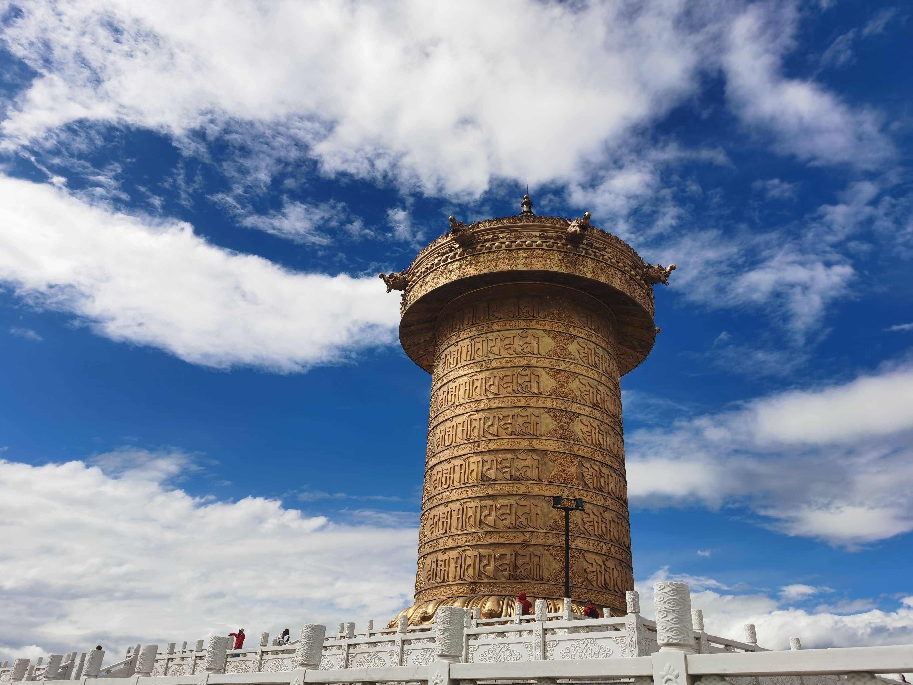
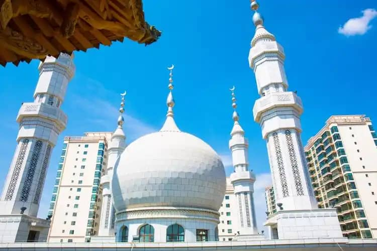

# 5 Crucial Cultural Taboos to Avoid in Northwest China: A Foreigner's Guide

Northwest China—encompassing Gansu, Qinghai, and Xinjiang—is one of the most culturally diverse corridors on earth. It is a stunning, living tapestry where Han culture seamlessly blends with Hui Muslim traditions and Tibetan Buddhist spiritualism. 

For international travelers, this ethnic fusion is the ultimate draw. However, because these cultures coexist under strict, ancient religious frameworks, actions that seem completely harmless in the West (or even in Shanghai and Beijing) can be deeply offensive, or even illegal, here.

To ensure your journey along the Silk Road remains deeply respectful and entirely smooth, here are the **5 non-negotiable cultural taboos** you must understand before stepping foot in the Northwest.

---

## Taboo 1: The Strict Halal Dining Etiquette (Qingzhen)

A vast portion of the culinary scene in Gansu (especially Lanzhou and Linxia) is run by the Hui and Dongxiang Muslim communities. You will see the characters **清真 (Qingzhen - Halal)** emblazoned in bright green or gold on almost every noodle shop and barbecue joint.

* **The Forbidden Items:** Never, under any circumstances, bring outside food containing **pork, lard, or non-halal meat** into a Qingzhen restaurant. Even bringing a packet of pork jerky snack or a ham sandwich in your backpack into the shop is considered a severe insult.
* **The Alcohol Rule:** While some casual Halal barbecue stalls allow local beers, many traditional, conservative family-run institutions ban alcohol completely. Look at the surrounding tables; if nobody is drinking alcohol, do not ask the staff for beer or pull a bottle of wine out of your bag. 

---

## Taboo 2: The "Clockwise Rule" in Tibetan Buddhist Territories

When you explore southern Gansu (the Gannan Tibetan Autonomous Prefecture, including Xiahe, Zagana, and Langmusi), you are entering the sacred heartland of the Gelug (Yellow Hat) sect of Tibetan Buddhism.

* **Always Move Clockwise:** When walking around a Tibetan monastery (Gompa), stupa (Chorten), Mani stone pile, or row of prayer wheels, you **MUST always walk in a clockwise direction**. Walking counter-clockwise is seen as actively reversing the cosmic prayers and is highly disrespectful to the pilgrims.
* **Spinning the Wheels:** If you choose to spin the brass prayer wheels along the boardwalks, use your right hand and spin them exclusively in a **clockwise** direction. Never stop a wheel that someone else has just spun.

---

## Taboo 3: Photography Oversteps (Inside Monasteries & Sensitive Rituals)

The light cutting through the incense smoke of a Tibetan assembly hall looks breathtaking, but your camera must remain strictly inside your bag in specific zones.

* **Inside the Chants:** Photography and videography are **universally banned inside the main prayer halls** of monasteries (such as Labrang Monastery). It is believed that flash and lens elements disturb the spiritual energy of the sacred statues and the meditating monks.
* **The Sky Burial Restriction:** As detailed in our Langmusi Guide, witnessing a Sky Burial requires absolute solemnity. Sneaking a photo or flying a drone over a active funeral site is an extreme violation of local religious protection laws and will result in aggressive confrontation by locals and immediate police intervention.

---

## Taboo 4: Disrespectful Attire and Body Language in Sacred Sites

Both Islamic mosques and Tibetan Buddhist monasteries maintain conservative modesty codes that independent backpackers frequently violate by mistake.

* **Dress the Part:** Shorts, short skirts, sleeveless tank tops, and low-cut shirts are strictly forbidden when entering religious compounds. Knees and shoulders must be fully covered.
* **Remove the Shades:** When stepping inside a dimly lit Tibetan chapel to view ancient Buddha statues, **take off your sunglasses and hats**. Keeping them on is interpreted as trying to hide your face, which signals deception or extreme arrogance in local custom.
* **Watch Your Feet:** When sitting down inside a monastery or near a monk, **never point the soles of your feet or shoes directly at a Buddha statue or a person**. Feet are considered the lowest, dirtiest part of the body; tuck your legs cross-legged or sit flat.

---

## Taboo 5: Engaging in Sensitive Political or Religious Debates

The borderlands of Northwest China have a complex, highly secure administrative history. 

* **Keep Conversations Light:** Do not initiate deep political arguments, sovereignty debates, or interrogative religious questions with local taxi drivers, hotel receptionists, or monks. Enjoy the culture for its aesthetic, historical, and human beauty without turning your interactions into political interviews.
* **Passport Readiness:** Expect frequent highway security checkpoints where passports are scanned. Cooperate silently, do not take photos of the police checkpoints, and let your driver handle the logistics.

---

## Northwest China Cultural Survival Metrics

| Scenario / Zone | Absolute Taboo | Pro-Move Solution |
| :--- | :--- | :--- |
| **Halal Restaurants** | Bringing pork snacks or outside alcohol. | Check for the "清真" sign; stick to local tea (*Babao Cha*). |
| **Tibetan Chapels** | Wearing hats/sunglasses; pointing feet at altars. | Remove hats at the doorway; keep hands folded or loose. |
| **Nomad Grasslands** | Wandering into private pasture tents uninvited. | Wait at the fence; local Tibetan mastiffs are fiercely protective. |

---

## Move Through the Borderlands with Absolute Confidence

The cultural landscape of the Silk Road is endlessly rewarding, but the nuances are highly intricate. Missing a single unwritten rule can transform a beautiful interaction into a hostile misunderstanding in a heartbeat. 

This is exactly why traversing the Northwest with an experienced, culturally sensitive local operator is an absolute game-changer. 

When you book an overland private journey with us, you are not just getting a driver; you are getting a seasoned cultural bridge. We know exactly which local alley restaurants cook the best hand-carved mutton, we maintain deep personal friendships with resident monks who welcome our guests warmly, and we ensure you navigate every single ethnic boundary with flawless grace and safety.

Take a look at our newly upgraded [Five-Tiered Blog Library Directory](/blog) to cross-reference your travel logistics, or hit the **Contact Me** button at the top of the screen to lock in Alex as your personal cultural guide across the Silk Road today!
