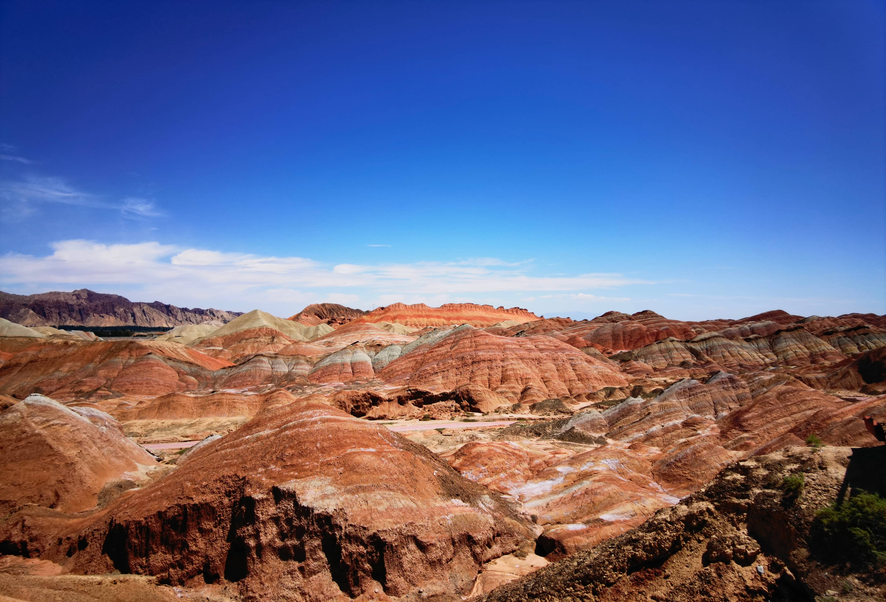
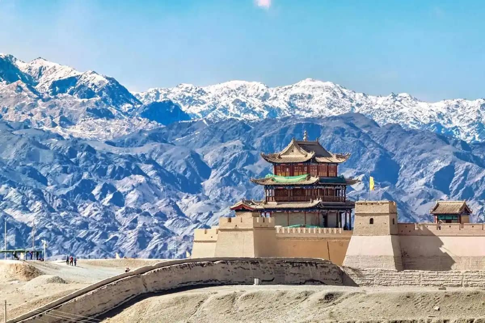
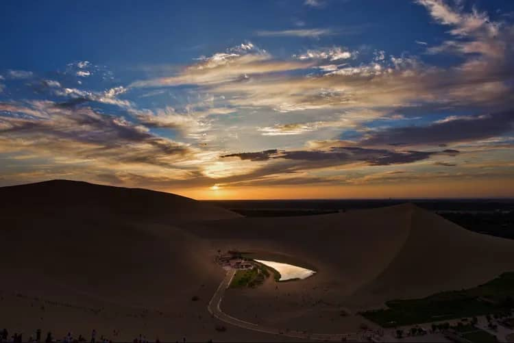

# The Ultimate 7-Day Silk Road Itinerary: From Lanzhou to Dunhuang

Stretching along the ancient Hexi Corridor (河西走廊), Gansu is the undisputed beating heart of the historic Silk Road in China. Wedged between the towering snow-capped Qilian Mountains and the vast expanses of the Gobi Desert, this narrow oasis oasis route hosted camel caravans, Buddhist pilgrims, and imperial armies for over two millennia.

However, planning a trip across Gansu can feel daunting. The distances are massive (covering over 1,100 kilometers from east to west), the landscapes change rapidly, and logistics require careful coordination.

If you are visiting Northwest China for the first time, **7 days is the absolute sweet spot**. 

In this complete 2026 guide, we break down the ultimate day-by-day overland itinerary from Lanzhou to Dunhuang, balancing world-class UNESCO heritage sites, surreal geological wonders, and authentic culinary experiences.

---

## At a Glance: The 7-Day Route Overview

* **Day 1:** Arrival in Lanzhou & Yellow River Culinary Crawl
* **Day 2:** High-Speed Train to Zhangye & Rainbow Mountains Sunset
* **Day 3:** Mati Temple Cliff Sculptures & Overland Drive to Jiayuguan
* **Day 4:** The Great Wall's Western Fortress & Drive to Dunhuang
* **Day 5:** Mogao Caves Masterpieces & Desert Oasis Sunset
* **Day 6:** Expedition to Yadan Geopark & The Ancient Frontier Passes
* **Day 7:** Dunhuang Departure or Silk Road Extension

[Lanzhou] ➔ High-Speed Rail ➔ [Zhangye] ➔ Private Overland Car ➔ [Jiayuguan] ➔ Overland ➔ [Dunhuang]

---

## Day-by-Day Detailed Itinerary

### Day 1: Arrive in Lanzhou (The Gateway)
* **Morning/Afternoon:** Arrive at Lanzhou Zhongchuan International Airport (LHW) or Lanzhou West Railway Station. Check into your hotel in downtown Lanzhou.
* **Late Afternoon:** Stroll along the scenic **Yellow River Mother Sculpture** promenade and cross the historic **Zhongshan Iron Bridge**—the first permanent bridge built across the Yellow River.
* **Evening:** Indulge in an authentic bowl of handmade Lanzhou Beef Noodles (*Ròudàn Shuāngfēi* style) and explore the bustling **Zhengning Road Night Market** for roasted lamb skewers and fermented sweet oat soup (*Tiánbáijiǔ*).

### Day 2: High-Speed Train to Zhangye & Rainbow Mountains
* **Morning:** Board a morning High-Speed Bullet Train from Lanzhou West to Zhangye West (approx. 3 hours). 
* **Afternoon:** Check into your Zhangye hotel and head straight to the **Zhangye Danxia National Geological Park (Rainbow Mountains)**. 
* **Golden Hour Highlight:** Spend 3–4 hours exploring the key viewing platforms. Watch the rolling sandstone hills ignite into brilliant shades of magenta, mustard yellow, and fiery orange as the sun sets over Scenery Field No. 4.

### Day 3: Mati Temple Caves & Overland Drive to Jiayuguan
* **Morning:** Visit **Mati Temple (Horse Hoof Temple - 马蹄寺)**, a dramatic Tibetan Buddhist cave complex carved into sheer sandstone cliffs with snow-capped Qilian peaks looming in the background.
* **Afternoon:** Embark on a private overland drive across the Hexi Corridor toward Jiayuguan City (approx. 3 hours). 
* **Evening:** Relax with a traditional Northwest clay-pot dinner in Jiayuguan and prepare for a day of ancient military history.

### Day 4: The Great Wall's Edge & Journey to Dunhuang
* **Morning:** Explore the imposing **Jiayuguan Pass Fortress (嘉峪关关城)**, the magnificent western terminus of the Ming Dynasty Great Wall. Walk along the ramparts and visit the Overhanging Great Wall (*Xuánbì Chángchéng*).
* **Afternoon:** Enjoy a scenic 4.5-hour overland drive across the Gobi Desert toward the legendary oasis town of Dunhuang. Watch the landscape transition from dark gravel plains to massive golden sand dunes on the horizon.
* **Evening:** Explore the vibrant **Dunhuang Shazhou Night Market**, sampling local dried fruits, mutton pies, and cold yellow noodles (*Huángmiàn*).

### Day 5: Mogao Caves & Singing Sand Dunes
* **Morning:** Experience the crown jewel of the Silk Road: **The Mogao Caves (莫高窟)**. Spend 3 hours exploring ancient Buddhist cave chapels accompanied by an official resident English scholar.
* **Late Afternoon:** Visit the **Singing Sand Dunes & Crescent Moon Lake (鸣沙山月牙泉)**. Ride a camel across the golden dunes, try sand-sliding, or climb to the ridge for an unforgettable sunset over the oasis.

### Day 6: Yadan Ghost City & Frontier Passes
* **Full Day Excursion:** Take an expedition westward along the Dunhuang West Route. Stop at ancient Han Dynasty watchtowers at **Yumenguan Pass (Jade Gate)** before entering the otherworldly **Yadan National Geopark (Ghost City)**.
* **Sunset:** Capture iconic photos of the wind-carved clay "battleships" glowing bronze in the Lop Nur border desert.

### Day 7: Dunhuang Departure
* **Morning:** Visit the local Dunhuang Museum for a final dive into Silk Road history, or shop for hand-painted mural replicas.
* **Afternoon:** Transfer to Dunhuang Airport (DNH) or Dunhuang Railway Station for your ongoing flight/train to Xi'an, Shanghai, or Urumqi.

---

## Travel Logistics & Pro-Tips

| Item | Insider Recommendation |
| :--- | :--- |
| **Best Travel Season** | **May to October** (June & September offer warm weather with smaller crowds) |
| **Transit Strategy** | Bullet Train for Lanzhou➔Zhangye; **Private SUV/Van Charter** for Zhangye➔Jiayuguan➔Dunhuang. |
| **Pacing Advice** | Avoid rushing; desert driving times are long. Build in rest breaks for tea and photo stops. |

---

## Experience the Ultimate Silk Road Journey with Us

Navigating train tickets across four cities, booking time-slotted Mogao Caves Category A passes, and coordinating long-distance Gobi driving on your own can quickly turn a dream vacation into a logistical nightmare.

**We make traveling the Silk Road effortless.**

When you book your 7-day Gansu journey with us, you get a completely seamless, high-end private travel experience:
* **Private Chauffeur & SUV:** Clean, modern vehicles with experienced mountain and desert drivers.
* **Guaranteed VIP Tickets:** Reserved Mogao Caves Category A passes with official English-speaking guides locked in advance.
* **Handpicked Expat-Friendly Lodging:** Vetted 4-star+ boutique stays and desert resorts that smoothly handle foreign passports.

Ready to embark on the adventure of a lifetime? Read our [Expat-Friendly Hotel Guide](/blog/expat-friendly-hotels-gansu-accommodation-guide) to check out recommended stays, or click **Contact Me** at the top of the page to have Alex design your custom 2026 Silk Road itinerary today!
