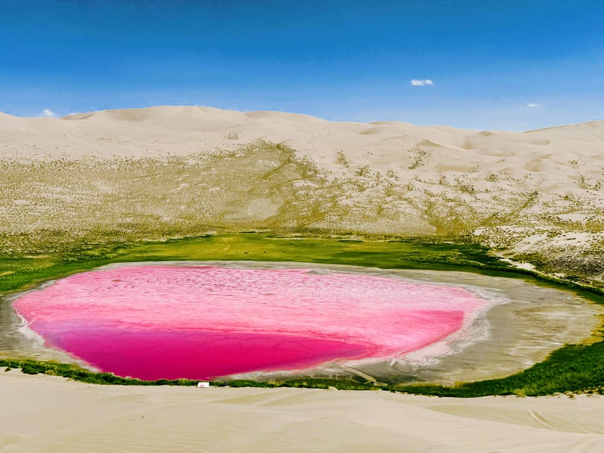
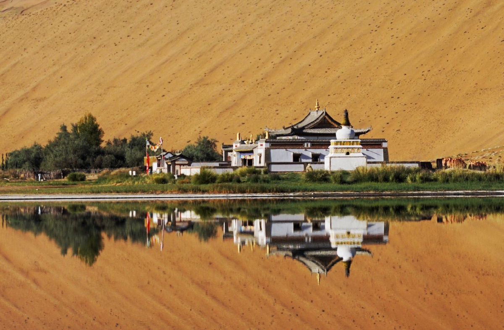

# Badain Jaran Desert & Pink Lakes: How to Visit China's Tallest Dunes

Covering over 49,000 square kilometers across the Inner Mongolia and Gansu border, the **Badain Jaran Desert (巴丹吉林沙漠)** is not just another expanse of sand. It is a geological marvel.

Known among global explorers as the *"Singing Sand Kingdom,"* Badain Jaran is home to the **world's tallest megadunes**—towering sand mountains that rise over 500 meters from their base. Even more astonishingly, tucked between these massive golden ridges lie over 140 spring-fed desert lakes, several of which naturally glow in brilliant shades of **rose pink, magenta, and turquoise**.

For international adventurers looking to venture far off the beaten track, Badain Jaran offers an adrenaline-pumping 4WD desert safari that rivals the Sahara or the Rub' al Khali.

In this 2026 guide, we cover how to visit the pink lakes, climb the highest dune on earth, and navigate the complex desert logistics.

---

## 1. Why Are the Desert Lakes Pink?

To most travelers, finding a lake in a hyper-arid desert seems impossible. Finding a **magenta-pink lake** surrounded by 400-meter golden sand slopes feels like an hallucination.

### The Science Behind the Pink Glow:
The unique color of lakes like **Dagutu (大格图)** and **Dagaitu (大盖图)** is caused by a combination of extreme salinity, high mineral concentrations, and blooming colonies of halophilic micro-algae (*Dunaliella salina*) alongside photosynthetic purple bacteria. 

* **Best Viewing Conditions:** The pink hues are most intense during sunny mid-summer afternoons (July to September) when water temperatures rise and evaporation concentrates the mineral pigments.

---

## 2. Key Highlights of a 4WD Desert Safari

Because there are zero paved roads inside the desert, exploration requires riding in high-clearance, modified 4WD desert jeeps driven by experienced local drivers.

### A. Mount Bilutu (必鲁图峰 - "The Everest of Sand")
Rising to an elevation of **1,611 meters above sea level** (with a relative height of 500+ meters), Bilutu Peak is officially recognized as the **tallest stationary sand dune on Earth**. Climbing to the crest takes 1.5 to 2 hours of grueling hiking, but rewards you with a panoramic view of six surrounding desert lakes simultaneously.

### B. Badain Jaran Monastery (巴丹吉林庙)
Built in 1755, this beautifully preserved Tibetan Buddhist temple sits serenely on the shores of Lake Badain. Known as the *"Forbidden Temple of the Desert,"* it was built using materials transported entirely by camels and remains active today.

### C. Dune Rollercoaster (4WD Dune-Bashing)
The drive itself is a major attraction. Skilled local drivers navigate steep 45-degree sand drops, riding the ridges of megadunes at exhilarating speeds.

---

## 3. Critical Logistical Warnings for Foreign Travelers

Visiting Badain Jaran is a true wilderness expedition, requiring advance preparation:

* **No Independent Driving Permitted:** Private rental cars (even rented 4WDs) are strictly prohibited from entering the core desert reserve. The terrain requires specialized sand-driving techniques and local knowledge of shifting quicksand zones.
* **Extreme Cell Service Dead Zone:** There is zero mobile phone signal once you plunge into the dune basins. Satellite communications or experienced convoy drivers are essential.
* **Basic Accommodation:** Night stays inside the desert are spent in rustic Mongolian yurts or basic desert guesthouses powered by solar generators. Expect limited hot water and bucket showers.

---

## Badain Jaran Expedition Summary

| Metric | Details |
| :--- | :--- |
| **Gateway Town** | Alxa Right Banner (右旗) or Zhangye City (approx. 2.5 hours drive to the desert entrance) |
| **Recommended Duration** | 2 Days / 1 Night deep desert expedition |
| **Best Travel Window** | **June to October** (mornings offer mild temperatures; mid-day lighting highlights the pink lakes) |

---

## Conquer the Singing Sands with Alex

Trying to coordinate desert entry permits, hire licensed 4WD sand drivers, and arrange foreign registration in remote border banners can be overwhelming for international travelers.

**We turn a complex desert expedition into an unforgettable luxury adventure.**

When you book your Badain Jaran overland extension with us, we handle all the heavy lifting:
* **Professional 4WD Convoy:** Modern, air-conditioned 4WD vehicles equipped with veteran desert drivers who know every dune angle and pink lake location.
* **Seamless Zhangye Pick-up:** We pick you up directly from your Zhangye hotel or train station, transport you smoothly to the desert basecamp, and guide you through entry logistics.
* **Aerial Photography Assistance:** We guide you to the absolute best ridge points for capturing epic drone and telephoto shots of the pink lakes and sand crests.

Ready to explore the "Everest of Sand"? Read our [7-Day Silk Road Itinerary Guide](/blog/7-day-silk-road-itinerary-lanzhou-to-dunhuang) to see how to add Badain Jaran to your route, or hit **Contact Me** at the top of the page to customize your desert safari today!
