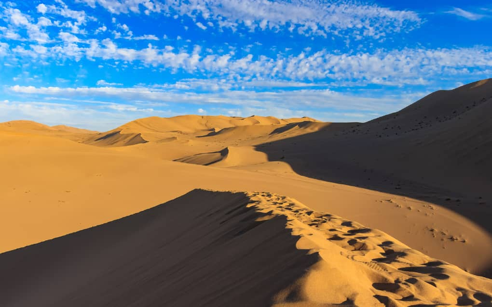
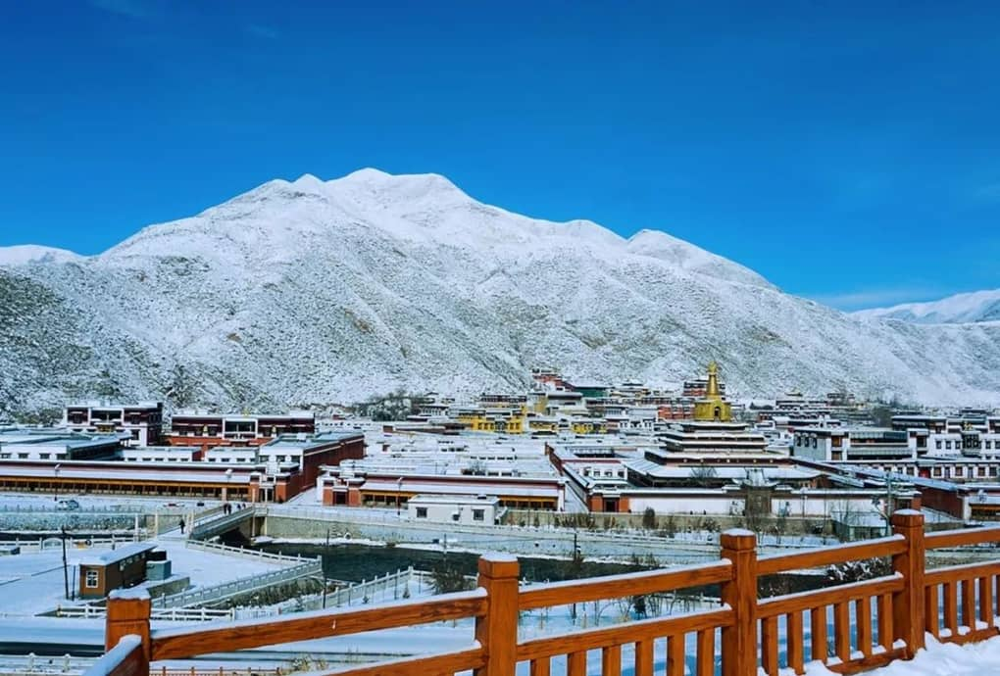

# When is the Best Time to Visit Gansu? Month-by-Month Weather & Crowd Guide

Stretching over 1,600 kilometers from the humid, forested mountains of the south to the arid Gobi Desert in the northwest, Gansu experiences one of the most diverse climate profiles in China.

In a single week, you might go from sunbathing in the 38°C (100°F) heat of Dunhuang's sand dunes to shivering in a 5°C (41°F) windstorm across the high-altitude Tibetan grasslands of Gannan.

Understanding seasonal nuances, temperature swings, and local holiday crowd surges is crucial to enjoying a seamless trip.

In this comprehensive 2026 guide, we break down Gansu's month-by-month weather, packing essentials, and insider strategies to help you choose the absolute best time for your adventure.

---

## Quick Verdict: The Golden Travel Windows

* **Overall Best Months:** **May to June** & **September to October**  
  *Why:* Comfortable temperatures, clear blue skies, vibrant autumn foliage or spring desert bloom, and manageable tourist numbers.
* **Best for Grasslands & Photography:** **July to August**  
  *Why:* The high alpine meadows of Gannan and Qilian are lush, green, and blanketed in wild canola flowers.
* **Best for Budget Travelers & Solitude:** **November to April**  
  *Why:* Discounted hotel rates, low ticket prices, zero crowds at major UNESCO sites, though crisp and cold.

---

## Gansu Season-by-Season Breakdown

### 1. Spring (April – May): Oasis Awakenings & Desert Calm
* **Average Temperature:** 10°C to 22°C (50°F – 72°F)
* **The Vibe:** Crisp air, blooming fruit trees in Dunhuang's oases, and pleasant daytime walking weather.
* **Pro-Tip:** Early spring (April) can occasionally bring spring Gobi windstorms (*Shāchénbào*). Bring a lightweight scarf or buff to cover your nose and mouth when hiking outdoors.

### 2. Summer (June – August): Peak Season & Vibrant Grasslands
* **Average Temperature:** 18°C to 35°C (64°F – 95°F)
* **The Vibe:** Hot, dry sunny days in the Gobi Desert contrasted with cool, refreshing mountain breezes in Gannan and Qilian.
* **Crowd Warning:** Late July and August mark Chinese school summer holidays. Major hotspots like Mogao Caves and Rainbow Mountains see heavy daily foot traffic. Advance ticket booking is non-negotiable.

### 3. Autumn (September – October): Golden Foliage & Perfect Skies
* **Average Temperature:** 8°C to 22°C (46°F – 72°F)
* **The Vibe:** Widely considered the **prime travel month**. Clear skies, comfortable desert heat, and vibrant golden yellow poplar leaves (*Húyánglín*) along desert riverbeds.
* **Critical Avoidance Window:** **October 1st to October 7th (China National Day Golden Week)**. Domestic tourism surges exponentially. Unless booked months in advance, avoid traveling during this specific week.

### 4. Winter (November – March): Snow-Capped Peaks & Quiet Heritage
* **Average Temperature:** -10°C to 8°C (14°F – 46°F)
* **The Vibe:** Cold, quiet, and dramatically beautiful. Viewing the snow-dusted Great Wall at Jiayuguan or quiet Tibetan monasteries in Xiahe offers incredible atmospheric photography.

---

## What to Pack: The 3-Layer Rule for Northwest China

Regardless of the season you visit, Gansu's extreme diurnal temperature variation (temperature drops of 15°C/27°F between day and night) means you must adopt a **smart layering system**:

1. **Base Layer:** Moisture-wicking short-sleeve or long-sleeve shirts.
2. **Mid Layer:** A warm fleece sweater or lightweight down jacket for chilly mornings and desert evenings.
3. **Outer Layer:** Windproof and water-resistant shell jacket (essential for mountain passes and windy desert dunes).
4. **Sun Protection Kit:** Polarized sunglasses, high-SPF sunscreen, wide-brimmed sun hat, and lip balm (the dry air will crack unprotected lips!).

---

## Gansu Seasonal Decision Matrix

| Month | Weather Condition | Crowd Level | Best Regional Focus |
| :--- | :--- | :--- | :--- |
| **Jan – Mar** | Cold & Dry (-5°C / 23°F) | 🟢 Very Low | Lanzhou, Mogao Caves, Jiayuguan |
| **Apr – May** | Mild & Pleasant (18°C / 64°F) | 🟡 Moderate | Silk Road Oasis Loop (Zhangye, Dunhuang) |
| **Jun – Aug** | Hot Desert / Cool Mountains (30°C / 86°F) | 🔴 High | Gannan Tibetan Grasslands, Shandan Horse Farm |
| **Sep – Oct** | Crisp & Sunny (20°C / 68°F) | 🟢 Low (Excl. Oct 1-7) | Entire Gansu Overland Loop (Golden Autumn) |
| **Nov – Dec** | Chilly & Quiet (2°C / 35°F) | 🟢 Very Low | Heritage & Photography Enthusiasts |

---

## Plan Your Perfect Gansu Trip with Alex

Whether you want to witness the lush green summer grasslands of Gannan, capture the golden autumn poplars of the desert, or explore UNESCO heritage sites in winter solitude, timing your itinerary properly makes all the difference.

**We take the stress out of seasonal planning.**

When you book your custom Gansu journey with us, we optimize every detail according to the season:
* **Crowd-Bypassing Timings:** We time your daily site visits to avoid peak tour group hours.
* **Seasonal Weather Monitoring:** We monitor high-altitude mountain pass conditions and desert weather forecasts daily, adjusting driving routes seamlessly.
* **Guaranteed Peak Season Tickets:** Visiting during busy summer months? We secure hard-to-get Category A Mogao Caves tickets and high-speed train seats well in advance.

Check out our [7-Day Silk Road Itinerary Guide](/blog/7-day-silk-road-itinerary-lanzhou-to-dunhuang) to start structuring your journey, or hit **Contact Me** at the top of the page to let Alex curate your 2026 Silk Road adventure today!
