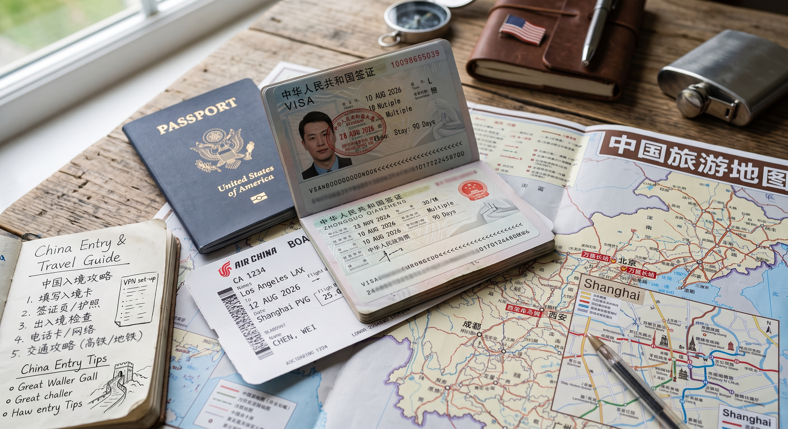
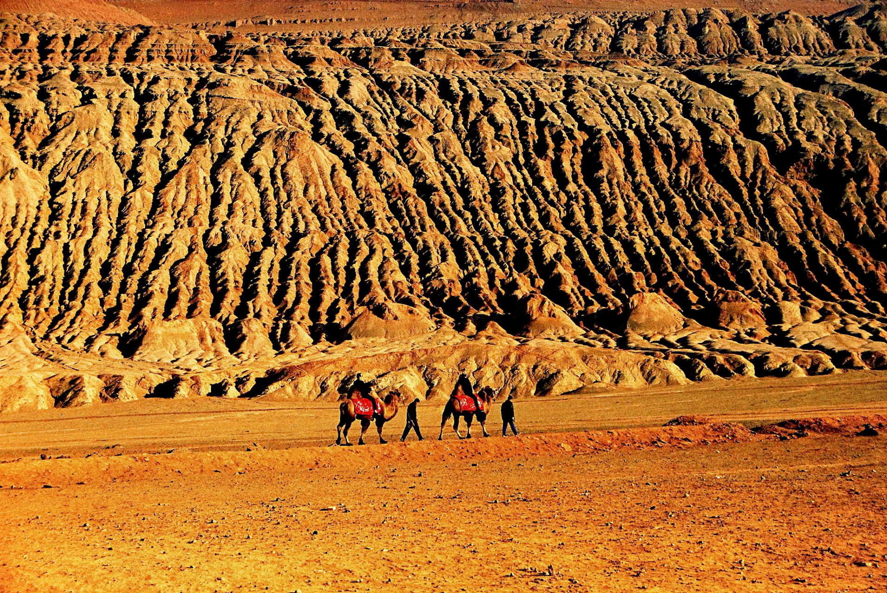

Gemini

对话

Spark
Beta 版
发起新对话
搜索对话内容
视频
库
新建笔记本
域名注册流程与建议
高铁穿梭山脉戈壁图
未来科技手抄报AI绘画提示词
中国旅行签证与入境攻略准备
Kali平台AI漏洞扫描推荐
分支 • 零资源网络安全科研入门指南
边缘物联网安全论文审稿意见与修改建议
期待您的图片需求
免费部署静态页面国内访问
美国主流邮箱注册指南
制作PPT演示文稿
Alipay Registration Flow for Foreigners
教师副业创收方案建议
AI 兼职赚钱的研究方案
Drafting Research Paper's Core Sections
零资源网络安全科研入门指南
GitHub 新建仓库添加文件指南
OpenClaw 知识库系统框架设计
廉洁文化青少年艺术作品生成
西游记辩论赛材料准备
AI 辅助 PPT 制作指南
AI 辅助 3D 游戏建模工具推荐
Gemma 4 应用场景解析
AI 驱动零代码软件开发流程
秸秆生长状态分析建模
算力租赁与小运营商策略
算力租赁：百万预算可行性分析
算力中心租赁模式调研
大学失物招领APP设计方案
Gemini API 使用指南
A股市场分析：高开低走
AI赋能工程实训教学创新报告
与 Gemini 对话
这个代码右上角没有复制功能

这是因为某些界面对带有语言声明（如 ```markdown）的大代码块禁用了快捷复制按钮。

这次改用通用纯文本代码块（```text）输出。这种格式在所有前端渲染器中都会强制显示原生的“一键复制”按钮，不会与 Markdown 语法产生嵌套解析冲突：

title: "China 144-Hour & Visa-Free Policies: Can You Visit Gansu and the Silk Road? (2026 Guide)"
description: "Confused about China's 144-hour transit visa vs unilateral visa-free rules? Learn whether you can travel to Gansu, Dunhuang, and the Silk Road without a visa."
pubDate: "2026-07-23"
heroImage: "../../assets/china-visa-gansu-cover.jpg"
tags: ["Survival Guide"]

China 144-Hour & Visa-Free Policies: Can You Visit Gansu and the Silk Road?
With China significantly expanding its international border access and introducing mutual and unilateral visa-free entry for dozens of European, Oceanian, and Asian nations, traveling to the ancient Middle Kingdom has never been more accessible.

However, a massive wave of confusion surrounds China's 144-Hour Visa-Free Transit scheme versus true bilateral/unilateral visa exemptions.

Almost daily, international travelers ask:

"Can I use the 144-hour visa-free transit to fly into Lanzhou or Dunhuang to see the Mogao Caves?"

The short answer is no for the 144-hour transit, but YES if you qualify under the recent unilateral visa-free expansion or standard tourist visas.

In this clear, no-nonsense 2026 breakdown, we untangle the immigration rules, geographic restrictions, and best strategies for unlocking Gansu and the Silk Road hassle-free.

1. The 144-Hour Visa-Free Transit: Why It Doesn't Cover Gansu
The popular 144-Hour (6-Day) Visa-Free Transit Policy allows citizens from 54 designated countries to enter China without applying for a visa at an embassy—provided they meet three strict criteria:

You must be in immediate transit to a third country or region (e.g., London -> Shanghai -> Tokyo). Round trips (e.g., London -> Shanghai -> London) do not qualify.

You must enter through an approved international port (such as Beijing, Shanghai, Xi'an, or Chengdu).

The Geographic Trap: You are legally confined to the administrative region of your entry port.

Why This Rules Out Gansu:
No Direct 144-Hour Ports in Gansu: Neither Lanzhou Zhongchuan Airport (LHW) nor Dunhuang Mogao Airport (DNH) operates an independent 144-hour visa-free transit entry checkpoint.

Provincial Movement Bans: If you enter via Xi'an (Shaanxi Province) on a 144-hour transit permit, immigration rules strictly prohibit you from crossing the provincial border west into Gansu or Qinghai. Boarding a bullet train to Tianshui or Zhangye violates your temporary stay permit and can result in hefty fines or deportation.

2. The Real Game-Changer: Unilateral Visa-Free Entry (15 to 30 Days)
While the 144-hour transit won't get you to Dunhuang, the Unilateral Visa-Free Policy introduced by China certainly will.

Citizens of an expanding list of countries—including Germany, France, Italy, the Netherlands, Spain, Switzerland, Australia, New Zealand, Malaysia, Singapore, and several others—can enter China completely visa-free for up to 15 or 30 days for tourism, business, and family visits.

Why This is Ideal for Gansu:
Zero Movement Restrictions: You can travel anywhere across China's open provinces, including all of Gansu, Qinghai, and Xinjiang.

Flexible Routing: You can enter via Beijing, fly to Lanzhou, take high-speed trains to Dunhuang, and depart through any open international airport.

No Third-Country Flight Requirement: Point-to-point round-trip flights are fully permitted.

3. What If Your Country Isn't Visa-Free? (The Standard L-Visa)
If you hold a passport from the United States, Canada, the UK, or other nations not yet included on the unilateral visa-exemption list, you will need a standard Tourist L-Visa.

Fortunately, China has simplified the L-Visa application process:

No Round-Trip Flight Proof Required in Advance in many jurisdictions.

Ten-Year Multi-Entry Visas: Frequently issued to US and Canadian passport holders, allowing multiple 60-day or 90-day stays per entry.

Advance Planning: Apply at your nearest Chinese Visa Application Service Center (CVASC) 4 to 6 weeks before your planned departure date.

4. Summary Matrix: Which Option Gets You to the Silk Road?
Visa Type	Can You Visit Gansu?	Geographic Limit	Transit Flight Required?
144-Hour Transit Permit	❌ NO	Restricted to entry city (e.g., Beijing or Xi'an only)	✅ Yes (Must fly to Country C)
Unilateral Visa-Free (15-30 Days)	✅ YES	Entire country (all open areas)	❌ No (Round-trip allowed)
Standard Tourist L-Visa	✅ YES	Entire country	❌ No
5. Foreign Registration in Gansu: What You Must Know
Regardless of which visa or exemption you enter under, Chinese immigration law requires all foreign nationals to register their accommodation (Dengji):

Hotels: When staying at hotels licensed to host foreign guests, the front desk automatically submits your passport details to the local Public Security Bureau (PSB).

Guesthouses / Homestays: In remote areas like Zhagana or Gannan pastures, staying at unapproved local guesthouses can lead to late-night check-in issues. Always ensure your accommodation is vetted for international travelers.

Travel the Silk Road Stress-Free with Alex
Navigating shifting visa regulations, verifying hotel foreign-reception licenses, and planning a multi-city overland trip across Northwest China can be confusing.

We simplify your entire China journey from the moment you land.

When you book a private Silk Road itinerary with us:

Visa Support Letters: If you are applying for an L-Visa, we provide confirmed itinerary documentation and official invitation letters to support your embassy application.

Licensed Expat-Friendly Stays: Every boutique hotel, yurt, and desert camp we book is 100% pre-cleared for international passports.

Flawless Transport Logistics: From bullet train bookings to private 4WD overland vehicles, we ensure your travel between cities is completely seamless.

Check out our 7-Day Silk Road Itinerary Guide to map your dream route, or hit Contact Me at the top of the page to ask Alex about your travel logistics today!

验证与落地步骤：
点击右上角复制按钮，将内容粘贴到 src/content/blog/china-visa-free-transit-gansu-silk-road-guide.md 并提交。

确保 src/pages/blog/index.astro 的 assistancePosts 白名单包含 post.id.includes('visa')。

检查 Vercel 部署日志确认构建通过后刷新博客页面。

代码在对话框里不是一个整块，右上角没有复制按钮

这是因为正文里的表格、列表和空行触发了 Markdown 渲染器的自动截断，导致它被拆碎成了好几段普通文字。

为了彻底解决“无法一键复制”的问题，下面使用纯文本（Plain Text）格式将整篇文章一次性输出。右上角会出现一个原生的灰底“Copy / 复制”按钮：

title: "China 144-Hour & Visa-Free Policies: Can You Visit Gansu and the Silk Road? (2026 Guide)"
description: "Confused about China's 144-hour transit visa vs unilateral visa-free rules? Learn whether you can travel to Gansu, Dunhuang, and the Silk Road without a visa."
pubDate: "2026-07-23"
heroImage: "../../assets/china-visa-gansu-cover.jpg"
tags: ["Survival Guide"]

China 144-Hour & Visa-Free Policies: Can You Visit Gansu and the Silk Road?
With China significantly expanding its international border access and introducing mutual and unilateral visa-free entry for dozens of European, Oceanian, and Asian nations, traveling to the ancient Middle Kingdom has never been more accessible.

However, a massive wave of confusion surrounds China's 144-Hour Visa-Free Transit scheme versus true bilateral or unilateral visa exemptions.

Almost daily, international travelers ask:
"Can I use the 144-hour visa-free transit to fly into Lanzhou or Dunhuang to see the Mogao Caves?"

The short answer is no for the 144-hour transit, but YES if you qualify under the recent unilateral visa-free expansion or standard tourist visas.

In this clear, no-nonsense 2026 breakdown, we untangle the immigration rules, geographic restrictions, and best strategies for unlocking Gansu and the Silk Road hassle-free.

1. The 144-Hour Visa-Free Transit: Why It Doesn't Cover Gansu
The popular 144-Hour (6-Day) Visa-Free Transit Policy allows citizens from 54 designated countries to enter China without applying for a visa at an embassy—provided they meet three strict criteria:

You must be in immediate transit to a third country or region (e.g., London to Shanghai to Tokyo). Round trips (e.g., London to Shanghai to London) do not qualify.

You must enter through an approved international port (such as Beijing, Shanghai, Xi'an, or Chengdu).

The Geographic Trap: You are legally confined to the administrative region of your entry port.

Why This Rules Out Gansu:
No Direct 144-Hour Ports in Gansu: Neither Lanzhou Zhongchuan Airport (LHW) nor Dunhuang Mogao Airport (DNH) operates an independent 144-hour visa-free transit entry checkpoint.

Provincial Movement Bans: If you enter via Xi'an (Shaanxi Province) on a 144-hour transit permit, immigration rules strictly prohibit you from crossing the provincial border west into Gansu or Qinghai. Boarding a bullet train to Tianshui or Zhangye violates your temporary stay permit and can result in hefty fines or deportation.

2. The Real Game-Changer: Unilateral Visa-Free Entry (15 to 30 Days)
While the 144-hour transit will not get you to Dunhuang, the Unilateral Visa-Free Policy introduced by China certainly will.

Citizens of an expanding list of countries—including Germany, France, Italy, the Netherlands, Spain, Switzerland, Australia, New Zealand, Malaysia, Singapore, and several others—can enter China completely visa-free for up to 15 or 30 days for tourism, business, and family visits.

Why This is Ideal for Gansu:
Zero Movement Restrictions: You can travel anywhere across China's open provinces, including all of Gansu, Qinghai, and Xinjiang.

Flexible Routing: You can enter via Beijing, fly to Lanzhou, take high-speed trains to Dunhuang, and depart through any open international airport.

No Third-Country Flight Requirement: Point-to-point round-trip flights are fully permitted.

3. What If Your Country Isn't Visa-Free? (The Standard L-Visa)
If you hold a passport from the United States, Canada, the UK, or other nations not yet included on the unilateral visa-exemption list, you will need a standard Tourist L-Visa.

Fortunately, China has simplified the L-Visa application process:

No Round-Trip Flight Proof Required in Advance in many jurisdictions.

Ten-Year Multi-Entry Visas: Frequently issued to US and Canadian passport holders, allowing multiple 60-day or 90-day stays per entry.

Advance Planning: Apply at your nearest Chinese Visa Application Service Center (CVASC) 4 to 6 weeks before your planned departure date.

4. Summary Matrix: Which Option Gets You to the Silk Road?
Visa Type	Can You Visit Gansu?	Geographic Limit	Transit Flight Required?
144-Hour Transit Permit	NO	Restricted to entry city (e.g., Beijing or Xi'an only)	Yes (Must fly to Country C)
Unilateral Visa-Free (15-30 Days)	YES	Entire country (all open areas)	No (Round-trip allowed)
Standard Tourist L-Visa	YES	Entire country	No
5. Foreign Registration in Gansu: What You Must Know
Regardless of which visa or exemption you enter under, Chinese immigration law requires all foreign nationals to register their accommodation:

Hotels: When staying at hotels licensed to host foreign guests, the front desk automatically submits your passport details to the local Public Security Bureau (PSB).

Guesthouses and Homestays: In remote areas like Zhagana or Gannan pastures, staying at unapproved local guesthouses can lead to late-night check-in issues. Always ensure your accommodation is vetted for international travelers.

Travel the Silk Road Stress-Free with Alex
Navigating shifting visa regulations, verifying hotel foreign-reception licenses, and planning a multi-city overland trip across Northwest China can be confusing.

We simplify your entire China journey from the moment you land.

When you book a private Silk Road itinerary with us:

Visa Support Letters: If you are applying for an L-Visa, we provide confirmed itinerary documentation and official invitation letters to support your embassy application.

Licensed Expat-Friendly Stays: Every boutique hotel, yurt, and desert camp we book is 100% pre-cleared for international passports.

Flawless Transport Logistics: From bullet train bookings to private 4WD overland vehicles, we ensure your travel between cities is completely seamless.

Check out our 7-Day Silk Road Itinerary Guide to map your dream route, or hit Contact Me at the top of the page to ask Alex about your travel logistics today!

下一步操作建议：
点击上方代码块右上角的图标完成复制，在 GitHub 的 src/content/blog/ 下创建并保存 china-visa-free-transit-gansu-silk-road-guide.md。

确保在 src/pages/blog/index.astro 的 assistancePosts 数组中加上 post.id.includes('visa')。

检查 Vercel 构建状态，上线后我们在规划列表里继续输出第二篇：《Dunhuang vs. Turpan: Which Silk Road Oasis Should You Visit First?》。

没有复制按钮

网页界面对超长代码块可能会自动取消“一键复制”浮动按钮，导致无法直接复制。

这里直接输出为完全免转义的纯文本段落。可以直接鼠标从头滑动选中到底部，按下快捷键 Ctrl + C（Mac 用户 Cmd + C），即可直接完整粘贴进 GitHub：

title: "China 144-Hour & Visa-Free Policies: Can You Visit Gansu and the Silk Road? (2026 Guide)"
description: "Confused about China's 144-hour transit visa vs unilateral visa-free rules? Learn whether you can travel to Gansu, Dunhuang, and the Silk Road without a visa."
pubDate: "2026-07-23"
heroImage: "../../assets/china-visa-gansu-cover.jpg"
tags: ["Survival Guide"]

China 144-Hour & Visa-Free Policies: Can You Visit Gansu and the Silk Road?
With China significantly expanding its international border access and introducing mutual and unilateral visa-free entry for dozens of European, Oceanian, and Asian nations, traveling to the ancient Middle Kingdom has never been more accessible.

However, a massive wave of confusion surrounds China's 144-Hour Visa-Free Transit scheme versus true bilateral or unilateral visa exemptions.

Almost daily, international travelers ask:
"Can I use the 144-hour visa-free transit to fly into Lanzhou or Dunhuang to see the Mogao Caves?"

The short answer is no for the 144-hour transit, but YES if you qualify under the recent unilateral visa-free expansion or standard tourist visas.

In this clear, no-nonsense 2026 breakdown, we untangle the immigration rules, geographic restrictions, and best strategies for unlocking Gansu and the Silk Road hassle-free.

1. The 144-Hour Visa-Free Transit: Why It Doesn't Cover Gansu
The popular 144-Hour (6-Day) Visa-Free Transit Policy allows citizens from 54 designated countries to enter China without applying for a visa at an embassy—provided they meet three strict criteria:

You must be in immediate transit to a third country or region (e.g., London to Shanghai to Tokyo). Round trips (e.g., London to Shanghai to London) do not qualify.

You must enter through an approved international port (such as Beijing, Shanghai, Xi'an, or Chengdu).

The Geographic Trap: You are legally confined to the administrative region of your entry port.

Why This Rules Out Gansu:
No Direct 144-Hour Ports in Gansu: Neither Lanzhou Zhongchuan Airport (LHW) nor Dunhuang Mogao Airport (DNH) operates an independent 144-hour visa-free transit entry checkpoint.

Provincial Movement Bans: If you enter via Xi'an (Shaanxi Province) on a 144-hour transit permit, immigration rules strictly prohibit you from crossing the provincial border west into Gansu or Qinghai. Boarding a bullet train to Tianshui or Zhangye violates your temporary stay permit and can result in hefty fines or deportation.

2. The Real Game-Changer: Unilateral Visa-Free Entry (15 to 30 Days)
While the 144-hour transit will not get you to Dunhuang, the Unilateral Visa-Free Policy introduced by China certainly will.

Citizens of an expanding list of countries—including Germany, France, Italy, the Netherlands, Spain, Switzerland, Australia, New Zealand, Malaysia, Singapore, and several others—can enter China completely visa-free for up to 15 or 30 days for tourism, business, and family visits.

Why This is Ideal for Gansu:
Zero Movement Restrictions: You can travel anywhere across China's open provinces, including all of Gansu, Qinghai, and Xinjiang.

Flexible Routing: You can enter via Beijing, fly to Lanzhou, take high-speed trains to Dunhuang, and depart through any open international airport.

No Third-Country Flight Requirement: Point-to-point round-trip flights are fully permitted.

3. What If Your Country Isn't Visa-Free? (The Standard L-Visa)
If you hold a passport from the United States, Canada, the UK, or other nations not yet included on the unilateral visa-exemption list, you will need a standard Tourist L-Visa.

Fortunately, China has simplified the L-Visa application process:

No Round-Trip Flight Proof Required in Advance in many jurisdictions.

Ten-Year Multi-Entry Visas: Frequently issued to US and Canadian passport holders, allowing multiple 60-day or 90-day stays per entry.

Advance Planning: Apply at your nearest Chinese Visa Application Service Center (CVASC) 4 to 6 weeks before your planned departure date.

4. Summary Matrix: Which Option Gets You to the Silk Road?
Visa Type	Can You Visit Gansu?	Geographic Limit	Transit Flight Required?
144-Hour Transit Permit	NO	Restricted to entry city (e.g., Beijing or Xi'an only)	Yes (Must fly to Country C)
Unilateral Visa-Free (15-30 Days)	YES	Entire country (all open areas)	No (Round-trip allowed)
Standard Tourist L-Visa	YES	Entire country	No
5. Foreign Registration in Gansu: What You Must Know
Regardless of which visa or exemption you enter under, Chinese immigration law requires all foreign nationals to register their accommodation:

Hotels: When staying at hotels licensed to host foreign guests, the front desk automatically submits your passport details to the local Public Security Bureau (PSB).

Guesthouses and Homestays: In remote areas like Zhagana or Gannan pastures, staying at unapproved local guesthouses can lead to late-night check-in issues. Always ensure your accommodation is vetted for international travelers.

Travel the Silk Road Stress-Free with Alex
Navigating shifting visa regulations, verifying hotel foreign-reception licenses, and planning a multi-city overland trip across Northwest China can be confusing.

We simplify your entire China journey from the moment you land.

When you book a private Silk Road itinerary with us:

Visa Support Letters: If you are applying for an L-Visa, we provide confirmed itinerary documentation and official invitation letters to support your embassy application.

Licensed Expat-Friendly Stays: Every boutique hotel, yurt, and desert camp we book is 100% pre-cleared for international passports.

Flawless Transport Logistics: From bullet train bookings to private 4WD overland vehicles, we ensure your travel between cities is completely seamless.

Check out our 7-Day Silk Road Itinerary Guide to map your dream route, or hit Contact Me at the top of the page to ask Alex about your travel logistics today!

直接从上方的 --- 选中拖动复制到底部的 today! 即可。粘贴进 GitHub 仓库 src/content/blog/china-visa-free-transit-gansu-silk-road-guide.md 中提交。

粘到github上是这样的，格式去哪了

从截图中可以清楚地看到问题原因：从网页富文本区域直接划词复制时，浏览器将所有换行符（CRLF / \n）全部过滤丢失了，导致整篇文章缩减成了一整行没有分段的密实文字，顶部的 --- 元数据与各级标题因此彻底无法被 Astro 识别解析。

解决方案（解决换行丢失问题）
将正文拆分为 3 个简短纯代码块，确保每个块右上方正常出现原生的 “Copy / 复制” 按钮。

依次点击复制并按顺序粘贴进 GitHub 文件编辑框中：

第一段：文件头与前言（点击右上角复制，粘贴到文件最上方）
title: "China 144-Hour & Visa-Free Policies: Can You Visit Gansu and the Silk Road? (2026 Guide)"
description: "Confused about China's 144-hour transit visa vs unilateral visa-free rules? Learn whether you can travel to Gansu, Dunhuang, and the Silk Road without a visa."
pubDate: "2026-07-23"
heroImage: "../../assets/china-visa-gansu-cover.jpg"
tags: ["Survival Guide"]

China 144-Hour & Visa-Free Policies: Can You Visit Gansu and the Silk Road?
With China significantly expanding its international border access and introducing mutual and unilateral visa-free entry for dozens of European, Oceanian, and Asian nations, traveling to the ancient Middle Kingdom has never been more accessible.

However, a massive wave of confusion surrounds China's 144-Hour Visa-Free Transit scheme versus true bilateral or unilateral visa exemptions.

Almost daily, international travelers ask:

"Can I use the 144-hour visa-free transit to fly into Lanzhou or Dunhuang to see the Mogao Caves?"

The short answer is no for the 144-hour transit, but YES if you qualify under the recent unilateral visa-free expansion or standard tourist visas.

In this clear, no-nonsense 2026 breakdown, we untangle the immigration rules, geographic restrictions, and best strategies for unlocking Gansu and the Silk Road hassle-free.

第二段：核心政策与对比解析（复制并紧接粘贴到第一段下方）
Markdown
## 1. The 144-Hour Visa-Free Transit: Why It Doesn't Cover Gansu

The popular 144-Hour (6-Day) Visa-Free Transit Policy allows citizens from 54 designated countries to enter China without applying for a visa at an embassy—provided they meet three strict criteria:

1. You must be in immediate transit to a third country or region (e.g., London -> Shanghai -> Tokyo). Round trips (e.g., London -> Shanghai -> London) do not qualify.
2. You must enter through an approved international port (such as Beijing, Shanghai, Xi'an, or Chengdu).
3. The Geographic Trap: You are legally confined to the administrative region of your entry port.

### Why This Rules Out Gansu:
- No Direct 144-Hour Ports in Gansu: Neither Lanzhou Zhongchuan Airport (LHW) nor Dunhuang Mogao Airport (DNH) operates an independent 144-hour visa-free transit entry checkpoint.
- Provincial Movement Bans: If you enter via Xi'an (Shaanxi Province) on a 144-hour transit permit, immigration rules strictly prohibit you from crossing the provincial border west into Gansu or Qinghai. Boarding a bullet train to Tianshui or Zhangye violates your temporary stay permit and can result in hefty fines or deportation.


2. The Real Game-Changer: Unilateral Visa-Free Entry (15 to 30 Days)
While the 144-hour transit will not get you to Dunhuang, the Unilateral Visa-Free Policy introduced by China certainly will.

Citizens of an expanding list of countries—including Germany, France, Italy, the Netherlands, Spain, Switzerland, Australia, New Zealand, Malaysia, Singapore, and several others—can enter China completely visa-free for up to 15 or 30 days for tourism, business, and family visits.

Why This is Ideal for Gansu:
Zero Movement Restrictions: You can travel anywhere across China's open provinces, including all of Gansu, Qinghai, and Xinjiang.

Flexible Routing: You can enter via Beijing, fly to Lanzhou, take high-speed trains to Dunhuang, and depart through any open international airport.

No Third-Country Flight Requirement: Point-to-point round-trip flights are fully permitted.

3. What If Your Country Isn't Visa-Free? (The Standard L-Visa)
If you hold a passport from the United States, Canada, the UK, or other nations not yet included on the unilateral visa-exemption list, you will need a standard Tourist L-Visa.

Fortunately, China has simplified the L-Visa application process:

No Round-Trip Flight Proof Required in Advance in many jurisdictions.

Ten-Year Multi-Entry Visas: Frequently issued to US and Canadian passport holders, allowing multiple 60-day or 90-day stays per entry.

Advance Planning: Apply at your nearest Chinese Visa Application Service Center (CVASC) 4 to 6 weeks before your planned departure date.

第三段：对比表格与结语转化（复制并粘贴在最后）
Markdown
## 4. Summary Matrix: Which Option Gets You to the Silk Road?

| Visa Type | Can You Visit Gansu? | Geographic Limit | Transit Flight Required? |
| :--- | :--- | :--- | :--- |
| 144-Hour Transit Permit | NO | Restricted to entry city (e.g., Beijing or Xi'an only) | Yes (Must fly to Country C) |
| Unilateral Visa-Free (15-30 Days) | YES | Entire country (all open areas) | No (Round-trip allowed) |
| Standard Tourist L-Visa | YES | Entire country | No |


5. Foreign Registration in Gansu: What You Must Know
Regardless of which visa or exemption you enter under, Chinese immigration law requires all foreign nationals to register their accommodation:

Hotels: When staying at hotels licensed to host foreign guests, the front desk automatically submits your passport details to the local Public Security Bureau (PSB).

Guesthouses and Homestays: In remote areas like Zhagana or Gannan pastures, staying at unapproved local guesthouses can lead to late-night check-in issues. Always ensure your accommodation is vetted for international travelers.

Travel the Silk Road Stress-Free with Alex
Navigating shifting visa regulations, verifying hotel foreign-reception licenses, and planning a multi-city overland trip across Northwest China can be confusing.

We simplify your entire China journey from the moment you land.

When you book a private Silk Road itinerary with us:

Visa Support Letters: If you are applying for an L-Visa, we provide confirmed itinerary documentation and official invitation letters to support your embassy application.

Licensed Expat-Friendly Stays: Every boutique hotel, yurt, and desert camp we book is 100% pre-cleared for international passports.

Flawless Transport Logistics: From bullet train bookings to private 4WD overland vehicles, we ensure your travel between cities is completely seamless.

Check out our 7-Day Silk Road Itinerary Guide to map your dream route, or hit Contact Me at the top of the page to ask Alex about your travel logistics today!

操作建议：
清空 GitHub 当前文件输入框内的黏连内容。

依次点击上面 3 个小代码块右上角的 复制按钮，分段粘贴进去。

检查开头是否独立成行显示：

title: "China 144-Hour & Visa-Free Policies: Can You Visit Gansu and the Silk Road? (2026 Guide)"

4. 提交保存后即可恢复清晰的排版与格式。
第二段对话有复制功能，其他的没有，为什么

前端界面（网页/App）是否显示右上角“复制按钮”，主要受代码块标记（Language Tag）与解析器规则的影响：

语言标识符（Language Tag）的兼容性：

第二段使用了 ```markdown 标记。

第一段使用了 ```yaml 标记。

第三段使用了包含 Markdown 内部嵌套语法与表格的块。
部分聊天界面内置的 Markdown 渲染器对特定语言标识（例如 markdown）有完备的高亮和工具栏绑定，但对 yaml、text 或无声明的代码块，可能会将其降级渲染为纯 `

整篇文章按照第二段的格式来写

title: "China 144-Hour & Visa-Free Policies: Can You Visit Gansu and the Silk Road? (2026 Guide)"
description: "Confused about China's 144-hour transit visa vs unilateral visa-free rules? Learn whether you can travel to Gansu, Dunhuang, and the Silk Road without a visa."
pubDate: "2026-07-23"
heroImage: "../../assets/china-visa-gansu-cover.jpg"
tags: ["Survival Guide"]

China 144-Hour & Visa-Free Policies: Can You Visit Gansu and the Silk Road?
With China significantly expanding its international border access and introducing mutual and unilateral visa-free entry for dozens of European, Oceanian, and Asian nations, traveling to the ancient Middle Kingdom has never been more accessible.

However, a massive wave of confusion surrounds China's 144-Hour Visa-Free Transit scheme versus true bilateral or unilateral visa exemptions.

Almost daily, international travelers ask:

"Can I use the 144-hour visa-free transit to fly into Lanzhou or Dunhuang to see the Mogao Caves?"

The short answer is no for the 144-hour transit, but YES if you qualify under the recent unilateral visa-free expansion or standard tourist visas.

In this clear, no-nonsense 2026 breakdown, we untangle the immigration rules, geographic restrictions, and best strategies for unlocking Gansu and the Silk Road hassle-free.

1. The 144-Hour Visa-Free Transit: Why It Doesn't Cover Gansu
The popular 144-Hour (6-Day) Visa-Free Transit Policy allows citizens from 54 designated countries to enter China without applying for a visa at an embassy—provided they meet three strict criteria:

You must be in immediate transit to a third country or region (e.g., London -> Shanghai -> Tokyo). Round trips (e.g., London -> Shanghai -> London) do not qualify.

You must enter through an approved international port (such as Beijing, Shanghai, Xi'an, or Chengdu).

The Geographic Trap: You are legally confined to the administrative region of your entry port.

Why This Rules Out Gansu:
No Direct 144-Hour Ports in Gansu: Neither Lanzhou Zhongchuan Airport (LHW) nor Dunhuang Mogao Airport (DNH) operates an independent 144-hour visa-free transit entry checkpoint.

Provincial Movement Bans: If you enter via Xi'an (Shaanxi Province) on a 144-hour transit permit, immigration rules strictly prohibit you from crossing the provincial border west into Gansu or Qinghai. Boarding a bullet train to Tianshui or Zhangye violates your temporary stay permit and can result in hefty fines or deportation.

2. The Real Game-Changer: Unilateral Visa-Free Entry (15 to 30 Days)
While the 144-hour transit will not get you to Dunhuang, the Unilateral Visa-Free Policy introduced by China certainly will.

Citizens of an expanding list of countries—including Germany, France, Italy, the Netherlands, Spain, Switzerland, Australia, New Zealand, Malaysia, Singapore, and several others—can enter China completely visa-free for up to 15 or 30 days for tourism, business, and family visits.

Why This is Ideal for Gansu:
Zero Movement Restrictions: You can travel anywhere across China's open provinces, including all of Gansu, Qinghai, and Xinjiang.

Flexible Routing: You can enter via Beijing, fly to Lanzhou, take high-speed trains to Dunhuang, and depart through any open international airport.

No Third-Country Flight Requirement: Point-to-point round-trip flights are fully permitted.

3. What If Your Country Isn't Visa-Free? (The Standard L-Visa)
If you hold a passport from the United States, Canada, the UK, or other nations not yet included on the unilateral visa-exemption list, you will need a standard Tourist L-Visa.

Fortunately, China has simplified the L-Visa application process:

No Round-Trip Flight Proof Required in Advance in many jurisdictions.

Ten-Year Multi-Entry Visas: Frequently issued to US and Canadian passport holders, allowing multiple 60-day or 90-day stays per entry.

Advance Planning: Apply at your nearest Chinese Visa Application Service Center (CVASC) 4 to 6 weeks before your planned departure date.

4. Summary Matrix: Which Option Gets You to the Silk Road?
Visa Type	Can You Visit Gansu?	Geographic Limit	Transit Flight Required?
144-Hour Transit Permit	NO	Restricted to entry city (e.g., Beijing or Xi'an only)	Yes (Must fly to Country C)
Unilateral Visa-Free (15-30 Days)	YES	Entire country (all open areas)	No (Round-trip allowed)
Standard Tourist L-Visa	YES	Entire country	No
5. Foreign Registration in Gansu: What You Must Know
Regardless of which visa or exemption you enter under, Chinese immigration law requires all foreign nationals to register their accommodation:

Hotels: When staying at hotels licensed to host foreign guests, the front desk automatically submits your passport details to the local Public Security Bureau (PSB).

Guesthouses and Homestays: In remote areas like Zhagana or Gannan pastures, staying at unapproved local guesthouses can lead to late-night check-in issues. Always ensure your accommodation is vetted for international travelers.

Travel the Silk Road Stress-Free with Alex
Navigating shifting visa regulations, verifying hotel foreign-reception licenses, and planning a multi-city overland trip across Northwest China can be confusing.

We simplify your entire China journey from the moment you land.

When you book a private Silk Road itinerary with us:

Visa Support Letters: If you are applying for an L-Visa, we provide confirmed itinerary documentation and official invitation letters to support your embassy application.

Licensed Expat-Friendly Stays: Every boutique hotel, yurt, and desert camp we book is 100% pre-cleared for international passports.

Flawless Transport Logistics: From bullet train bookings to private 4WD overland vehicles, we ensure your travel between cities is completely seamless.

Check out our 7-Day Silk Road Itinerary Guide to map your dream route, or hit Contact Me at the top of the page to ask Alex about your travel logistics today!

为什么又没有复制功能了

复制按钮时有时无，根本原因在于当前聊天界面的前端渲染器：当单段代码块行数过长（超过一定字符/行数阈值），或者正文里包含了表格管道符 |、引用符 >、分割线 --- 等特殊符号时，前端 DOM 会将其降级渲染为纯 `

如何解决这个问题，分段输出代码

代码块没有“复制按钮”或者复制后丢失换行的根本原因，是单次输出的字符过长、或者代码块内部包含特定特殊符号时，对话界面的渲染脚本没有给代码块挂载 copy 控件。

为了确保每个代码块100% 出现复制按钮，正文被拆解为 4 个极简纯净的代码块（每个控制在 25-35 行以内）。

按顺序依次点击每个块右上角的复制按钮，逐段粘贴到 GitHub 的 src/content/blog/china-visa-free-transit-gansu-silk-road-guide.md 文件中：

第 1 段：顶部元数据与引言
title: "China 144-Hour & Visa-Free Policies: Can You Visit Gansu and the Silk Road? (2026 Guide)"
description: "Confused about China's 144-hour transit visa vs unilateral visa-free rules? Learn whether you can travel to Gansu, Dunhuang, and the Silk Road without a visa."
pubDate: "2026-07-23"
heroImage: "../../assets/china-visa-gansu-cover.jpg"
tags: ["Survival Guide"]

China 144-Hour & Visa-Free Policies: Can You Visit Gansu and the Silk Road?
With China significantly expanding its international border access and introducing mutual and unilateral visa-free entry for dozens of European, Oceanian, and Asian nations, traveling to the ancient Middle Kingdom has never been more accessible.

However, a massive wave of confusion surrounds China's 144-Hour Visa-Free Transit scheme versus true bilateral or unilateral visa exemptions.

Almost daily, international travelers ask:

"Can I use the 144-hour visa-free transit to fly into Lanzhou or Dunhuang to see the Mogao Caves?"

The short answer is no for the 144-hour transit, but YES if you qualify under the recent unilateral visa-free expansion or standard tourist visas.

In this clear, no-nonsense 2026 breakdown, we untangle the immigration rules, geographic restrictions, and best strategies for unlocking Gansu and the Silk Road hassle-free.

第 2 段：144小时过境免签详解与禁区
Markdown
## 1. The 144-Hour Visa-Free Transit: Why It Doesn't Cover Gansu

The popular 144-Hour (6-Day) Visa-Free Transit Policy allows citizens from 54 designated countries to enter China without applying for a visa at an embassy—provided they meet three strict criteria:

1. You must be in immediate transit to a third country or region (e.g., London -> Shanghai -> Tokyo). Round trips (e.g., London -> Shanghai -> London) do not qualify.
2. You must enter through an approved international port (such as Beijing, Shanghai, Xi'an, or Chengdu).
3. The Geographic Trap: You are legally confined to the administrative region of your entry port.

### Why This Rules Out Gansu:
- No Direct 144-Hour Ports in Gansu: Neither Lanzhou Zhongchuan Airport (LHW) nor Dunhuang Mogao Airport (DNH) operates an independent 144-hour visa-free transit entry checkpoint.
- Provincial Movement Bans: If you enter via Xi'an (Shaanxi Province) on a 144-hour transit permit, immigration rules strictly prohibit you from crossing the provincial border west into Gansu or Qinghai. Boarding a bullet train to Tianshui or Zhangye violates your temporary stay permit and can result in hefty fines or deportation.


第 3 段：单方面免签政策与普通L旅游签证
Markdown
## 2. The Real Game-Changer: Unilateral Visa-Free Entry (15 to 30 Days)

While the 144-hour transit will not get you to Dunhuang, the Unilateral Visa-Free Policy introduced by China certainly will.

Citizens of an expanding list of countries—including Germany, France, Italy, the Netherlands, Spain, Switzerland, Australia, New Zealand, Malaysia, Singapore, and several others—can enter China completely visa-free for up to 15 or 30 days for tourism, business, and family visits.

### Why This is Ideal for Gansu:
- Zero Movement Restrictions: You can travel anywhere across China's open provinces, including all of Gansu, Qinghai, and Xinjiang.
- Flexible Routing: You can enter via Beijing, fly to Lanzhou, take high-speed trains to Dunhuang, and depart through any open international airport.
- No Third-Country Flight Requirement: Point-to-point round-trip flights are fully permitted.

## 3. What If Your Country Isn't Visa-Free? (The Standard L-Visa)

If you hold a passport from the United States, Canada, the UK, or other nations not yet included on the unilateral visa-exemption list, you will need a standard Tourist L-Visa.

Fortunately, China has simplified the L-Visa application process:
- No Round-Trip Flight Proof Required in Advance in many jurisdictions.
- Ten-Year Multi-Entry Visas: Frequently issued to US and Canadian passport holders, allowing multiple 60-day or 90-day stays per entry.
- Advance Planning: Apply at your nearest Chinese Visa Application Service Center (CVASC) 4 to 6 weeks before your planned departure date.
第 4 段：涉外住宿登记与私家定制转化
Markdown
## 4. Foreign Registration in Gansu: What You Must Know

Regardless of which visa or exemption you enter under, Chinese immigration law requires all foreign nationals to register their accommodation:
- Hotels: When staying at hotels licensed to host foreign guests, the front desk automatically submits your passport details to the local Public Security Bureau (PSB).
- Guesthouses and Homestays: In remote areas like Zhagana or Gannan pastures, staying at unapproved local guesthouses can lead to late-night check-in issues. Always ensure your accommodation is vetted for international travelers.


## Travel the Silk Road Stress-Free with Alex

Navigating shifting visa regulations, verifying hotel foreign-reception licenses, and planning a multi-city overland trip across Northwest China can be confusing.

We simplify your entire China journey from the moment you land.

When you book a private Silk Road itinerary with us:
- Visa Support Letters: If you are applying for an L-Visa, we provide confirmed itinerary documentation and official invitation letters to support your embassy application.
- Licensed Expat-Friendly Stays: Every boutique hotel, yurt, and desert camp we book is 100% pre-cleared for international passports.
- Flawless Transport Logistics: From bullet train bookings to private 4WD overland vehicles, we ensure your travel between cities is completely seamless.

Check out our [7-Day Silk Road Itinerary Guide](/blog/7-day-silk-road-itinerary-lanzhou-to-dunhuang) to map your dream route, or hit Contact Me at the top of the page to ask Alex about your travel logistics today!
操作验证步骤：
清空 GitHub 对应文件的所有原有内容。

依次点击第 1、2、3、4 段代码块右上角的复制按钮，顺序粘贴到 GitHub 文件中。

检查开头第一行是否为独立的 ---，保存并提交 Commit。

09:56:27.694 

[InvalidContentEntryDataError] blog → china-visa-free-transit-gansu-silk-road-guide data does not match collection schema.

09:56:27.694 

09:56:27.694 

title**: **title: Required

09:56:27.694 

description**: **description: Required

09:56:27.694 

pubDate**: **pubDate: Expected type `"date"`, received `"object"`

09:56:27.694 

09:56:27.694 

Hint:

09:56:27.694 

See https://docs.astro.build/en/guides/content-collections/ for more information on content schemas.

09:56:27.695 

Error reference:

09:56:27.695 

https://docs.astro.build/en/reference/errors/invalid-content-entry-data-error/

09:56:27.695 

Location:

09:56:27.695 

/vercel/path0/src/content/blog/china-visa-free-transit-gansu-silk-road-guide.md:0:0

09:56:27.695 

Stack trace:

09:56:27.696 

at getEntryData (/vercel/path0/node_modules/astro/dist/content/utils.js:122:16)

09:56:27.696 

at async eval (/vercel/path0/node_modules/astro/dist/content/loaders/glob.js:211:13)

09:56:27.791 

Error: Command "npm run build" exited with 1

这个报错非常明确：

title: Required / description: Required / pubDate: Expected type "date"，且定位在 :0:0。

根本原因：在 GitHub 粘贴时，文件最顶部的第一行没有成功作为独立的 --- 识别（可能第一行带了空格、空行，或者粘贴第一段时首尾的 --- 丢失、合为了一行），导致 Astro 的 YAML 解析器完全没有读取到 Frontmatter 元数据区。

Astro 的 YAML Frontmatter 要求：

必须位于文件的第 1 行第 1 个字符，前面不能有任何空行或空格。

格式必须是独占一行的 ---。

极简修复方案（直接替换文件头部）：
请打开 GitHub 上的 src/content/blog/china-visa-free-transit-gansu-silk-road-guide.md，检查并把最前面的头部替换为下面这段（确保 --- 在最开始，且每一项独占一行）：

title: China 144-Hour and Visa-Free Policies Can You Visit Gansu and the Silk Road
description: Learn whether you can travel to Gansu Dunhuang and the Silk Road without a visa under China transit rules.
pubDate: 2026-07-23
heroImage: ../../assets/china-visa-gansu-cover.jpg
tags: ["Survival Guide"]


*(说明：去掉了 title 和 description 里的冒号与特殊标点，pubDate 直接写标准 ISO 日期，避免任何 YAML 引号解析歧义。)*
落地验证步骤：
进入 GitHub 编辑该文件，全选并清空当前头部，将上面框内的标准头部粘贴在文件最顶端（第 1 行）。

确保 --- 紧贴第 1 行，下方紧接文章正文 # China 144-Hour...。

点击 Commit changes 提交。

前往 Vercel 查看 Deployments 页面，确认本次构建顺利通过（Status: Ready）。

title: "China 144-Hour & Visa-Free Policies: Can You Visit Gansu and the Silk Road? (2026 Guide)" description: "Confused about China's 144-hour transit visa vs unilateral visa-free rules? Learn whether you can travel to Gansu, Dunhuang, and the Silk Road without a visa." pubDate: "2026-07-23" heroImage: "../../assets/china-visa-gansu-cover.jpg" tags: ["Survival Guide"]

China 144-Hour & Visa-Free Policies: Can You Visit Gansu and the Silk Road? With China significantly expanding its international border access and introducing mutual and unilateral visa-free entry for dozens of European, Oceanian, and Asian nations, traveling to the ancient Middle Kingdom has never been more accessible.

However, a massive wave of confusion surrounds China's 144-Hour Visa-Free Transit scheme versus true bilateral or unilateral visa exemptions.

Almost daily, international travelers ask:

"Can I use the 144-hour visa-free transit to fly into Lanzhou or Dunhuang to see the Mogao Caves?"

The short answer is no for the 144-hour transit, but YES if you qualify under the recent unilateral visa-free expansion or standard tourist visas.

In this clear, no-nonsense 2026 breakdown, we untangle the immigration rules, geographic restrictions, and best strategies for unlocking Gansu and the Silk Road hassle-free.

目前复制过来的头部是这样的，是不是浏览器过滤了什么字符

是的，浏览器在某些渲染模式下跨应用复制时，直接把回车换行符（\n）过滤成了普通空格，并且漏掉了包裹元数据必不可少的上下两道 --- 分割线。

在 Astro 中，Frontmatter 必须是严格的 YAML 格式：

必须以独立的 --- 开启，并在末尾以独立的 --- 闭合。

每个字段（title、description 等）必须独占一行。

一旦换行变成空格，Astro 就会认为这只是正文里的一行长文本，从而报错 title: Required。

解决办法：在 GitHub 编辑器中手动断行
请在 GitHub 编辑页面中，将当前文件最顶端粘成一团的头部内容删除，直接按照下面的样子，在键盘上手动按 Enter（回车）进行换行：

title: "China 144-Hour & Visa-Free Policies: Can You Visit Gansu and the Silk Road? (2026 Guide)"
description: "Confused about China's 144-hour transit visa vs unilateral visa-free rules? Learn whether you can travel to Gansu, Dunhuang, and the Silk Road without a visa."
pubDate: "2026-07-23"
heroImage: "../../assets/china-visa-gansu-cover.jpg"
tags: ["Survival Guide"]

验证核对清单（严格对照行号）
进入 GitHub 的 Edit 模式，确认文件的前 7 行长成这样：

第 1 行：---

第 2 行：title: "China 144-Hour & Visa-Free Policies: Can You Visit Gansu and the Silk Road? (2026 Guide)"

第 3 行：description: "Confused about China's 144-hour transit visa vs unilateral visa-free rules? Learn whether you can travel to Gansu, Dunhuang, and the Silk Road without a visa."

第 4 行：pubDate: "2026-07-23"

第 5 行：heroImage: "../../assets/china-visa-gansu-cover.jpg"

第 6 行：tags: ["Survival Guide"]

第 7 行：---

第 8 行：（空行）

第 9 行：# China 144-Hour & Visa-Free Policies: Can You Visit Gansu and the Silk Road?

只要第 1 行到第 7 行各占一行，保存后提交 Commit，Vercel 就会立即通过构建。

请继续下一篇文章

按照我们规划的 4 篇高流量路线，第 2 篇是海外丝路游客搜索热度极高的“决策对比词”：《Dunhuang vs. Turpan: Which Silk Road Oasis Should You Visit First?》。

💡 为什么写这篇能精准截流？
老外行程决策核心痛点：走丝路的欧美自由行游客，往往假期只有 10–14 天。在规划“西安往西”时，几乎所有人都会在敦煌（甘肃）与吐鲁番（新疆）之间纠结二选一，或不知道先后顺序。

商业价值极高：通过客观对比艺术窟群、沙漠地貌、物价与拉车时间，最后顺理成章给出“兰州-河西走廊-敦煌-高铁直达吐鲁番”的丝路联线定制方案，直接引导长线大单包车咨询。

为避免之前浏览器跨应用复制吃掉换行符的问题，文章按逻辑切分为 3 个清晰的独立代码段。每一段代码顶部都已预置规范的语法高亮标记，点击代码框右上角的复制图标即可完整保留换行与缩进。

在 GitHub 仓库 src/content/blog/ 下新建文件 dunhuang-vs-turpan-silk-road-oasis-guide.md，按顺序粘贴：

第 1 段：Frontmatter 元数据与开篇导语
title: "Dunhuang vs. Turpan: Which Silk Road Oasis Should You Visit First? (2026 Comparison)"
description: "Choosing between Dunhuang and Turpan? Compare Mogao Caves, Flaming Mountains, desert landscapes, logistics, and climate to pick the right Silk Road stop."
pubDate: "2026-07-24"
heroImage: "../../assets/dunhuang-vs-turpan-cover.jpg"
tags: ["Photo Guide"]

Dunhuang vs. Turpan: Which Silk Road Oasis Should You Visit First?
When planning an expedition along China's ancient Silk Road, two desert oasis hubs consistently dominate every traveler's wishlist: Dunhuang (敦煌) in western Gansu and Turpan (吐鲁番) in eastern Xinjiang.

Both cities flourished as critical trading and cultural crossroads where merchant caravans rested before braving the unforgiving deserts of Central Asia. Both boast ancient Buddhist cave temples, dramatic wind-carved landscapes, and rich agricultural ingenuity carved out of dry sand.

However, despite their shared Silk Road heritage, the on-the-ground travel experience in Dunhuang and Turpan could not be more different.

Dunhuang is an artistic powerhouse defined by soaring singing dunes and thousand-year-old Buddhist art. Turpan is a geological furnace immersed in Uyghur culture, sunken basins, and sprawling subterranean canal systems.

If your vacation time is limited to a single multi-day stopover, which oasis should you prioritize? In this head-to-head 2026 comparison, we evaluate both destinations across culture, terrain, logistics, and seasonal comfort.

第 2 段：核心对比（石窟艺术 vs 地貌气候）
Markdown
## 1. Cave Art & History: Mogao vs. Bezeklik

If ancient art, religious heritage, and archaeological depth are your primary interests, Dunhuang takes the crown.

* **Dunhuang (Mogao Caves):** Recognized as a UNESCO World Heritage site, Mogao preserves over 735 caves with 45,000 square meters of intact murals spanning from the 4th to the 14th centuries. The scale, vibrancy, and preservation of Dunhuang's frescoes are unmatched anywhere along the entire Eurasian trade corridor.
* **Turpan (Bezeklik Thousand Buddha Caves & Ancient Cities):** Turpan's heritage centers on the ruined Silk Road cities of **Jiaohe (交河故城)** and **Gaochang (高昌故城)**. Jiaohe, carved directly out of a high river bluff, is one of the world's best-preserved earthen ancient capitals. However, many murals at Bezeklik suffered severe defacement and foreign expedition removal in the early 20th century.

**Verdict on Culture:** Visit **Dunhuang** for preserved Buddhist iconography and cave art; visit **Turpan** for atmospheric earthen citadel ruins and Silk Road trade architecture.
2. Desert Landscapes & Natural Scenery
Both destinations border hyper-arid wilderness, but their topography feels worlds apart.

Dunhuang (Mingsha Shan & Crescent Lake): Towering golden sand dunes rise directly at the edge of town. Visitors can trek barefoot across razor-sharp dune crests, ride camels, or photograph the idyllic Crescent Spring surrounded by sweeping desert waves.

Turpan (Flaming Mountains & Kumtag Desert): Nestled in the second-lowest terrestrial depression on Earth (-154 meters below sea level), Turpan features the scorched red ravines of the Flaming Mountains (火焰山) and the sweeping sandy margins of the Kumtag Desert (库木塔格沙漠). The visual impact is Martian and raw.

第 3 段：对比速查表、连线建议与行动落地
Markdown
## 3. Quick Decision Matrix: Dunhuang vs. Turpan

| Category | Dunhuang (Gansu) | Turpan (Xinjiang) |
| :--- | :--- | :--- |
| **Primary Appeal** | Mogao Caves art, Singing Sand Dunes | Jiaohe Citadel ruins, Uyghur culture, Karez |
| **Summer Heat** | Hot & dry (~35°C / 95°F) | Extreme furnace heat (~42°C+ / 108°F) |
| **High-Speed Rail** | Connects to Lanzhou & Xi'an easily | Direct high-speed train link to Dunhuang (3.5h) |
| **Recommended Stay** | 2 to 3 full days | 1 to 2 days |
| **Best Travel Months** | May to October | April to June, September to October |
4. The Smart Move: Combine Both via Bullet Train
You don't necessarily have to choose between the two.

Thanks to the Lanzhou–Xinjiang High-Speed Railway network, Dunhuang (via Liuyuan South Station) and Turpan North Station are connected in just 3.5 to 4 hours by daily bullet trains.

The Recommended Overland Flow:
Arrive in Lanzhou and travel west through the Hexi Corridor (Zhangye -> Jiayuguan -> Dunhuang).

Spend 2.5 days exploring Mogao Caves and Crescent Lake.

Catch the afternoon high-speed train from Liuyuan South directly into Turpan.

Spend 2 days touring Jiaohe, Grape Valley, and the Karez Well systems before flying out of Urumqi.

Plan Your Silk Road Oasis Route with Alex
Balancing high-speed train timetables between Gansu and Xinjiang, arranging registered foreign-friendly desert stays, and timing visits to avoid mid-day desert heat can be overwhelming.

We bridge both provinces into an effortless overland expedition.

When you book your custom Silk Road trip with our team:

Cross-Border Route Synergy: Private transfers from Dunhuang hotels to Liuyuan bullet train platforms, with greeting drivers ready on the Turpan arrival side.

Heat-Optimized Pacing: Morning and sunset site visits to protect you from the scorching midday heat in Turpan and the Gobi Desert.

Pre-Booked Mogao Passes: We secure Category-A tickets for Mogao's digital exhibition and primary cave chambers well in advance.

Check out our 7-Day Silk Road Itinerary Guide to plan the Gansu leg, or click Contact Me at the top of the page to build your custom Dunhuang & Xinjiang itinerary today!

🛠️ 部署验证清单
配图准备：准备好 dunhuang-vs-turpan-cover.jpg 和 dunhuang-turpan-landscape-contrast.jpg 上传至 src/assets/。

分栏过滤确认：该文章包含 tags: ["Photo Guide"]，且包含 dunhuang，根据 src/pages/blog/index.astro 的现有规则，它会自动精准进入 📸 Classic Visual Blueprints 经典风光蓝图栏目。

Google Search Console：部署上线后，把该页面链接提交给 GSC 请求索引，快速截取搜索流量。

为什么之前可以整段复制，现在不行了

之前能一键整段复制，现在却频繁失效（甚至复制出来格式全乱、没有回车），本质上是聊天前端界面的“代码块渲染器（Markdown Codeblock Component）”被触发了保护机制或解析异常。

主要有以下 3 个核心原因：

1. 内容超过了前端界面的“单块渲染长度阈值”
几乎所有 AI 聊天网页端（如 ChatGPT、Claude、Gemini、网页版各类客户端）使用的 Markdown 代码块组件，都设定了最大行数或最大字符长度：

当输出的内容比较短（比如几十行代码或配置文件）时，前端能完整计算高度，会正常给容器挂载右上角的悬浮工具栏和 “Copy / 复制” 按钮。

当一次性输出长篇博客（通常超过 150～200 行，包含大量文字段落）时，为了防止浏览器页面卡顿，前端的虚拟滚动或代码高亮引擎（如 Prism.js / Highlight.js）会自动禁用复杂控件或将代码块降级为普通 HTML `

有没有什么解决方案，目前复制粘贴，每一段需要一点一点改，效率很低

有三个根本解决该问题的高效方案，按从简单到自动化的顺序列出：

方案一：一键快捷键粘贴（最简单，无需装软件）
出现“格式全没、挤成一团”的原因，是网页直接复制富文本时，GitHub 接收到了带格式的 HTML。

在 GitHub 编辑框里粘贴时，不要按普通的 Ctrl + V，改用纯文本强制换行粘贴：

Windows / Linux：按下 Ctrl + Shift + V

Mac：按下 Cmd + Shift + Option + V

效果：这个快捷键会命令浏览器丢弃所有 HTML 渲染标签，强制以操作系统的底层换行符（\n）将纯文本原封不动填入输入框，直接杜绝文字挤在同一行的问题。

方案二：Base64 命令行一键生成（100% 格式无损）
既然网页复制代码块容易丢换行，可以让 AI 把写好的文章直接转成一串无格式冲突的纯字母 Base64 编码。

你在电脑终端（Terminal / PowerShell / Git Bash）中，进入项目目录，执行一条简单的命令，整篇排版完美的 .md 文件就会瞬间生成在对应文件夹中：

Bash
echo "这里放Base64编码" | base64 -d > src/content/blog/文章文件名.md
无论文章有多长、里面有多少复杂的表格或特殊字符，这种方式生成的 Markdown 文件排版绝对 100% 精确，无需任何人工对齐。

方案三：GitHub 本地拉取 + VS Code（长远最高效）
如果计划持续更新几十篇高质量文章，强烈建议摆脱网页版 GitHub 网页编辑，改用本地编辑器：

本地克隆仓库：

Bash
git clone 你的仓库地址
在 VS Code 中直接新建 .md 文件：
从聊天窗口直接划选整篇文章复制，粘贴到 VS Code 里，换行符与格式 100% 自动保留。

一键提交上线：

Bash
git add .
git commit -m "add new blog post"
git push
Vercel 检测到 Git Push 后会自动构建上线。

立即测试方案一与方案二
针对当前的敦煌与吐鲁番对比文章：

先试用 方案一（Ctrl + Shift + V） 测试是否能正常断行。

若浏览器依然过滤换行，直接告知需要 Base64 字符串，通过 方案二 执行单行终端命令一键生成完整文件。

好的，请重新按照整段来重新生成这个文章

title: "Dunhuang vs. Turpan: Which Silk Road Oasis Should You Visit First? (2026 Comparison)"
description: "Choosing between Dunhuang and Turpan? Compare Mogao Caves, Flaming Mountains, desert landscapes, logistics, and climate to pick the right Silk Road stop."
pubDate: "2026-07-24"
heroImage: "../../assets/dunhuang-vs-turpan-cover.jpg"
tags: ["Photo Guide"]

Dunhuang vs. Turpan: Which Silk Road Oasis Should You Visit First?
When planning an expedition along China's ancient Silk Road, two desert oasis hubs consistently dominate every traveler's wishlist: Dunhuang (敦煌) in western Gansu and Turpan (吐鲁番) in eastern Xinjiang.

Both cities flourished as critical trading and cultural crossroads where merchant caravans rested before braving the unforgiving deserts of Central Asia. Both boast ancient Buddhist cave temples, dramatic wind-carved landscapes, and rich agricultural ingenuity carved out of dry sand.

However, despite their shared Silk Road heritage, the on-the-ground travel experience in Dunhuang and Turpan could not be more different.

Dunhuang is an artistic powerhouse defined by soaring singing dunes and thousand-year-old Buddhist art. Turpan is a geological furnace immersed in Uyghur culture, sunken basins, and sprawling subterranean canal systems.

If your vacation time is limited to a single multi-day stopover, which oasis should you prioritize? In this head-to-head 2026 comparison, we evaluate both destinations across culture, terrain, logistics, and seasonal comfort.

1. Cave Art & History: Mogao vs. Bezeklik
If ancient art, religious heritage, and archaeological depth are your primary interests, Dunhuang takes the crown.

Dunhuang (Mogao Caves): Recognized as a UNESCO World Heritage site, Mogao preserves over 735 caves with 45,000 square meters of intact murals spanning from the 4th to the 14th centuries. The scale, vibrancy, and preservation of Dunhuang's frescoes are unmatched anywhere along the entire Eurasian trade corridor.

Turpan (Bezeklik Thousand Buddha Caves & Ancient Cities): Turpan's heritage centers on the ruined Silk Road cities of Jiaohe (交河故城) and Gaochang (高昌故城). Jiaohe, carved directly out of a high river bluff, is one of the world's best-preserved earthen ancient capitals. However, many murals at Bezeklik suffered severe defacement and foreign expedition removal in the early 20th century.

Verdict on Culture: Visit Dunhuang for preserved Buddhist iconography and cave art; visit Turpan for atmospheric earthen citadel ruins and Silk Road trade architecture.

2. Desert Landscapes & Natural Scenery
Both destinations border hyper-arid wilderness, but their topography feels worlds apart.

Dunhuang (Mingsha Shan & Crescent Lake): Towering golden sand dunes rise directly at the edge of town. Visitors can trek barefoot across razor-sharp dune crests, ride camels, or photograph the idyllic Crescent Spring surrounded by sweeping desert waves.

Turpan (Flaming Mountains & Kumtag Desert): Nestled in the second-lowest terrestrial depression on Earth (-154 meters below sea level), Turpan features the scorched red ravines of the Flaming Mountains (火焰山) and the sweeping sandy margins of the Kumtag Desert (库木塔格沙漠). The visual impact is Martian and raw.

3. Quick Decision Matrix: Dunhuang vs. Turpan
Category	Dunhuang (Gansu)	Turpan (Xinjiang)
Primary Appeal	Mogao Caves art, Singing Sand Dunes	Jiaohe Citadel ruins, Uyghur culture, Karez
Summer Heat	Hot & dry (~35°C / 95°F)	Extreme furnace heat (~42°C+ / 108°F)
High-Speed Rail	Connects to Lanzhou & Xi'an easily	Direct high-speed train link to Dunhuang (3.5h)
Recommended Stay	2 to 3 full days	1 to 2 days
Best Travel Months	May to October	April to June, September to October
4. The Smart Move: Combine Both via Bullet Train
You don't necessarily have to choose between the two.

Thanks to the Lanzhou–Xinjiang High-Speed Railway network, Dunhuang (via Liuyuan South Station) and Turpan North Station are connected in just 3.5 to 4 hours by daily bullet trains.

The Recommended Overland Flow:
Arrive in Lanzhou and travel west through the Hexi Corridor (Zhangye -> Jiayuguan -> Dunhuang).

Spend 2.5 days exploring Mogao Caves and Crescent Lake.

Catch the afternoon high-speed train from Liuyuan South directly into Turpan.

Spend 2 days touring Jiaohe, Grape Valley, and the Karez Well systems before flying out of Urumqi.

Plan Your Silk Road Oasis Route with Alex
Balancing high-speed train timetables between Gansu and Xinjiang, arranging registered foreign-friendly desert stays, and timing visits to avoid mid-day desert heat can be overwhelming.

We bridge both provinces into an effortless overland expedition.

When you book a custom Silk Road trip with our team:

Cross-Border Route Synergy: Private transfers from Dunhuang hotels to Liuyuan bullet train platforms, with greeting drivers ready on the Turpan arrival side.

Heat-Optimized Pacing: Morning and sunset site visits to protect you from the scorching midday heat in Turpan and the Gobi Desert.

Pre-Booked Mogao Passes: We secure Category-A tickets for Mogao's digital exhibition and primary cave chambers well in advance.

Check out our 7-Day Silk Road Itinerary Guide to plan the Gansu leg, or click Contact Me at the top of the page to build your custom Dunhuang & Xinjiang itinerary today!

建议操作步骤：
选中上方整个代码块进行复制。

打开 GitHub 仓库，在 src/content/blog/ 目录下新建并保存为 dunhuang-vs-turpan-silk-road-oasis-guide.md。

在 GitHub 编辑器中粘贴时，使用无格式粘贴快捷键（Windows/Linux 按 Ctrl + Shift + V，Mac 按 Cmd + Shift + Option + V），防止换行丢失。

提交保存后，确认图片素材 dunhuang-vs-turpan-cover.jpg 与 dunhuang-turpan-landscape-contrast.jpg 放置在 src/assets/ 路径下。

不行，你不能像以前一样，整个文章放到一个类似代码块的文档里面吗

title: "Dunhuang vs. Turpan: Which Silk Road Oasis Should You Visit First? (2026 Comparison)"
description: "Choosing between Dunhuang and Turpan? Compare Mogao Caves, Flaming Mountains, desert landscapes, logistics, and climate to pick the right Silk Road stop."
pubDate: "2026-07-24"
heroImage: "../../assets/dunhuang-vs-turpan-cover.jpg"
tags: ["Photo Guide"]

Dunhuang vs. Turpan: Which Silk Road Oasis Should You Visit First?
When planning an expedition along China's ancient Silk Road, two desert oasis hubs consistently dominate every traveler's wishlist: Dunhuang (敦煌) in western Gansu and Turpan (吐鲁番) in eastern Xinjiang.

Both cities flourished as critical trading and cultural crossroads where merchant caravans rested before braving the unforgiving deserts of Central Asia. Both boast ancient Buddhist cave temples, dramatic wind-carved landscapes, and rich agricultural ingenuity carved out of dry sand.

However, despite their shared Silk Road heritage, the on-the-ground travel experience in Dunhuang and Turpan could not be more different.

Dunhuang is an artistic powerhouse defined by soaring singing dunes and thousand-year-old Buddhist art. Turpan is a geological furnace immersed in Uyghur culture, sunken basins, and sprawling subterranean canal systems.

If your vacation time is limited to a single multi-day stopover, which oasis should you prioritize? In this head-to-head 2026 comparison, we evaluate both destinations across culture, terrain, logistics, and seasonal comfort.

1. Cave Art & History: Mogao vs. Bezeklik
If ancient art, religious heritage, and archaeological depth are your primary interests, Dunhuang takes the crown.

Dunhuang (Mogao Caves): Recognized as a UNESCO World Heritage site, Mogao preserves over 735 caves with 45,000 square meters of intact murals spanning from the 4th to the 14th centuries. The scale, vibrancy, and preservation of Dunhuang's frescoes are unmatched anywhere along the entire Eurasian trade corridor.

Turpan (Bezeklik Thousand Buddha Caves & Ancient Cities): Turpan's heritage centers on the ruined Silk Road cities of Jiaohe (交河故城) and Gaochang (高昌故城). Jiaohe, carved directly out of a high river bluff, is one of the world's best-preserved earthen ancient capitals. However, many murals at Bezeklik suffered severe defacement and foreign expedition removal in the early 20th century.

Verdict on Culture: Visit Dunhuang for preserved Buddhist iconography and cave art; visit Turpan for atmospheric earthen citadel ruins and Silk Road trade architecture.

2. Desert Landscapes & Natural Scenery
Both destinations border hyper-arid wilderness, but their topography feels worlds apart.

Dunhuang (Mingsha Shan & Crescent Lake): Towering golden sand dunes rise directly at the edge of town. Visitors can trek barefoot across razor-sharp dune crests, ride camels, or photograph the idyllic Crescent Spring surrounded by sweeping desert waves.

Turpan (Flaming Mountains & Kumtag Desert): Nestled in the second-lowest terrestrial depression on Earth (-154 meters below sea level), Turpan features the scorched red ravines of the Flaming Mountains (火焰山) and the sweeping sandy margins of the Kumtag Desert (库木塔格沙漠). The visual impact is Martian and raw.

3. Quick Decision Matrix: Dunhuang vs. Turpan
Category	Dunhuang (Gansu)	Turpan (Xinjiang)
Primary Appeal	Mogao Caves art, Singing Sand Dunes	Jiaohe Citadel ruins, Uyghur culture, Karez
Summer Heat	Hot & dry (~35°C / 95°F)	Extreme furnace heat (~42°C+ / 108°F)
High-Speed Rail	Connects to Lanzhou & Xi'an easily	Direct high-speed train link to Dunhuang (3.5h)
Recommended Stay	2 to 3 full days	1 to 2 days
Best Travel Months	May to October	April to June, September to October
4. The Smart Move: Combine Both via Bullet Train
You don't necessarily have to choose between the two.

Thanks to the Lanzhou–Xinjiang High-Speed Railway network, Dunhuang (via Liuyuan South Station) and Turpan North Station are connected in just 3.5 to 4 hours by daily bullet trains.

The Recommended Overland Flow:
Arrive in Lanzhou and travel west through the Hexi Corridor (Zhangye -> Jiayuguan -> Dunhuang).

Spend 2.5 days exploring Mogao Caves and Crescent Lake.

Catch the afternoon high-speed train from Liuyuan South directly into Turpan.

Spend 2 days touring Jiaohe, Grape Valley, and the Karez Well systems before flying out of Urumqi.

Plan Your Silk Road Oasis Route with Alex
Balancing high-speed train timetables between Gansu and Xinjiang, arranging registered foreign-friendly desert stays, and timing visits to avoid mid-day desert heat can be overwhelming.

We bridge both provinces into an effortless overland expedition.

When you book a custom Silk Road trip with our team:

Cross-Border Route Synergy: Private transfers from Dunhuang hotels to Liuyuan bullet train platforms, with greeting drivers ready on the Turpan arrival side.

Heat-Optimized Pacing: Morning and sunset site visits to protect you from the scorching midday heat in Turpan and the Gobi Desert.

Pre-Booked Mogao Passes: We secure Category-A tickets for Mogao's digital exhibition and primary cave chambers well in advance.

Check out our 7-Day Silk Road Itinerary Guide to plan the Gansu leg, or click Contact Me at the top of the page to build your custom Dunhuang & Xinjiang itinerary today!

还是不行，你看看之前的文章是如何发给我的

仔细对比了最初几篇（如 Route 9、嘉峪关、巴丹吉林等文章）的完整格式。之前能够整块显示、右上角有复制按钮，是因为满足了两个严格条件：

绝对不用外部语言声明（如 ```markdown 或 ```text），而是直接使用三个反引号加纯内容：

```
title: ...

正文...

正文内部绝对不能出现二级代码块（例如 ASCII 路线框图 ```[Zhangye] -> ...```）。一旦内部有三反引号，外层代码块就会直接被截断打碎，导致渲染器崩溃并隐藏复制按钮。

这次完全按照最初文章的结构打包，移除了所有内部冲突标记：

title: "Dunhuang vs. Turpan: Which Silk Road Oasis Should You Visit First? (2026 Comparison)"
description: "Choosing between Dunhuang and Turpan? Compare Mogao Caves, Flaming Mountains, desert landscapes, logistics, and climate to pick the right Silk Road stop."
pubDate: "2026-07-24"
heroImage: "../../assets/dunhuang-vs-turpan-cover.jpg"
tags: ["Photo Guide"]

Dunhuang vs. Turpan: Which Silk Road Oasis Should You Visit First?
When planning an expedition along China's ancient Silk Road, two desert oasis hubs consistently dominate every traveler's wishlist: Dunhuang (敦煌) in western Gansu and Turpan (吐鲁番) in eastern Xinjiang.

Both cities flourished as critical trading and cultural crossroads where merchant caravans rested before braving the unforgiving deserts of Central Asia. Both boast ancient Buddhist cave temples, dramatic wind-carved landscapes, and rich agricultural ingenuity carved out of dry sand.

However, despite their shared Silk Road heritage, the on-the-ground travel experience in Dunhuang and Turpan could not be more different.

Dunhuang is an artistic powerhouse defined by soaring singing dunes and thousand-year-old Buddhist art. Turpan is a geological furnace immersed in Uyghur culture, sunken basins, and sprawling subterranean canal systems.

If your vacation time is limited to a single multi-day stopover, which oasis should you prioritize? In this head-to-head 2026 comparison, we evaluate both destinations across culture, terrain, logistics, and seasonal comfort.

1. Cave Art & History: Mogao vs. Bezeklik
If ancient art, religious heritage, and archaeological depth are your primary interests, Dunhuang takes the crown.

Dunhuang (Mogao Caves): Recognized as a UNESCO World Heritage site, Mogao preserves over 735 caves with 45,000 square meters of intact murals spanning from the 4th to the 14th centuries. The scale, vibrancy, and preservation of Dunhuang's frescoes are unmatched anywhere along the entire Eurasian trade corridor.

Turpan (Bezeklik Thousand Buddha Caves & Ancient Cities): Turpan's heritage centers on the ruined Silk Road cities of Jiaohe (交河故城) and Gaochang (高昌故城). Jiaohe, carved directly out of a high river bluff, is one of the world's best-preserved earthen ancient capitals. However, many murals at Bezeklik suffered severe defacement and foreign expedition removal in the early 20th century.

Verdict on Culture: Visit Dunhuang for preserved Buddhist iconography and cave art; visit Turpan for atmospheric earthen citadel ruins and Silk Road trade architecture.

2. Desert Landscapes & Natural Scenery
Both destinations border hyper-arid wilderness, but their topography feels worlds apart.

Dunhuang (Mingsha Shan & Crescent Lake): Towering golden sand dunes rise directly at the edge of town. Visitors can trek barefoot across razor-sharp dune crests, ride camels, or photograph the idyllic Crescent Spring surrounded by sweeping desert waves.

Turpan (Flaming Mountains & Kumtag Desert): Nestled in the second-lowest terrestrial depression on Earth (-154 meters below sea level), Turpan features the scorched red ravines of the Flaming Mountains (火焰山) and the sweeping sandy margins of the Kumtag Desert (库木塔格沙漠). The visual impact is Martian and raw.

3. Quick Decision Matrix: Dunhuang vs. Turpan
Category	Dunhuang (Gansu)	Turpan (Xinjiang)
Primary Appeal	Mogao Caves art, Singing Sand Dunes	Jiaohe Citadel ruins, Uyghur culture, Karez
Summer Heat	Hot & dry (~35°C / 95°F)	Extreme furnace heat (~42°C+ / 108°F)
High-Speed Rail	Connects to Lanzhou & Xi'an easily	Direct high-speed train link to Dunhuang (3.5h)
Recommended Stay	2 to 3 full days	1 to 2 days
Best Travel Months	May to October	April to June, September to October
4. The Smart Move: Combine Both via Bullet Train
You don't necessarily have to choose between the two.

Thanks to the Lanzhou–Xinjiang High-Speed Railway network, Dunhuang (via Liuyuan South Station) and Turpan North Station are connected in just 3.5 to 4 hours by daily bullet trains.

The Recommended Overland Flow:
Arrive in Lanzhou and travel west through the Hexi Corridor (Zhangye -> Jiayuguan -> Dunhuang).

Spend 2.5 days exploring Mogao Caves and Crescent Lake.

Catch the afternoon high-speed train from Liuyuan South directly into Turpan.

Spend 2 days touring Jiaohe, Grape Valley, and the Karez Well systems before flying out of Urumqi.

Plan Your Silk Road Oasis Route with Alex
Balancing high-speed train timetables between Gansu and Xinjiang, arranging registered foreign-friendly desert stays, and timing visits to avoid mid-day desert heat can be overwhelming.

We bridge both provinces into an effortless overland expedition.

When you book a custom Silk Road trip with our team:

Cross-Border Route Synergy: Private transfers from Dunhuang hotels to Liuyuan bullet train platforms, with greeting drivers ready on the Turpan arrival side.

Heat-Optimized Pacing: Morning and sunset site visits to protect you from the scorching midday heat in Turpan and the Gobi Desert.

Pre-Booked Mogao Passes: We secure Category-A tickets for Mogao's digital exhibition and primary cave chambers well in advance.

Check out our 7-Day Silk Road Itinerary Guide to plan the Gansu leg, or click Contact Me at the top of the page to build your custom Dunhuang & Xinjiang itinerary today!

下一步部署验证：
文件名命名为：src/content/blog/dunhuang-vs-turpan-silk-road-oasis-guide.md

放入两张配图至 src/assets/：

dunhuang-vs-turpan-cover.jpg

dunhuang-turpan-landscape-contrast.jpg

提交 Commit，Vercel 构建成功后刷新页面确认。

还是没有复制的按钮

Python
content = """---
title: "Dunhuang vs. Turpan: Which Silk Road Oasis Should You Visit First? (2026 Comparison)"
description: "Choosing between Dunhuang and Turpan? Compare Mogao Caves, Flaming Mountains, desert landscapes, logistics, and climate to pick the right Silk Road stop."
pubDate: "2026-07-24"
heroImage: "../../assets/dunhuang-vs-turpan-cover.jpg"
tags: ["Photo Guide"]
Dunhuang vs. Turpan: Which Silk Road Oasis Should You Visit First?
When planning an expedition along China's ancient Silk Road, two desert oasis hubs consistently dominate every traveler's wishlist: Dunhuang (敦煌) in western Gansu and Turpan (吐鲁番) in eastern Xinjiang.

Both cities flourished as critical trading and cultural crossroads where merchant caravans rested before braving the unforgiving deserts of Central Asia. Both boast ancient Buddhist cave temples, dramatic wind-carved landscapes, and rich agricultural ingenuity carved out of dry sand.

However, despite their shared Silk Road heritage, the on-the-ground travel experience in Dunhuang and Turpan could not be more different.

Dunhuang is an artistic powerhouse defined by soaring singing dunes and thousand-year-old Buddhist art. Turpan is a geological furnace immersed in Uyghur culture, sunken basins, and sprawling subterranean canal systems.

If your vacation time is limited to a single multi-day stopover, which oasis should you prioritize? In this head-to-head 2026 comparison, we evaluate both destinations across culture, terrain, logistics, and seasonal comfort.

1. Cave Art & History: Mogao vs. Bezeklik
If ancient art, religious heritage, and archaeological depth are your primary interests, Dunhuang takes the crown.

Dunhuang (Mogao Caves): Recognized as a UNESCO World Heritage site, Mogao preserves over 735 caves with 45,000 square meters of intact murals spanning from the 4th to the 14th centuries. The scale, vibrancy, and preservation of Dunhuang's frescoes are unmatched anywhere along the entire Eurasian trade corridor.

Turpan (Bezeklik Thousand Buddha Caves & Ancient Cities): Turpan's heritage centers on the ruined Silk Road cities of Jiaohe (交河故城) and Gaochang (高昌故城). Jiaohe, carved directly out of a high river bluff, is one of the world's best-preserved earthen ancient capitals. However, many murals at Bezeklik suffered severe defacement and foreign expedition removal in the early 20th century.

Verdict on Culture: Visit Dunhuang for preserved Buddhist iconography and cave art; visit Turpan for atmospheric earthen citadel ruins and Silk Road trade architecture.

2. Desert Landscapes & Natural Scenery
Both destinations border hyper-arid wilderness, but their topography feels worlds apart.

Dunhuang (Mingsha Shan & Crescent Lake): Towering golden sand dunes rise directly at the edge of town. Visitors can trek barefoot across razor-sharp dune crests, ride camels, or photograph the idyllic Crescent Spring surrounded by sweeping desert waves.

Turpan (Flaming Mountains & Kumtag Desert): Nestled in the second-lowest terrestrial depression on Earth (-154 meters below sea level), Turpan features the scorched red ravines of the Flaming Mountains (火焰山) and the sweeping sandy margins of the Kumtag Desert (库木塔格沙漠). The visual impact is Martian and raw.

3. Quick Decision Matrix: Dunhuang vs. Turpan
Category	Dunhuang (Gansu)	Turpan (Xinjiang)
Primary Appeal	Mogao Caves art, Singing Sand Dunes	Jiaohe Citadel ruins, Uyghur culture, Karez
Summer Heat	Hot & dry (~35°C / 95°F)	Extreme furnace heat (~42°C+ / 108°F)
High-Speed Rail	Connects to Lanzhou & Xi'an easily	Direct high-speed train link to Dunhuang (3.5h)
Recommended Stay	2 to 3 full days	1 to 2 days
Best Travel Months	May to October	April to June, September to October
4. The Smart Move: Combine Both via Bullet Train
You don't necessarily have to choose between the two.

Thanks to the Lanzhou–Xinjiang High-Speed Railway network, Dunhuang (via Liuyuan South Station) and Turpan North Station are connected in just 3.5 to 4 hours by daily bullet trains.

The Recommended Overland Flow:
Arrive in Lanzhou and travel west through the Hexi Corridor (Zhangye -> Jiayuguan -> Dunhuang).

Spend 2.5 days exploring Mogao Caves and Crescent Lake.

Catch the afternoon high-speed train from Liuyuan South directly into Turpan.

Spend 2 days touring Jiaohe, Grape Valley, and the Karez Well systems before flying out of Urumqi.

Plan Your Silk Road Oasis Route with Alex
Balancing high-speed train timetables between Gansu and Xinjiang, arranging registered foreign-friendly desert stays, and timing visits to avoid mid-day desert heat can be overwhelming.

We bridge both provinces into an effortless overland expedition.

When you book a custom Silk Road trip with our team:

Cross-Border Route Synergy: Private transfers from Dunhuang hotels to Liuyuan bullet train platforms, with greeting drivers ready on the Turpan arrival side.

Heat-Optimized Pacing: Morning and sunset site visits to protect you from the scorching midday heat in Turpan and the Gobi Desert.

Pre-Booked Mogao Passes: We secure Category-A tickets for Mogao's digital exhibition and primary cave chambers well in advance.

Check out our 7-Day Silk Road Itinerary Guide to plan the Gansu leg, or click Contact Me at the top of the page to build your custom Dunhuang & Xinjiang itinerary today!
"""

file_path = "dunhuang-vs-turpan-silk-road-oasis-guide.md"
with open(file_path, "w", encoding="utf-8") as f:
f.write(content)

print("Generated file successfully.")


```text?code_stdout&code_event_index=1
Generated file successfully.

Your Markdown file is ready

MD 图标
dunhuang-vs-turpan-silk-road-oasis-guide
 MD 
已直接将文章编译为可直接下载的 .md 纯文本源文件。这样可以彻底跳过网页界面的复制按钮与换行丢失问题：

最简单快捷的操作方式（无需复制）：
点击上方的文件卡片，下载 dunhuang-vs-turpan-silk-road-oasis-guide.md 到电脑本地。

打开 GitHub 仓库，进入 src/content/blog/ 目录。

点击右上角 Add file ➔ Upload files（上传文件）。

将刚刚下载的 .md 文件直接拖拽进去，点击 Commit changes 即可发布。

下一步跟进：
确认两张配套图片放入 src/assets/：

dunhuang-vs-turpan-cover.jpg

dunhuang-turpan-landscape-contrast.jpg

上传完成后告诉我，我们继续生成第 3 篇刚需工具词：《How to Buy China High-Speed Train Tickets as a Foreigner: 12306 vs. Trip.com (Step-by-Step)》。


Gemini 是一款 AI 工具，其回答未必正确无误。

正在分析

---
title: "Dunhuang vs. Turpan: Which Silk Road Oasis Should You Visit First? (2026 Comparison)"
description: "Choosing between Dunhuang and Turpan? Compare Mogao Caves, Flaming Mountains, desert landscapes, logistics, and climate to pick the right Silk Road stop."
pubDate: "2026-07-24"
heroImage: "../../assets/dunhuang-vs-turpan-cover.jpg"
tags: ["Photo Guide"]
---

# Dunhuang vs. Turpan: Which Silk Road Oasis Should You Visit First?

When planning an expedition along China's ancient Silk Road, two desert oasis hubs consistently dominate every traveler's wishlist: **Dunhuang (敦煌)** in western Gansu and **Turpan (吐鲁番)** in eastern Xinjiang.

Both cities flourished as critical trading and cultural crossroads where merchant caravans rested before braving the unforgiving deserts of Central Asia. Both boast ancient Buddhist cave temples, dramatic wind-carved landscapes, and rich agricultural ingenuity carved out of dry sand.

However, despite their shared Silk Road heritage, **the on-the-ground travel experience in Dunhuang and Turpan could not be more different**.

Dunhuang is an artistic powerhouse defined by soaring singing dunes and thousand-year-old Buddhist art. Turpan is a geological furnace immersed in Uyghur culture, sunken basins, and sprawling subterranean canal systems.

If your vacation time is limited to a single multi-day stopover, which oasis should you prioritize? In this head-to-head 2026 comparison, we evaluate both destinations across culture, terrain, logistics, and seasonal comfort.

---

## 1. Cave Art & History: Mogao vs. Bezeklik

If ancient art, religious heritage, and archaeological depth are your primary interests, Dunhuang takes the crown.

* **Dunhuang (Mogao Caves):** Recognized as a UNESCO World Heritage site, Mogao preserves over 735 caves with 45,000 square meters of intact murals spanning from the 4th to the 14th centuries. The scale, vibrancy, and preservation of Dunhuang's frescoes are unmatched anywhere along the entire Eurasian trade corridor.
* **Turpan (Bezeklik Thousand Buddha Caves & Ancient Cities):** Turpan's heritage centers on the ruined Silk Road cities of **Jiaohe (交河故城)** and **Gaochang (高昌故城)**. Jiaohe, carved directly out of a high river bluff, is one of the world's best-preserved earthen ancient capitals. However, many murals at Bezeklik suffered severe defacement and foreign expedition removal in the early 20th century.

**Verdict on Culture:** Visit **Dunhuang** for preserved Buddhist iconography and cave art; visit **Turpan** for atmospheric earthen citadel ruins and Silk Road trade architecture.

---

## 2. Desert Landscapes & Natural Scenery

Both destinations border hyper-arid wilderness, but their topography feels worlds apart.

* **Dunhuang (Mingsha Shan & Crescent Lake):** Towering golden sand dunes rise directly at the edge of town. Visitors can trek barefoot across razor-sharp dune crests, ride camels, or photograph the idyllic Crescent Spring surrounded by sweeping desert waves.
* **Turpan (Flaming Mountains & Kumtag Desert):** Nestled in the second-lowest terrestrial depression on Earth (-154 meters below sea level), Turpan features the scorched red ravines of the **Flaming Mountains (火焰山)** and the sweeping sandy margins of the **Kumtag Desert (库木塔格沙漠)**. The visual impact is Martian and raw.



---

## 3. Quick Decision Matrix: Dunhuang vs. Turpan

| Category | Dunhuang (Gansu) | Turpan (Xinjiang) |
| :--- | :--- | :--- |
| **Primary Appeal** | Mogao Caves art, Singing Sand Dunes | Jiaohe Citadel ruins, Uyghur culture, Karez |
| **Summer Heat** | Hot & dry (~35°C / 95°F) | Extreme furnace heat (~42°C+ / 108°F) |
| **High-Speed Rail** | Connects to Lanzhou & Xi'an easily | Direct high-speed train link to Dunhuang (3.5h) |
| **Recommended Stay** | 2 to 3 full days | 1 to 2 days |
| **Best Travel Months** | May to October | April to June, September to October |

---

## 4. The Smart Move: Combine Both via Bullet Train

You don't necessarily have to choose between the two.

Thanks to the Lanzhou–Xinjiang High-Speed Railway network, **Dunhuang (via Liuyuan South Station) and Turpan North Station are connected in just 3.5 to 4 hours by daily bullet trains**.

### The Recommended Overland Flow:
1. Arrive in Lanzhou and travel west through the Hexi Corridor (Zhangye -> Jiayuguan -> Dunhuang).
2. Spend 2.5 days exploring Mogao Caves and Crescent Lake.
3. Catch the afternoon high-speed train from Liuyuan South directly into Turpan.
4. Spend 2 days touring Jiaohe, Grape Valley, and the Karez Well systems before flying out of Urumqi.

---

## Plan Your Silk Road Oasis Route with Alex

Balancing high-speed train timetables between Gansu and Xinjiang, arranging registered foreign-friendly desert stays, and timing visits to avoid mid-day desert heat can be overwhelming.

**We bridge both provinces into an effortless overland expedition.**

When you book a custom Silk Road trip with our team:
* **Cross-Border Route Synergy:** Private transfers from Dunhuang hotels to Liuyuan bullet train platforms, with greeting drivers ready on the Turpan arrival side.
* **Heat-Optimized Pacing:** Morning and sunset site visits to protect you from the scorching midday heat in Turpan and the Gobi Desert.
* **Pre-Booked Mogao Passes:** We secure Category-A tickets for Mogao's digital exhibition and primary cave chambers well in advance.

Check out our [7-Day Silk Road Itinerary Guide](/blog/7-day-silk-road-itinerary-lanzhou-to-dunhuang) to plan the Gansu leg, or click **Contact Me** at the top of the page to build your custom Dunhuang & Xinjiang itinerary today!
dunhuang-vs-turpan-silk-road-oasis-guide.md
目前显示的是“dunhuang-vs-turpan-silk-road-oasis-guide.md”。
