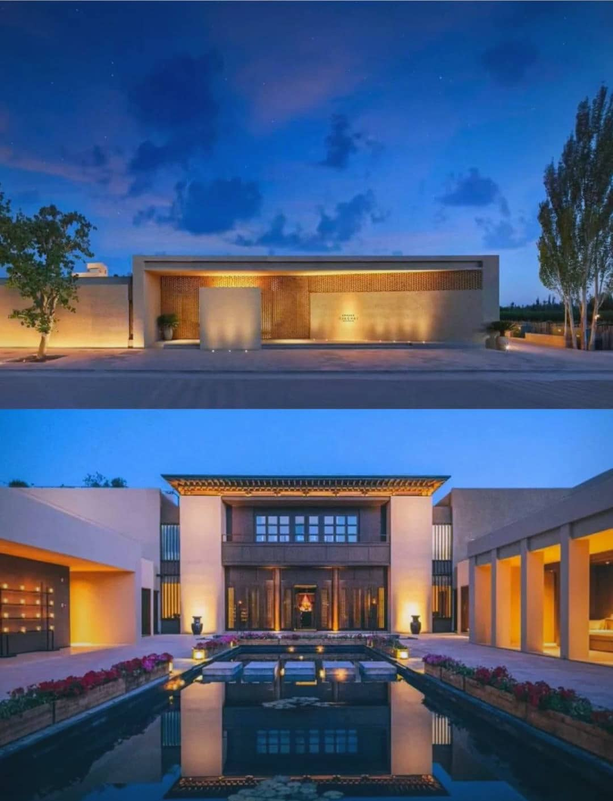
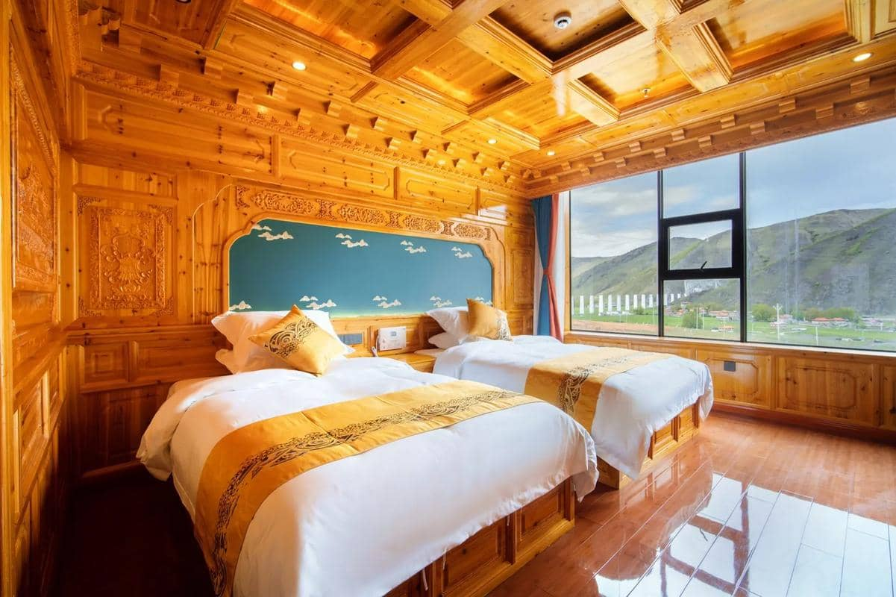

# Expat-Friendly Hotels in Gansu: The 2026 Accommodation & Registration Survival Guide

Imagine arriving in a remote Silk Road town at 11:30 PM after a 6-hour train ride, dragging your heavy luggage to the hotel front desk, only to be told: *"Sorry, we cannot accept foreign passport holders."*

Unfortunately, for international travelers in Northwest China, this scenario happens far more often than it should. 

Because of local public security regulations, Chinese accommodations must have a specialized electronic registration system (historically referred to as *Shewai* 涉外) to process non-Chinese passports. While top-tier international hotel chains in big cities have no issues, smaller boutique inns, Tibetan homestays, and budget hotels across Gansu often lack the system—or simply don't know how to operate it.

In this 2026 guide, we break down how to avoid registration nightmares, how to verify hotel compliance before booking, and share our curated list of foreign-friendly stays along the Gansu Silk Road loop.

---

## 1. The "Foreigner Registration" Rule: What You Must Know

Under Chinese immigration law, every foreign citizen staying overnight in mainland China must be registered with the local Public Security Bureau (PSB) within 24 hours.

### Why Hotels Turn Foreigners Away:
* **Missing Terminal Systems:** Many budget local chains (like certain 7 Days Inn or HanTing branches in rural areas) do not have the passport scanning hardware installed.
* **Language & Staff Hesitation:** Front desk staff in smaller towns who have never handled a foreign passport may panic or claim they "don't accept foreigners" simply because they don't know which fields to fill in the registration software.

> 💡 **2026 Insider Tip:** Never assume a hotel accepts international travelers just because it is listed on global booking sites like Booking.com or Agoda. Always cross-check or message the hotel directly asking: *"Do you accept international passport holders?" (接不接待外宾?)*

---

## 2. Handpicked Expat-Friendly Stays Across Gansu

To save you hours of stressful researching, here are tested, reliable options in key Gansu hubs that seamlessly process foreign passports and offer high English-service standards:

### A. Lanzhou (Transit Hub)
* **Luxury Pick: Hyatt Regency Lanzhou (兰州凯悦酒店)**
    * *Why stay here:* Panoramic views of the Yellow River, English-fluent concierge, and direct access to downtown food night markets.
* **Boutique Pick: Mercer Hotel / Legend Hotel Lanzhou (飞天大酒店)**
    * *Why stay here:* Located directly opposite Lanzhou West Railway Station (High-Speed Rail). Perfect for late-night train arrivals.

### B. Zhangye (Rainbow Mountains)
* **Top Pick: Silk Road Travelers Hostel / Kaoshan Tent Resort**
    * *Why stay here:* Excellent English-speaking staff who understand international hiking itineraries and can organize reliable morning taxis to the Danxia National Park.

### C. Dunhuang (Oasis & Desert)
* **Luxury Pick: Silk Road Dunhuang Hotel (敦煌山庄)**
    * *Why stay here:* Built in traditional Han-Tang architectural style with mud-brick walls. The rooftop breakfast terrace overlooks the Mingshashan Sand Dunes. Unforgettable views.
* **Desert Glamping: Custom Private Desert Camps**
    * *Warning:* Most public desert camps near the dunes have primitive pit toilets. If you want luxury desert camping with private showers, book through a licensed private operator.

### D. Gannan (Tibetan Plateau: Xiahe, Zagana & Langmusi)
* **Xiahe Pick: Norden Camp / Tara Palace Hotel**
    * *Why stay here:* Norden Camp offers world-class luxury yak-hair tents on the high grasslands. Tara Palace is located steps away from Labrang Monastery with heated rooms and full foreign registration compliance.
* **Zagana & Langmusi Note:** Traditional wooden Tibetan homestays in Zagana are incredibly atmospheric, but **90% of them cannot process foreign passports independently**. 

---

## 3. How to Book Compliant Hotels Without Stress

1. **Use Trip.com Instead of Booking.com:** Within China, **Trip.com (Ctrip's international arm)** is far more reliable than Booking.com. Trip.com explicitly displays a filter tag: *"Accepts Foreign Guests"* or *"Mainland Chinese Guests Only"*.
2. **Keep Physical Passport Copies Ready:** Keep a paper copy or a clear photo of your Chinese visa page and entry stamp on your phone; if the scanner malfunctions at a rural front desk, staff can manually enter the numbers.
3. **Arrive Before 10 PM in Rural Areas:** Rural hotel front desks often close early or switch to night-shift security guards who lack system access passwords.

---

## Gansu Hotel Planning Cheat Sheet

| City / Region | Foreign Acceptance Level | Best Booking Strategy |
| :--- | :--- | :--- |
| **Lanzhou** | 🟢 Very High (90%+ of mid-to-high hotels) | Book via Trip.com or global chains. |
| **Zhangye & Dunhuang** | 🟡 Moderate (50%-70% in downtown) | Stick to recommended 4-star+ hotels or verified hostels. |
| **Gannan (Tibetan Zone)** | 🔴 Low (20%-30% in rural villages) | **Do not book randomly.** Work with a private guide/chauffeur. |

---

## Let Us Handle Your Silk Road Lodging
Navigating hotel registration policies in high-altitude Tibetan villages or remote Gobi Desert oases shouldn't ruin your Silk Road adventure. 

When you book a private multi-day Gansu tour with us, we take care of all accommodation logistics. We hand-pick vetted, foreign-compliant boutique hotels, luxury desert glamping sites, and authentic Tibetan homestays with private bathrooms and heating—ensuring your check-ins are instant, smooth, and 100% legal.

Check out our [Gansu Overland Transit and Private Driver Guide](/blog/getting-around-gansu-train-flight-charter), or tap **Contact Me** at the top of the page to have Alex curate your custom 2026 Silk Road itinerary and hotel bookings today!
