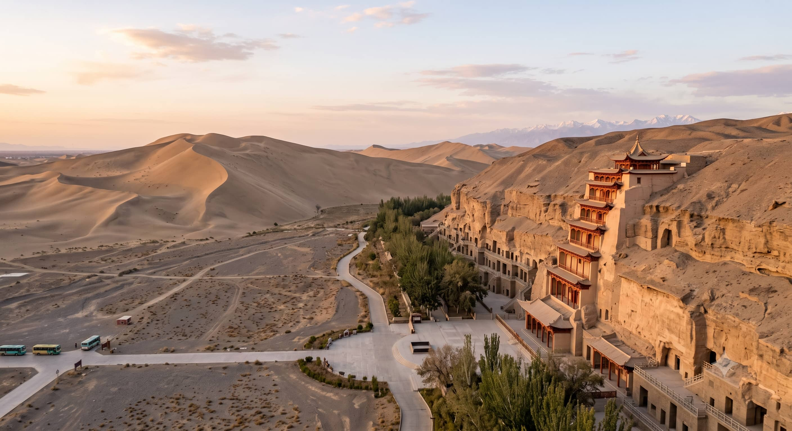
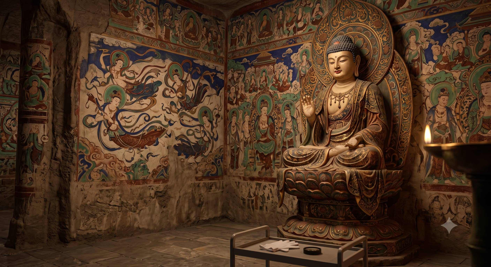

# How to Book Mogao Caves Tickets: A 2026 Survival Guide for Foreigners

The **Mogao Caves (Mogao Grottoes)** in Dunhuang are the holy grail of ancient Buddhist art. Housing over 45,000 square meters of brilliant murals and 2,000 painted sculptures spanning a millennium, it is an absolute bucket-list destination. 

However, it is also one of the most strictly regulated tourist sites in Asia. To preserve the delicate caves from humidity and carbon dioxide, the Chinese government caps daily visitor numbers. During the peak summer season (July to August), tickets sell out **seconds** after they are released. 

For international travelers, navigating the Chinese-only booking mini-programs without a local phone number or Chinese ID can be an absolute nightmare. If you turn up without a plan, you *will* be turned away at the gates. Here is your ultimate 2026 survival blueprint to secure your entry.

---

## 1. Understanding the Ticket Types: A-Ticket vs. B-Ticket

The reservation system offers two main categories of tickets for independent travelers. Knowing the difference is crucial for your itinerary.

### 🎟️ The A-Ticket (Normal Ticket) — *Highly Recommended*
*   **The Experience:** Includes 2 high-tech immersive digital movies at the Digital Exhibition Center, a shuttle bus to the cliff face, an **English-speaking expert guide** equipped with radio headphones, and entry to **8 standard caves**.
*   **Daily Cap:** 6,000 tickets per day.
*   **Price:** ~238 RMB.
*   **Booking Window:** Opens exactly **30 days in advance** at 7:00 AM (Beijing Time).

### 🎫 The B-Ticket (Emergency Ticket) — *The Backup Plan*
*   **The Experience:** Does **NOT** include the 2 digital movies. Includes a shuttle bus to the cliff face, but **no tour guide** (you join massive crowds shuffling through). Gives entry to only **4 standard caves**.
*   **Daily Cap:** 12,000 tickets per day (only released on specific peak days).
*   **Price:** ~100 RMB.
*   **Booking Window:** Typically opens 1–2 weeks in advance or on short notice during peak season.

---

## 2. The Nightmare: Why Foreigners Get Stuck

The official booking engine is the *Mogao Caves Reservation WeChat Mini-Program* or their domestic website. Here is why international tourists fail:
1.  **Language Barrier:** The system is 100% in Mandarin Chinese.
2.  **Identity Verification:** It requires inputting passport names perfectly matching the system's strict formatting, which often glitches with Western middle names.
3.  **Payment Bottleneck:** It requires immediate payment via WeChat Pay or Alipay. If your mobile payment authentication drops during the 5-minute checkout window, your reserved ticket is instantly released back to the public.

---

## 3. The 2026 Solutions: How to Secure Your Tickets Safely

If you are planning your Silk Road trip, use one of these three foolproof methods to guarantee you step foot inside the caves.

### Method A: Use Trip.com (The Easiest Self-Service Route)
The overseas version of **Trip.com** now integrates direct ticketing access for Mogao. You can pay in USD, Euro, or GBP using your international Visa/Mastercard. 
*   *Tip:* Set a calendar reminder for **32 days before your visit** and submit your booking on Trip.com. Their system will queue your passport details and automatically inject them into the official ticket pool the exact second the 30-day window opens.

### Method B: Book an Authoritative Local Agency (The Guarantee Route)
If the 30-day window has already opened and you see "SOLD OUT" on all online platforms, do not despair. Local authorized travel agencies in Gansu hold a separate allocation of "Group Tickets" and "Custom Tour Slots" that are not visible to the general public. 

---

## Summary Cheat Sheet for Mogao Caves

| Feature | A-Ticket | B-Ticket |
| :--- | :--- | :--- |
| **Caves Visited** | 8 Caves (Deep, detailed tour) | 4 Caves (Quick, crowded walk) |
| **English Guide?** | **Yes** (Included in price) | **No** (Must wander on your own) |
| **When to Book?** | Exactly 30 days prior | Only if A-Tickets are completely gone |
| **Total Duration** | ~3.5 to 4 hours | ~1.5 to 2 hours |

## Don't Let Logistics Ruin Your Silk Road Dream
Securing your Mogao ticket is only half the battle. Getting to the Digital Center from downtown Dunhuang requires reliable transit, especially in the 40°C (104°F) summer heat. 

We can bypass the booking headaches entirely for you. We offer all-in-one Dunhuang packages that combine **Guaranteed Mogao A-Tickets**, private air-conditioned vehicle transfers, and sunset tours of the Crescent Lake sand dunes. 

Head over to our [Gansu Transport and Chauffeur Comparison](/blog/getting-around-gansu-train-flight-charter) to understand regional movement, or click **Contact Me** at the very top of this page to email Alex directly with your travel dates and passport count—we'll handle the stress while you pack your camera gear!
