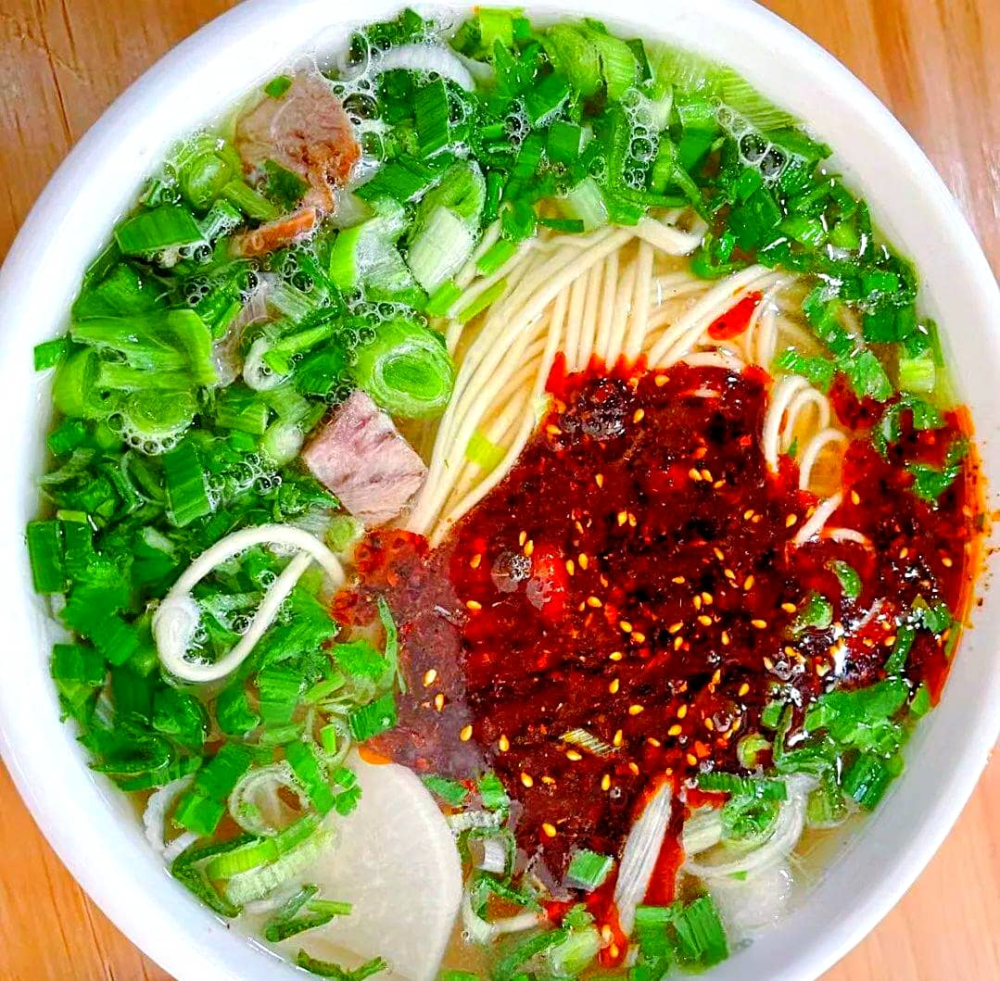
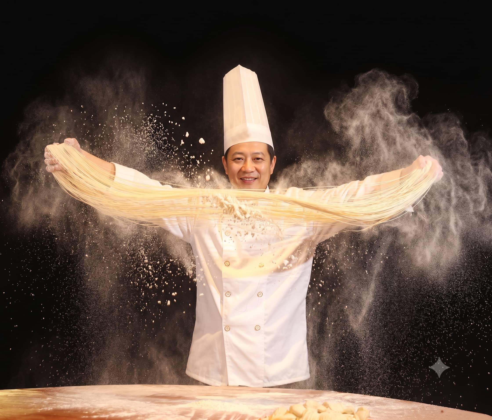

# The Ultimate Lanzhou Beef Noodles Guide: How to Order Like a Local

If you pass through Lanzhou, the provincial capital of Gansu and the gateway to the Silk Road, you cannot leave without eating a steaming bowl of **Lanzhou Beef Noodles (兰州牛肉面)**. 

To call it just "soup noodles" is an understatement. This is a culinary art form. Every single bowl is made entirely from scratch: a master noodle puller (Mianjiang) takes a lump of wheat dough and, in less than 30 seconds, slaps, stretches, and folds it into hundreds of uniform, delicate strands before plunging them into a roaring cauldron of clear, spice-infused beef broth.

However, entering a traditional, bustling Lanzhou noodle shop at 7:30 AM can be an absolute sensory overload. The queues are chaotic, the staff yell in local dialects, and you are expected to customize your noodle thickness, broth style, and meat toppings on the fly. 

If you just say *"Beef noodles, please"* in English, you will get blank stares. Here is your ultimate 2026 survival guide to decoding the secret language of Lanzhou's iconic comfort food.

---

## 1. The Five Golden Criteria of an Authentic Bowl

Locals don't judge a shop by its decor; they judge it by a strict historical formula known as **"One Clear, Two White, Three Red, Four Green, Five Yellow" (一清、二白、三红、四绿、五黄)**.

*   **1. Clear (清):** The broth must be crystal clear, brewed for over 5 hours with beef bones, yak meat, and over 20 secret spices (including Sichuan peppercorn and cumin).
*   **2. White (白):** Shaved slices of tender white radish parboiled in the broth.
*   **3. Red (红):** A generous ladle of vivid red chili oil floating on top.
*   **4. Green (绿):** A handful of freshly chopped cilantro (coriander) and garlic leeks.
*   **5. Yellow (黄):** The noodles themselves must have a distinct, pale-yellow hue from the natural ash wheat treatment, giving them a springy, chewy texture.

---

## 2. Decoding Noodle Thickness (The Secret Language)

When you hand your ticket to the noodle puller at the window, they will look at you and bark a single question in Chinese. They are asking what thickness you want. You must answer immediately with one of these traditional names:

### The Round Shapes (圆形面):
*   **Maoxi (毛细 - "Hair-Thin"):** Extremely fine, almost like angel hair pasta. It absorbs the broth instantly but goes soggy if you don't eat it within 3 minutes.
*   **Xi (细 - "Thin"):** The absolute standard. It has the perfect balance of broth absorption and chewiness. **If it's your first time, order this.**
*   **Erxi (二细 - "Double-Thin"):** Slightly thicker and highly muscular. This is the preferred choice of young Lanzhou locals who love a heavy, elastic bite.
*   **Sanxi (三细 - "Triple-Thin"):** Very thick, resembling thick spaghetti.

### The Flat Shapes (扁形面):
*   **Jiuye (韭叶 - "Leek Leaf"):** Flat and medium-wide, exactly the width of a Chinese leek leaf. It holds chili oil beautifully.
*   **Dakuan (大宽 - "Mega-Wide"):** Wide like a leather belt. It requires serious jaw work but offers an incredible texture.

---

## 3. The Ultimate Pro Moves: "Rou Dan Shuang Tiao"

If you just order a standard bowl (~8 to 10 RMB), it comes with only a tiny speck of meat. To eat like a true connoisseur, you must upgrade your order at the cashier using the local "black huanier" (local slang/custom pairings) formula:

*   **Order a portion of Beef (加肉 - Jia Rou):** A separate plate of cold, sliced spiced beef brisket.
*   **Order a Tea Egg (加蛋 - Jia Dan):** A savory, spiced hard-boiled egg.
*   **The Secret Phrase: "Rou Dan Shuang Tiao" (肉蛋双挑):** Say this to the cashier. It means *"Give me the double upgrade of extra meat AND an egg."* You dump the sliced beef and slide the egg directly into the hot chili broth. It is heaven in a bowl.

> 🌶️ **Chili Warning:** Lanzhou chili oil is famous for being incredibly fragrant and smoky, but *not* melt-your-face-off hot. However, if you cannot handle spice at all, loudly tell the noodle puller: **"Bu Yao La" (不要辣 - No chili)**. If you want a standard kick, say **"Normal La"**.

---

## Lanzhou Noodles Ordering Cheat Sheet

| English Meaning | Chinese Characters | Pinyin Pronunciation | When to Use |
| :--- | :--- | :--- | :--- |
| **Thin Noodles (Standard)** | 细的 | Xì de | When the puller asks for your shape preference. |
| **Flat & Medium Wide** | 韭叶 | Jiǔ yè | Great choice if you like flat pasta textures. |
| **Extra Meat & Egg Upgrade** | 肉蛋双挑 | Ròu dàn shuāng tiāo | Say this to the **cashier** when buying your ticket. |
| **More Chili Oil, Please!** | 多些辣子 | Duō xiē là zi | Say this to the **noodle puller** at the pickup window. |

---

## Start Your Silk Road Culinary Journey Flawlessly
Lanzhou Beef Noodles are strictly a breakfast and lunch affair; the best, clearest broth is served before 10:00 AM, and many legendary local shops close their doors by 2:00 PM. 

If you are arriving at Lanzhou Zhongchuan International Airport or Lanzhou West Railway Station, navigating the city's chaotic morning traffic to track down an authentic, non-touristy noodle institution while dragging heavy luggage can be incredibly stressful.

We provide premium, food-focused Lanzhou transit experiences. Our English-friendly local drivers will pick you up directly from your arrival gate in a spacious, air-conditioned vehicle, whisk you past the tourist traps straight to a century-old neighborhood noodle joint hidden in the back alleys, and help you order the perfect "Rou Dan Shuang Tiao" combo before connecting you to your high-speed train to Zhangye or Dunhuang.

Check out our [Gansu Train and Chauffeur Comparison Guide](/blog/getting-around-gansu-train-flight-charter) to plan your transit, or tap **Contact Me** at the very top of the page to customize your Lanzhou culinary layover itinerary with Alex today!
