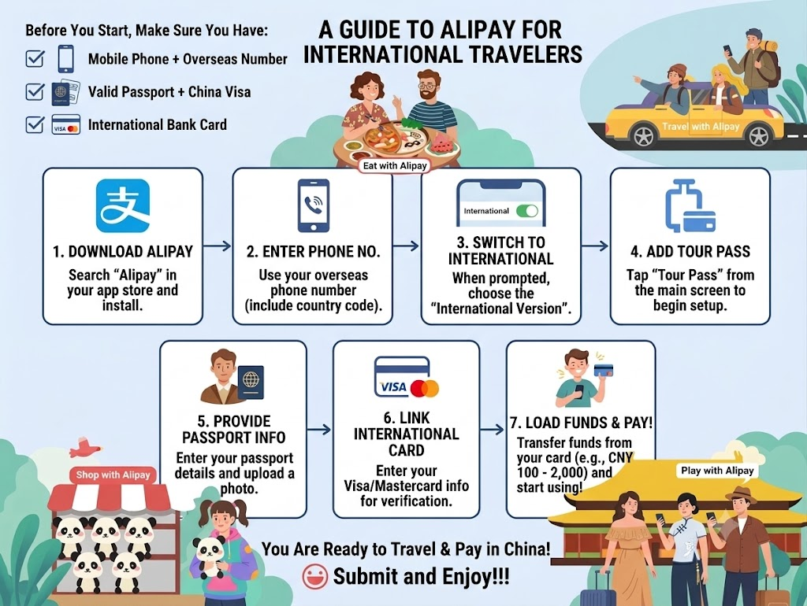

# Travelling Cashless in Northwest China: The Ultimate Payment Guide

Many foreign tourists worry about how to pay for things before arriving in Gansu. Since the Silk Road stretches across vast deserts and remote plateaus, you might wonder: *Do I need a mountain of cash? Can I use my international credit card?* The short answer is: **In 2026, China is almost 100% a cashless society, and Gansu is no exception.** From taxi drivers in Lanzhou to fruit vendors in Dunhuang, everyone uses QR codes. 

Fortunately, both **Alipay** and **WeChat Pay** now fully support international credit cards. Here is your step-by-step survival guide.

---

## 1. Why Cash is NOT Recommended in Gansu

While major tourist spots like the Mogao Caves or Zhangye Danxia will accept cash at official ticket booths, day-to-day travel is a different story. 

* **Local Taxis:** Most drivers in Lanzhou or Jiayuguan do not carry enough paper change.
* **Night Markets:** Street food vendors in Dunhuang handle hundreds of digital transactions a minute; stopping to count cash slows them down significantly.
* **Convenience:** Having digital payment linked to your phone makes renting camels in the desert or ordering Dunhuang Apricot Peel Tea seamless.

---

## 2. Step-by-Step: How to Set Up Alipay with a Foreign Card

Alipay is the friendliest app for international travelers and seamlessly integrates with **Trip.com** for high-speed rail bookings.

1. **Download the App:** Search for "Alipay" in the Apple App Store or Google Play Store.
2. **Sign Up:** Register using your international mobile phone number (ensure you can receive SMS verification codes).
3. **Switch to International Version:** The app should automatically switch, offering a clean, English-friendly interface.
4. **Add Your Card:** Go to **Account** -> **Bank Cards** -> **Add Card**.
5. **Enter Details:** Input your Visa, Mastercard, or Diners Club info. You will need to complete a standard 3D Secure verification from your home bank.

*Figure 1: Follow the clean English layout to bind your passport and international card.*

---

## 3. Setting Up WeChat Pay (The Alternative)

WeChat is primarily a messaging app, but its payment feature (**WeChat Pay**) is equally powerful in China.

1. Download **WeChat** and create an account.
2. Go to **Me** -> **Services** -> **Wallet** -> **Cards**.
3. Tap **Add a Card** and fill in your foreign credit card details.

> 📌 **Pro-Tip:** Setup **both** apps before flying into China. Sometimes, a remote vendor in Gannan (Southern Gansu) might have a weak signal on one network, and having a backup payment method will save your day.

---

## 4. Crucial Survival Tips for Gansu Payment

Before you catch your train from Lanzhou to the Gobi Desert, keep these golden rules in mind:

### Watch Out for Transaction Fees

For transactions under **200 RMB** (like buying noodles, bus tickets, or souvenirs), Alipay and WeChat **do not charge any fees**. For transactions above 200 RMB, a 3% fee applies. 

### Keep a "Emergency 200 RMB" Cash Stash

When hiking deep into the Singing Sand Dunes of Dunhuang or driving through the high-altitude grasslands of Gannan, cell service can drop. Always keep around 200-300 RMB in paper cash in your backpack just in case the internet goes down.

### Notify Your Home Bank Before Traveling

Because mobile transactions in China look like "online internet purchases" to your home bank, your fraud prevention system might block them. Call your bank or use their app to set a travel notice for China.

---

## Summary: Your Next Steps

1. Get your phone ready and bind your card using our guide above.
2. Ensure your phone has a stable data roaming plan or buy an eSIM before landing.
3. [Check out our guide on Train vs Flight in Gansu](/blog/getting-around-gansu-train-flight-charter) to plan your transit!
