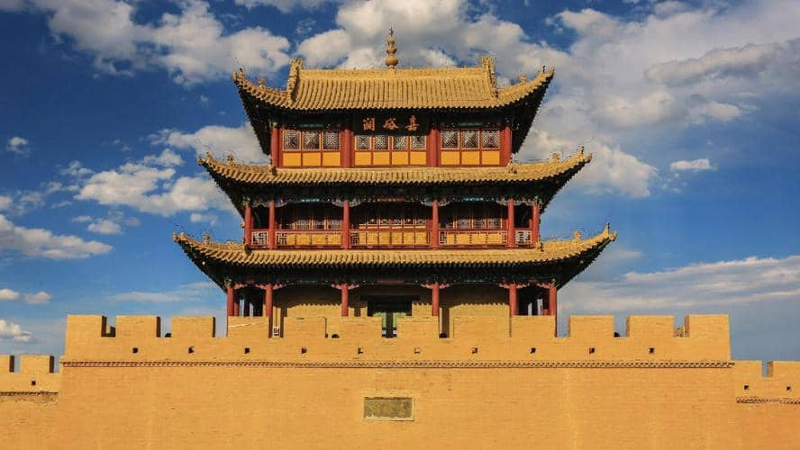
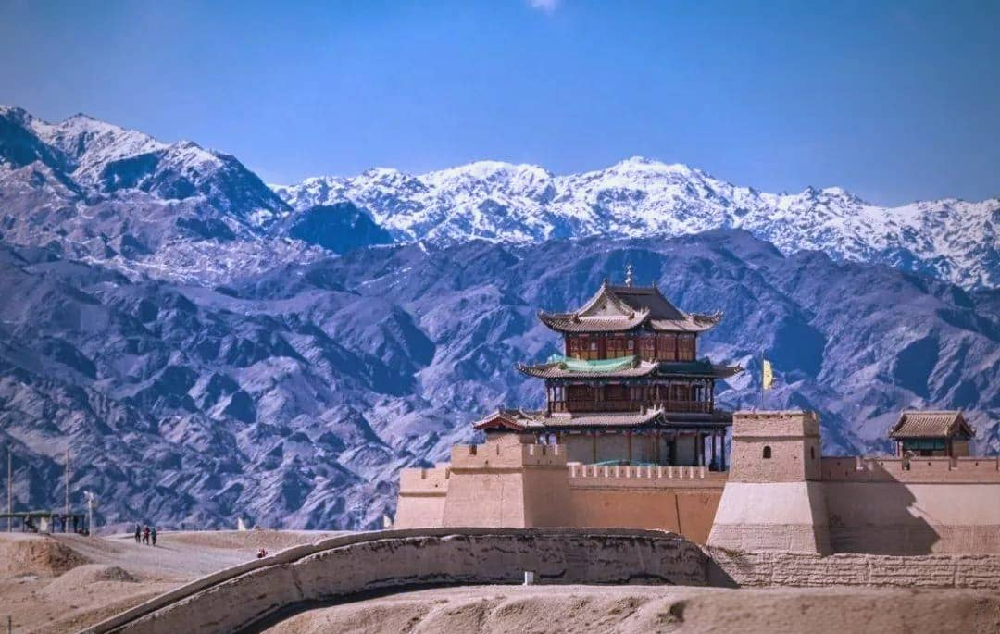

# Jiayuguan Pass Guide: Visiting the Western End of the Great Wall

Rising abruptly from the windswept Gobi Desert with the majestic, snow-capped **Qilian Mountains** looming in the background, **Jiayuguan Pass (嘉峪关关城)** is one of the most formidable and iconic military structures in Asian history.

Built in 1372 during the early Ming Dynasty, Jiayuguan was known for centuries as **"The First and Greatest Pass Under Heaven" (天下第一雄关)**. It marked the absolute westernmost boundary of Imperial China. Beyond these massive mud-brick gates lay the wild, unknown territories of the Western Regions (*Xiyu*), vast deserts, and unpredictable Silk Road frontier tribes.

For international travelers exploring the Hexi Corridor between Zhangye and Dunhuang, Jiayuguan is an unmissable historical and photographic landmark.

In this 2026 guide, we cover the history, the three key sites that make up the defense complex, and essential photography tips.

---

## 1. The Three Elements of the Jiayuguan Defense System

Jiayuguan is not just a single castle; it is an integrated military defense network composed of three primary attractions:

### A. Jiayuguan Fort (The Main Fortress - 嘉峪关关城)
The centerpiece of the complex. It features a trapezoidal double-walled fortress with three inner defense rings, massive watchtowers, arched gateways, and a dry moat. 
* **The Legend of the Extra Brick:** Look out for a single loose brick resting above the rear rampart ledge of the Rouyuan Gate. Legend says the chief architect calculated the exact number of bricks needed for construction down to 99,999. When the official questioned his precision, he added one extra brick—which remains untouched to this day.

### B. The Overhanging Great Wall (Xuanbi Changcheng - 悬壁长城)
Located 8 kilometers northern slope of Black Mountain (*Heishan*), this section of the Great Wall clings dramatically to a 45-degree steep ridge. 
* **The Experience:** Climbing the steep stone steps rewards you with a breathtaking, 360-degree panoramic view of the Gobi Desert and distant mountain chains.

### C. The First Pier of the Great Wall (Taolai River Pier - 长城第一墩)
Situated 7.5 kilometers south of the fort, this massive earthen mound sits perched on the edge of a sheer 80-meter canyon carved by the Taolai River. It is the absolute starting point of the Ming Dynasty Great Wall.

---

## 2. Best Photography Spots & Lighting Strategy

Jiayuguan is a dream location for heritage and landscape photographers:

1. **The Classic Reflection Pool:** Inside the main fort park, shoot the reflection of the three-tiered watchtower across the small Willow Lake (*Jiayuguan Lake*) during early morning.
2. **The Qilian Snow Peak Backdrop:** Stand on the western ramparts looking east or south. Use a telephoto lens (70-200mm) to compress the ancient battlements against the massive white glaciers of the Qilian Mountains.
3. **Overhanging Wall Sunset:** Climb to the top tower of the Overhanging Great Wall 1 hour before sunset to capture the long shadows cast by the wall across the desert canyons.

---

## 3. Practical Logistics for International Visitors

* **Location:** Jiayuguan City, central Gansu Province. It sits conveniently between Zhangye (2 hours by bullet train) and Dunhuang (4.5 hours by car).
* **Combined Pass Ticket:** The official entry ticket covers all three main sites (The Fort, Overhanging Wall, and First Pier). Electric shuttle carts inside the main fort require a small extra fee (~15 RMB).
* **Getting Between Sites:** The three sites are separated by 8 to 15 kilometers of open desert road. There are no direct public buses connecting all three efficiently. **A private charter car or taxi is essential** to cover all three in a single afternoon.

---

## Jiayuguan Pass Visit Summary

| Metric | Details |
| :--- | :--- |
| **Recommended Time** | 3 to 4 Hours total for all 3 sites |
| **Best Season** | May to October (mornings and late afternoons offer cool breezes) |
| **Pacing Strategy** | Ideal mid-way overland stop between Zhangye and Dunhuang |

---

## Explore the Great Wall's Frontier with Alex

Trying to coordinate local taxis across three spread-out desert sites while managing luggage between train rides can be exhausting.

**We turn Jiayuguan into a smooth, scenic pitstop on your Silk Road journey.**

When you travel overland with our private driver service, you can effortlessly explore Jiayuguan at your own pace:
* **Seamless Overland Transfer:** We pick you up at your Zhangye hotel, visit Jiayuguan's three fortress sites comfortably, and drive you straight to your Dunhuang hotel by evening.
* **Luggage Security:** Keep all your heavy bags safely inside our private vehicle while you hike the Overhanging Wall.
* **Pro Photo Timing:** We time your arrival to ensure you catch the absolute best light over the fort and Qilian snow peaks.

Check out our [7-Day Silk Road Itinerary Guide](/blog/7-day-silk-road-itinerary-lanzhou-to-dunhuang) to see how Jiayuguan fits into your route, or hit **Contact Me** at the top of the page to lock in your private Silk Road driver today!
