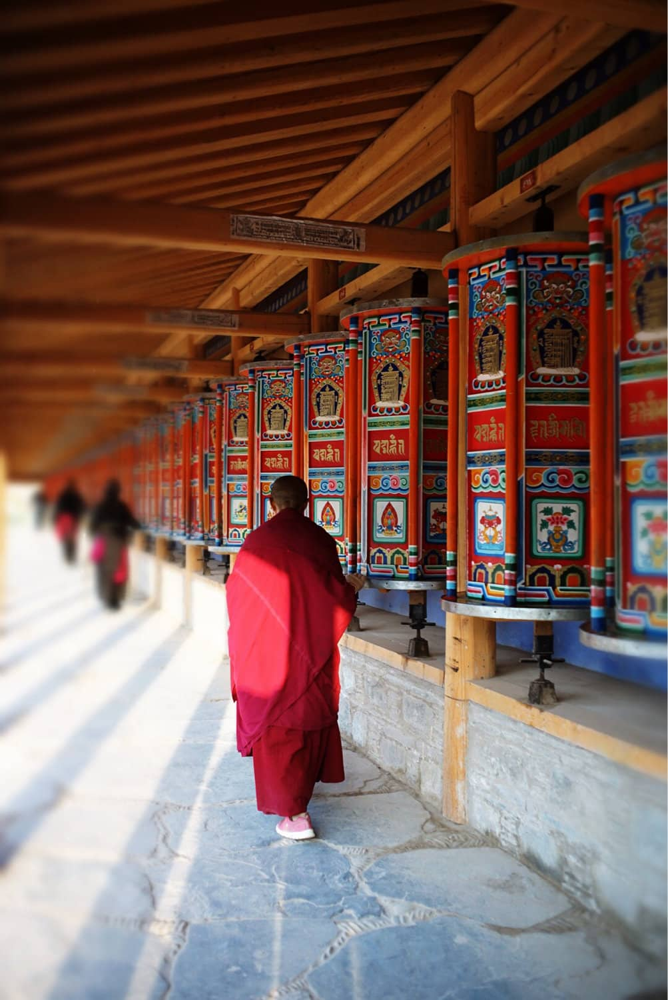
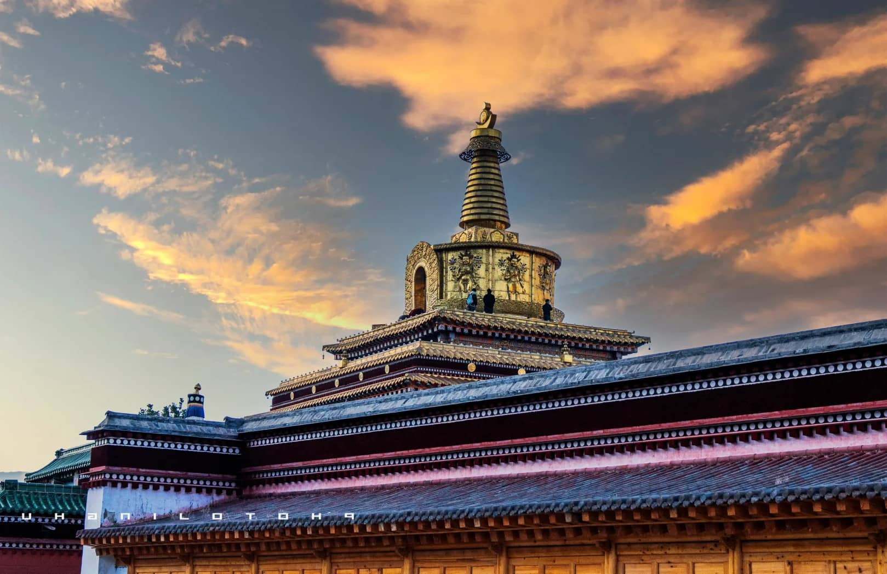

# Labrang Monastery Guide: Exploring the Heart of Eastern Tibet Without a Tibet Permit

For many international travelers, experiencing the raw, mystical beauty of Tibetan Buddhism is a lifelong dream. However, navigating the strict permit regulations, mandatory tour groups, and high costs of entering the Tibet Autonomous Region (TAR) can be incredibly daunting. 

Here is the best-kept travel secret in China: You don't need a Tibet permit to experience authentic Tibetan culture. 

Located in Xiahe, a small valley town in southern Gansu’s Gannan Tibetan Autonomous Prefecture, **Labrang Monastery** is home to the largest population of monks outside of Lhasa. Sitting at an altitude of 3,200 meters, this massive monastic city allows independent foreign travelers to freely wander among golden-roofed temples, crimson-robed monks, and sweeping high-altitude grasslands using just a standard Chinese tourist visa.

In this 2026 guide, we breakdown how to get to Xiahe, cultural etiquette, and the best vantage points for breathtaking travel photography.

---

## 1. The Ultimate Cultural Experience: Walking the World’s Longest Kora

A *Kora* is a sacred pilgrimage path walked clockwise around a Buddhist site. Labrang Monastery boasts the longest Kora in the world, stretching over **3.5 kilometers** and lined with more than 1,700 copper prayer wheels.

### How to Join the Pilgrimage:
*   **Follow the Devotion:** Wake up around 6:30 AM to join hundreds of local Tibetan pilgrims spinning the wheels. The rhythmic creaking of the copper, the smell of burning juniper incense, and the low chanting create an unforgettable atmosphere.
*   **The Golden Rule:** You **MUST** walk the path clockwise. Never spin the prayer wheels counter-clockwise, as this is considered highly disrespectful.

---

## 2. Best Photography Viewpoints in Xiahe

Labrang is a sprawling complex of over 18 golden temples, monk residences, and colleges. To truly capture its scale against the surrounding mountains, you need to know where to shoot.

### Viewpoint 1: The Gongtang Pagoda & Southern Ridge (The Sweeping Vista)
*   **Where it is:** Cross the Daxia River to the south of the monastery and climb up the hillside paths, or climb to the top tier of the golden Gongtang Pagoda (entry ~20 RMB).
*   **The Shot:** This is the best place to use a wide-angle lens ($16-35mm$). During the late afternoon, the setting sun hits the gilded roofs of the main assembly halls, turning the entire valley into a sea of gold and crimson.

### Viewpoint 2: The Alleyways (For Abstract Light and Shadow)
*   **Where it is:** Wander deeply into the residential alleyways between the white-washed mud walls and dark red wooden doors.
*   **The Shot:** Keep a telephoto lens ($70-200mm$) ready. The contrast between the shadows of the narrow alleys and the bright mountain sun creates dramatic lighting. If a monk walks past in their flowing dark-burgundy robes, the composition is pure magic.

---

## 3. Strict Etiquette and Photography Warnings

Because Labrang is an active place of worship and monastic education—not a theme park—you must adhere to strict cultural guidelines to avoid altercations or causing offense.

*   **NO Photos Inside Temples:** Photographing the interior of any chapel, Buddha statue, or mural is strictly forbidden. Keep your lens cap on inside.
*   **Asking Before Portraiture:** Tibetan monks and local nomads are often very welcoming, but always gesture or ask *"May I?"* before pointing a camera at their faces. If they wave their hand or look away, put the camera down immediately.
*   **Dress Warmly and Respectfully:** No shorts, skirts, or sleeveless tops are allowed inside the temple compounds. Even in July, Xiahe’s high altitude means mornings can drop to a chilly 10°C (50°F), so packing a windbreaker is essential.

---

## Xiahe Logistics Cheat Sheet

| Detail | 2026 Advisory | Traveler's Note |
| :--- | :--- | :--- |
| **Altitude Warning** | 3,200 meters (10,500 feet) | Walk slowly on Day 1. Avoid heavy alcohol to prevent altitude sickness. |
| **Monastery Entry Fee** | ~40 RMB for main halls | Walking the outside Kora and alleyways is 100% free. |
| **Best Season** | June to September | The summer grasslands are lush green. Winters are brutally cold but offer fewer tourists. |

---

## Getting to Gannan Safely and Comfortably
There are no train stations or commercial airports in Xiahe. Most independent travelers take a 3-hour public bus from Lanzhou, but these buses are prone to delays, have limited departures, and leave no room for large luggage or camera cases. Furthermore, navigating from Xiahe deeper into the breathtaking grasslands of **Sangke** or the stone village of **Zagana** is impossible without private transit.

To maximize your time capturing the raw beauty of Eastern Tibet, we recommend a seamless overland private car connection. We provide English-friendly, licensed local drivers who know the best roadside lookouts across Gannan.

Check out our comprehensive [Gansu Overland Transit Comparison](/blog/getting-around-gansu-train-flight-charter), or click **Contact Me** at the very top of this page to email Alex directly for a custom 3-day Gannan Tibetan culture tour itinerary.
