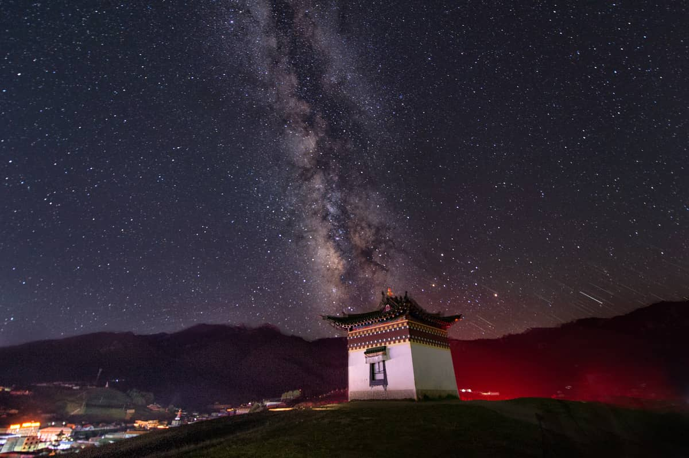
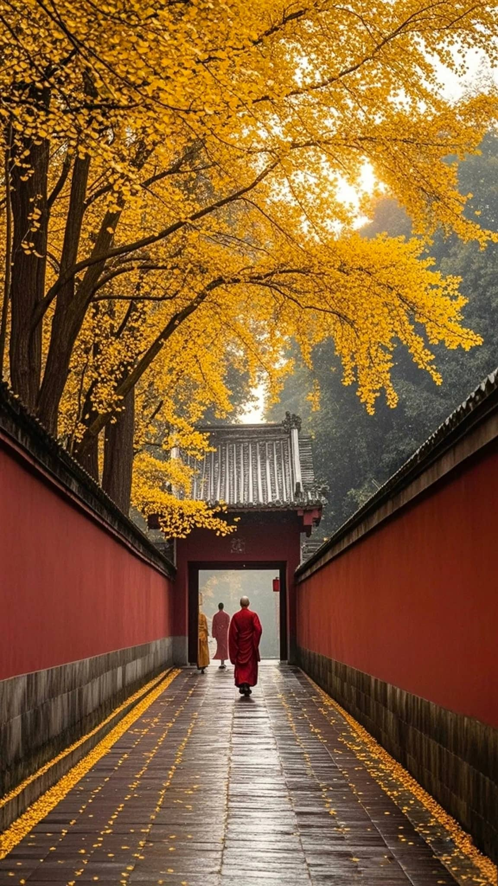

# Langmusi Travel Guide: Sky Burials, Monastic Life, and Milky Way Photography

Perched on the mountain border of Gansu and Sichuan provinces, the valley town of **Langmusi** (also known as Taktsang Lhamo) feels completely detached from the modern world. Split in two by a narrow, bubbling stream known as the "White Dragon River," this high-altitude alpine settlement (~3,300 meters) is dominated by two massive Tibetan monasteries glistening under snow-capped peaks.

For international travelers, Langmusi offers a raw, unfiltered encounter with Tibetan cosmic philosophy and pristine wilderness. It is one of the very few accessible places where independent foreign tourists can witness an ancient **Sky Burial (Jhator)**, while its pitch-black alpine plateau skies offer a perfect canvas for astrophotography.

However, entering this spiritually charged territory requires an iron-clad understanding of local taboos. Here is your respectful 2026 survival and photography blueprint.

---

## 1. Witnessing a Tibetan Sky Burial: The Strict Code of Conduct

In Tibetan Buddhism, a Sky Burial is not a tourist spectacle; it is a profound sacred ritual. The body of the deceased is offered to sacred vultures, a final act of ultimate generosity and an illustration of the impermanence of life. 

The sky burial site in Langmusi is located on a sweeping hillside behind the Sertri Monastery (the Gansu side). If you choose to go, you must follow these absolute rules:

* **NO PHOTOGRAPHY WHATSOEVER:** This is non-negotiable. Pointing a camera, phone, or drone at the sky burial site during a ritual is a severe violation of local religious laws and deeply traumatizing to the grieving families. **Keep your camera inside your backpack until you have left the valley completely.**
* **Maintain Distance:** Do not blend into the family circle. Stand far back on the surrounding ridges, remain completely silent, and do not whisper, laugh, or point.
* **The Timing:** Rituals typically take place in the cold dawn hours (around 6:00 AM – 7:30 AM), but they do not happen every day. Do not ask locals or monks for a "schedule." If you see large flocks of vultures circling the northern valley at dawn, a ritual is likely underway.

---

## 2. Capturing the Milky Way Over the Alpine Monasteries

Once the heavy religious solemnity of the day passes, Langmusi transforms into an astrophotographer’s paradise. Because the town is nestled deeply inside a mountain bowl with minimal street lighting, the light pollution is nearly zero.

### The Ultimate Star Shot: The Red Cliff Ridge (Hongshi Ya)
* **Where it is:** Hike up to the jagged red sandstone cliffs overlooking the town from the north. 
* **The Shot:** Point your camera south-east toward the golden rooftops of Kerti Monastery. During July and August, the core of the **Milky Way** arcs vertically directly above the Tibetan prayer flags waving on the peaks.
* **Lens Settings:** Use your fastest wide-angle lens ($14-24mm, f/1.8$ or $f/2.8$). Shoot at $ISO\ 3200$ with a 20-second exposure to keep the stars sharp without capturing the earth's rotation trail.

---

## 3. Navigating the Gansu vs. Sichuan Divide

Langmusi is geographically unique because the town is split into two provinces by a tiny stream. You will want to visit both sides to capture different lighting styles.

### The Gansu Side (Sertri Monastery)
* Climbs steeply up the northern slopes. It offers the best bird’s-eye panoramic views of the entire valley during sunset.

### The Sichuan Side (Kerti Monastery)
* Sprawls across the flatter southern meadows. It features a spectacular, dark pine forest canyon at the rear where you can hike directly to the source of the White Dragon River, capturing beautiful shots of monks walking past ancient limestone caves.

---

## Langmusi Alpine Travel Breakdown

| Metric | 2026 Specification | Photographer's Note |
| :--- | :--- | :--- |
| **Altitude Caution** | 3,300m to 3,600m | Night photography on the ridges gets dangerously windy and freezing. Pack thermal underwear even in August. |
| **Monastery Fees** | ~30 RMB for each side | Tickets are checked at the footbridges spanning the river. |
| **Local Wildlife** | Tibetan Mastiffs | Do **NOT** wander onto the high hillsides alone at night. Local nomad tents are protected by aggressive mastiffs. |

---

## Conquer the High-Altitude Border Safely
Langmusi is a 4-hour drive from Xiahe and nearly 7 hours away from the provincial capital of Lanzhou. There are no trains or nearby commercial flights. Public buses are sparse, requiring multiple transfers in rural town hubs where English is completely non-existent. Furthermore, arriving after dark without an arranged vehicle means facing sub-zero alpine temperatures and dark, unlit roads.

To experience the deep spiritual energy of Langmusi and capture its star-filled skies without safety worries, our private overland tours are the gold standard. We provide high-clearance 4WD vehicles, warm thermal gear for your night shoots, and local Tibetan-speaking guides who ensure your interactions remain completely respectful.

Take a look at our [Gansu Overland Transit Comparison Matrix](/blog/getting-around-gansu-train-flight-charter) to plan your routing, or click **Contact Me** at the top of the page to lock in Alex as your personal cultural guide across the Tibetan border!
