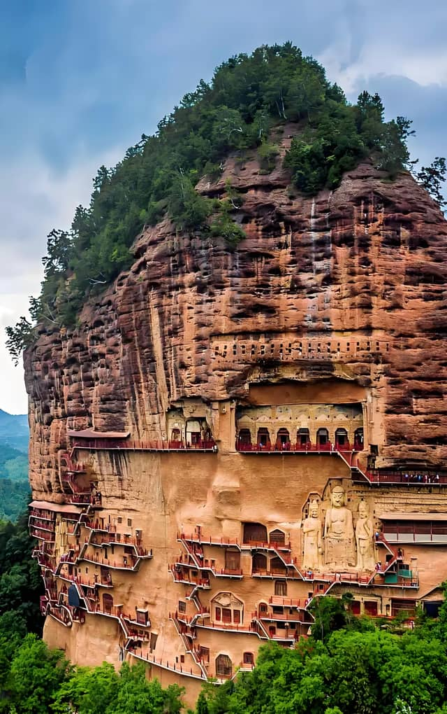
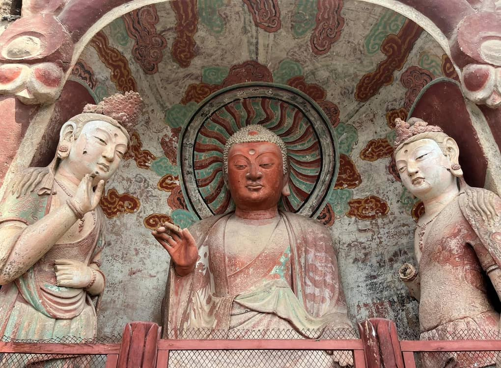

# Maijishan Grottoes Guide: Exploring the Oriental Sculpture Museum on a Cliff

Rising like a giant solitary wheat stack out of the lush pine forests of the Xiaolongshan Mountains, **Maijishan (麦积山)** is one of the most visually stunning UNESCO World Heritage sites along the ancient Silk Road.

Meaning *"Wheat Stack Mountain"* in Chinese due to its unique mesh-like sandstone silhouette, this 142-meter-isolated peak houses one of the four great grotto complexes of China (alongside Mogao, Longmen, and Yungang).

However, unlike the flat desert caverns of Dunhuang, Maijishan's treasures are carved into the sheer, vertical rock face. Visitors must navigate a dizzying network of wooden and metal catwalks clinging to the precipice, offering an exhilarating bridge between ancient art and high-altitude cliff hiking.

Known globally as the **"Oriental Sculpture Museum,"** Maijishan offers international travelers an unforgettable cultural stop in eastern Gansu.

---

## 1. The Artistic Marvel: What Makes Maijishan Unique

While Dunhuang is famous for its flat, vivid wall paintings, Maijishan is world-renowned for its exquisite **clay sculptures and 3D relief statues**.

Dating back to the Later Qin period (384–417 AD), artists spent over 1,600 years carving more than 10,000 Buddhist statues and 221 cave chapels directly into the porous clay-rock cliff.

### Highlights You Must See:
* **The Giant Cliff Buddhas (Cave 13 & Cave 98):** Massive, 16-meter-tall triadic Buddha statues carved onto the open rock face, overlooking the forested valley below.
* **Cave 4 (The Upper Temple of Seven Buddhas):** Suspended 80 meters above ground, this grand hallway features delicate Northern Zhou dynasty murals and lifelike guardian statues with remarkably expressive faces.
* **Cave 133 (The Smiling Monk):** Houses the famous "Young Disciple" statue whose subtle, peaceful smile has been compared by art historians to Da Vinci's Mona Lisa.

---

## 2. Navigating the Cliff Catwalks: Safety & Accessibility

The defining experience of visiting Maijishan is walking along the sprawling staircases suspended mid-air.

* **Is it Safe?** Yes. Originally constructed from wooden logs driven into cliff holes, the entire walkway system has been reinforced with concrete pillars, steel frames, and thick safety railings.
* **Vertigo Warning:** If you have severe acrophobia (fear of heights), take note: the walkways feature open metal grates where you can look straight down through your feet to the forest floor below.
* **One-Way Traffic Flow:** During peak hours, the park enforces a strict one-way walking loop to prevent congestion on the narrow stairs.

---

## 3. Practical Logistics for International Travelers

### How to Get There:
* **Gateway City:** Tianshui (天水), eastern Gansu Province.
* **High-Speed Rail Access:** Tianshui South Railway Station (*Tianshuinan*) is directly connected by bullet train to **Xi'an (1.5 hours)** and **Lanzhou (1.5 hours)**, making it the perfect transit stop when entering Gansu from Xi'an.
* **Local Transit:** Maijishan sits about 45 kilometers southeast of Tianshui city center (approx. 50 minutes by taxi or private car).

---

## Maijishan Grottoes Visit Summary

| Metric | Details |
| :--- | :--- |
| **Recommended Time** | 3 to 4 Hours total (including electric shuttle from visitor center) |
| **Best Travel Season** | **May to November** (Autumn foliage turning golden across the mountains in October is spectacular) |
| **Pacing Strategy** | Ideal 1-Day stopover when traveling between Xi'an and Lanzhou |

---

## Experience Silk Road Masterpieces with Alex

Trying to coordinate luggage storage at train stations, arrange local private transfers, and decipher ancient Buddhist iconography without English guides can be challenging.

**We turn your Tianshui stopover into an effortless, inspiring highlight.**

When you travel across Gansu with our private driver and custom itinerary services, we ensure a completely stress-free experience:
* **Seamless Xi'an-to-Gansu Overland Route:** We pick you up right from Tianshui High-Speed Rail Station, take care of your heavy bags, and handle all entrance logistics smoothly.
* **Crowd Avoidance Timing:** We time your cliff climb during early morning hours to ensure quiet, peaceful photography along the high catwalks.
* **Gourmet Local Stops:** After exploring the grottoes, we take you to taste Tianshui's famous local specialties, including hand-pulled *Gua'gan* noodles and spicy Hot Pot.

Read our [7-Day Silk Road Itinerary Guide](/blog/7-day-silk-road-itinerary-lanzhou-to-dunhuang) to see how Tianshui fits into your overland travel plan, or click **Contact Me** at the top of the page to customize your Silk Road journey today!
