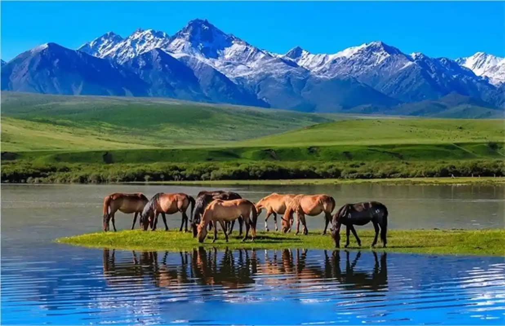
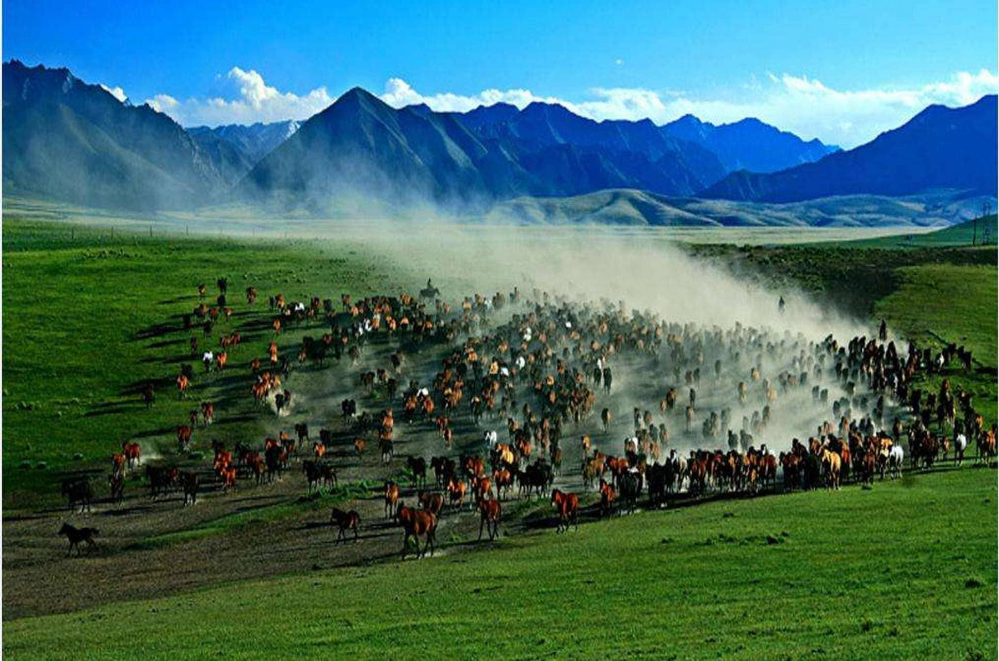

# Galloping Under Snow Peaks: The Ultimate Guide to Shandan Army Horse Farm

Tucked away in the emerald valleys at the northern base of the snow-capped **Qilian Mountains (祁连山)** lies a destination so remote and historic that most Western guidebooks don't even have a page for it.

This is **Shandan Army Horse Farm (山丹军马场)**. 

Originally founded in 121 BC by the legendary Han Dynasty general **Huo Qubing**, this vast high-altitude pasture has bred warhorses for every major Chinese empire, from the Tang knights to the People’s Liberation Army cavalry. Spanning over 2,000 square kilometers at an elevation of 2,700 meters, it is officially recognized as the **oldest and largest horse-breeding ranch in the world**.

For adventurous travelers seeking pristine grasslands, nomadic history, and raw epic horse culture far away from tour groups, Shandan is the ultimate Silk Road detour.

---

## 1. The Heritage of the Shandan Horse

For over two millennia, this ranch has perfected the breeding of the **Shandan Horse**. 

Crossbred with native wild steppe horses and legendary "Heavenly Horses" (*Tianma*) imported from Central Asia, these beasts are uniquely adapted to high-altitude warfare. They are stocky, highly resilient to cold, sure-footed on steep mountain gravel, and possess incredible endurance. 

While the military era of cavalry has largely passed, the ranch still maintains thousands of horses grazing on the rolling plains beneath the glaciers.

---

## 2. Top Experiences: What to Do in Shandan

Visiting Shandan is about reconnecting with the wild. Here are the experiences you cannot miss:

### A. Horseback Riding Across the Steppe
Unlike commercial tourist ranches in China where your horse is led on a short pedestrian leash, Shandan offers true, unbridled freedom. You can hire a local Tibetan or nomadic guide to take you deep into the Qilian foothills. 
* *The Experience:* Ride through fields of blooming golden rapeseed flowers (in July/August) with 5,000-meter snow peaks framing your horizon. 

### B. Witnessing the "Thousand Horse Gallop" (万马奔腾)
During mid-summer, at specific times of the day, the herdsmen drive hundreds of horses down from the high mountain pastures to drink at the riverbanks. The sight and sound of hundreds of hooves thundering across the Gobi streams, throwing up dust and water against the backdrop of the Qilian Mountains, is a photographer's dream.

### C. Exploring Luanbaotuan (鸾鸟湖 Lake) & Gorges
Deep inside the ranch territory lie pristine, untouched emerald-green alpine lakes and sheer rocky gorges where you can hike for hours without seeing another tourist.

---

## 3. Critical Logistical Warnings for International Travelers

Because Shandan Horse Farm remains an active agricultural and semi-military zone, it requires careful logistical preparation:

* **The Road Infrastructure:** The ranch is split into several branches (Site 1, Site 2, Site 3, and Site 4). **Site 3 (三场)** is the most scenic for tourists. However, the access roads from Shandan town or Zhangye are rough, unpaved gravel roads prone to washouts during rain. A 4WD SUV is highly recommended.
* **The Altitude & Weather:** At 2,700 to 3,200 meters, the weather can change in minutes. Even in July, a sunny afternoon can instantly turn into a freezing rain or hailstorm. Always pack a heavy windproof jacket and thermal layers.
* **Lack of English Services:** There are zero English signs, and the local herdsmen speak a heavy Northwest dialect. Booking rides and finding the best photographic viewpoints requires a local guide or translator.

---

## Shandan Horse Farm Travel Metrics

| Metric | Details |
| :--- | :--- |
| **Best Visiting Window** | July to early September (when grasslands are lush and flowers bloom) |
| **Location** | ~130 km southeast of Zhangye City (approx. 3 hours drive one-way due to rough roads) |
| **Recommended Stay** | 1 to 2 Nights in a local rustic guesthouse or grassland yurt |

---

## Ride the Silk Road Steppes with Alex

Shandan Army Horse Farm is the absolute antithesis of a crowded, commercialized tourist trap. It is vast, windy, rugged, and deeply poetic. But trying to navigate its unpaved mountain tracks, coordinate with local herdsmen for horse rentals, and secure a clean grassland stay on your own is incredibly challenging.

**That is where we come in.**

We have maintained personal relationships with the veteran herdsmen of Shandan's Site 3 for years. When you book a private overland Gansu journey with us, we arrange:
* **Rugged 4WD SUVs:** Built to handle the bumpy mountain passes of the Qilian range comfortably.
* **Authentic Horseback Treks:** Tailored to your riding experience level, led by trusted local horsemen.
* **The Ultimate Photo Setup:** We coordinate with local herdsmen to position you at the absolute best private riverbanks to capture the legendary "Thousand Horse Gallop" at perfect golden hour lighting.

Ready to leave the concrete world behind? Check out our [2026 Northwest Cultural Taboos Guide](/blog/5-cultural-taboos-northwest-china-foreigner-guide) to prepare for your journey, or hit **Contact Me** at the top of the page to customize your custom Gansu itinerary today!
