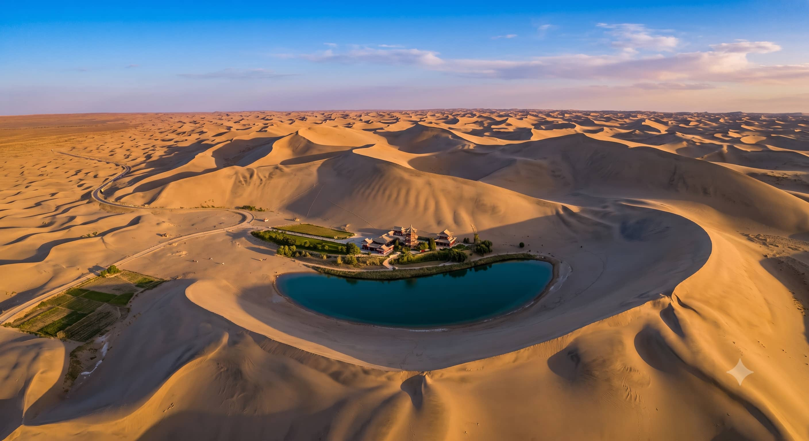
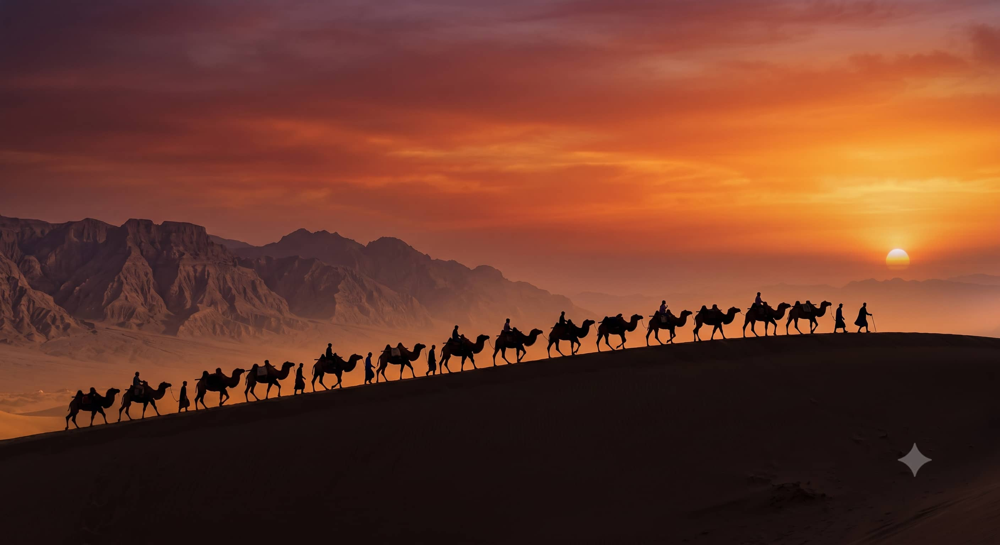

# The Ultimate Guide to Dunhuang's Singing Sand Dunes and Crescent Moon Lake

If you have ever dreamed of standing atop a massive wind-swept sand dune as the sun dips below the horizon of the ancient Silk Road, **Mingshashan (Singing Sand Dunes)** and **Yueyaquan (Crescent Moon Lake)** are where that dream comes true. Located just 5 kilometers south of Dunhuang city center, this natural oasis is nothing short of a geological miracle.

However, because of its global fame, it can easily turn into a chaotic tourist trap if you arrive unprepared. During the peak summer season, thousands of tourists queue up in 40°C (104°F) heat, and the sand dunes can look more like an amusement park than a tranquil desert.

In this 2026 guide, we share how to bypass the chaotic crowds, avoid local scams, and find the absolute best secret spots for jaw-dropping desert photography.

---

## 1. Surviving the Infamous Dunhuang Camel Rides

For many Western travelers, riding a camel over the crest of a Gobi sand dune is a top bucket-list item. Yes, seeing the massive lines of camels cutting through the sand is an incredible sight, but you need to know the logistics to avoid frustration.

### The Reality Check:
*   **The Crowd Factor:** Mingshashan is home to over 2,000 camels. During July and August, there are literally "camel traffic jams"—so much so that the park installed the world's first camel traffic lights!
*   **The Pricing:** A standard camel ride follows a fixed route and costs around **120 RMB per person** for about 40 minutes. 
*   **The Photo Trap:** Your camel handler will offer to take photos of you using your own phone for an extra 20 RMB. **Pay it.** They know exactly how to frame the shot from a low angle to make you look like an ancient Silk Road merchant, and it is well worth the small tip.

> ⚠️ **Ethics Note:** If you are a larger traveler or are concerned about animal welfare, skip the camels entirely. The summer heat is brutal on the animals. You can easily walk into the dunes using the wooden boardwalks or hire an electric desert buggy instead.

---

## 2. Best Photography Positions (Escaping the Crowds)

Most tourists stick to the low valley area immediately surrounding the Crescent Lake pavilion. If you stay down there, your photos will be filled with hundreds of people wearing neon-orange sand boots. To get clean shots, you must climb.

### Position A: The Middle Ridge (For the Classic Pavilion Shot)
*   **Where it is:** Climb the wooden ladder-steps directly facing the lake. It is a grueling 20-minute thigh-burning hike up the loose sand.
*   **The Shot:** From here, use a mid-range zoom lens ($24-70mm$). You can capture the iconic crescent shape of the turquoise oasis perfectly framed by the towering, razor-sharp curved ridges of the sand dunes.

### Position B: The High Western Dune (For Sunset & Silk Road Silhouettes)
*   **Where it is:** Skip the main lake area and head further west along the crests of the high dunes. 
*   **The Shot:** This is where you get the "Lawrence of Arabia" vibe. Turn around to face away from the lake, shoot directly into the sunset, and use a telephoto lens ($70-200mm$) to compress the distant waves of sand. Look for other travelers or camels walking along the distant ridges to capture epic silhouette shots.

---

## 3. Essential Gear & Desert Survival Tactics

The Gobi Desert is incredibly harsh on camera equipment. A single gust of wind can force microscopic sand particles into your lens gears, instantly ruining a $2,000 setup.

*   **Never Change Lenses on the Dunes:** Pick your lens (we recommend a versatile $24-105mm$ or keeping a zoom attached) before you leave the taxi. Changing lenses in the desert is a death sentence for your camera sensor.
*   **Protect Your Gear:** Keep your camera inside a sealed zip bag when you are not actively shooting. 
*   **Buy the Sand Boots:** Right at the entrance, you can rent neon shoe covers for 15 RMB. They look ridiculous, but they are absolutely essential to prevent your shoes from filling with scorching, heavy sand.

---

## Quick Trip Planning Cheat Sheet

| advisory | 2026 Operating Specs | Insider Tip |
| :--- | :--- | :--- |
| **Best Entry Time** | 6:30 PM (In Summer) | Avoid entering between 11 AM and 5 PM unless you want to get baked alive. |
| **Sunset Window** | 8:30 PM – 9:15 PM | The twilight "blue hour" over the lake happens 15 minutes *after* the sun disappears. |
| **Ticket Validity** | Valid for 3 consecutive days | You must register your facial ID at the exit gates on Day 1 to return for free. |

---

## Experience Dunhuang Without the Stress
Climbing sand dunes in 40°C heat while carrying heavy camera tripods is exhausting. If you want to skip the commercial chaos, we arrange **Exclusive Desert Sunset VIP Experiences**. We bypass the main tourist gates via private all-terrain vehicles (ATVs), taking you deep into private, untouched sand dunes far away from the crowds, complete with a professional desert photography setup.

Check out our [Gansu Transport and Driver Guide](/blog/getting-around-gansu-train-flight-charter) to plan your journey to Dunhuang, or tap **Contact Me** at the top of the page to lock in your private 2026 desert photography van.
