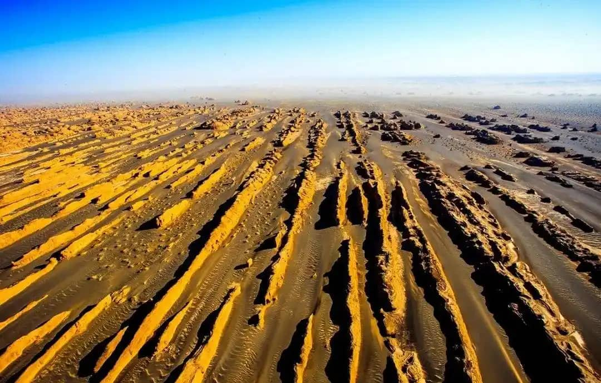
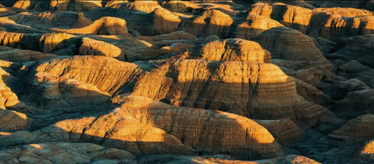

# Yadan National Geopark Photography & Survival Guide: Exploring Dunhuang's Ghost City

Imagine standing in the vast, silent heart of the Gobi Desert, surrounded by hundreds of towering, wind-carved clay fleet formations that resemble massive alien warships anchored on Mars. 

As the sun dips below the horizon, the howling desert wind whistle through the narrow clay canyons, producing eerie, haunting sounds. This is **Yadan National Geopark (雅丹国家地质公园)**, locally known as the **Ghost City (魔鬼城)**.

Located 180 kilometers northwest of Dunhuang near the desolate border of Xinjiang and the Lop Nur no-man's land, Yadan offers one of the most otherworldly landscapes along the entire Silk Road. 

In this 2026 guide, we cover everything you need to know about navigating the West Route, capturing sunset photography, and preparing for extreme desert conditions.

---

## 1. What is Yadan Landform & Why Is It Called "Ghost City"?

"Yadan" (Yardang) comes from the Uyghur language, meaning "steep mounds." Over 700,000 years, fierce desert winds and rare flash floods eroded the ancient lacustrine clay, sculpting it into long, parallel ridges, natural arches, and stylized monuments.

### The Origin of the "Ghost City" Name:
When night falls or high-speed winds sweep across the Gobi, the air rushes through the clay crevices, creating uncanny, screeching sounds resembling roaring beasts or weeping spirits. Historically, Silk Road camel caravans avoided staying here after dark out of supernatural fear.

---

## 2. The Dunhuang "West Route" Day Trip Itinerary

Yadan Geopark is rarely visited alone. It forms the anchor point of the famous **Dunhuang West Route (敦煌西线)**, a full-day overland desert expedition.

### Recommended Full-Day Flow:
* **09:30 AM | Departure from Dunhuang City**  
  Head west along Highway G215 through vast Gobi gravel plains.
* **11:00 AM | Yumenguan Pass (Jade Gate Pass - 玉门关)**  
  Explore the ancient Han Dynasty military fortress that once guarded the westernmost boundary of Ancient China.
* **01:30 PM | Yangguan Pass & Ruined Beacon Towers (阳关)**  
  Visit the historic oasis gateway where Silk Road traders said their final goodbyes before entering the dreaded Taklamakan Desert.
* **04:30 PM | Arrival at Yadan Geopark (North Area)**  
  Board the park's official sightseeing shuttle.
* **07:30 PM - 08:30 PM | Golden Hour & Sunset at the "Peacock Monument"**  
  Watch the clay monuments glow in deep shades of crimson, bronze, and burnt orange as the sun sinks into the horizon.

---

## 3. Top Photography Spot Highlights

The park shuttle stops at four primary viewpoint stations along the designated loop:

1. **The Golden Lion Welcoming Guests (金狮迎宾):** A massive clay mound resembling a lion guarding the desert entrance.
2. **The Sphinx (狮身人面像):** A natural erosion monument that mirrors the famous Egyptian landmark.
3. **The Peacock (孔雀开屏):** The most delicate structure in the park. Perfect for silhouette shots as the sun sits directly behind its thin "feathers."
4. **The Fleet of the South Sea (南海舰队):** Dozens of uniform, long clay mounds aligned parallel to the prevailing wind direction, resembling a naval armada sailing across a dry ocean.

---

## 4. Crucial Desert Survival Rules for Foreign Travelers

Because Yadan Geopark borders remote military zones and the dangerous Lop Nur wilderness, independent logistical planning is critical:

* **Zero Mobile Signal Zone:** Once you pass Yumenguan Pass, cellular network coverage (including China Mobile and Telecom) drops to zero for nearly 100 kilometers. Download offline maps and coordinate return rendezvous times with your private driver in advance.
* **Extreme Heat & Sun Exposure:** Summer temperatures in the Gobi easily exceed **42°C (107°F)** with zero natural shade. Bring at least 2 liters of water per person, high-SPF sunscreen, polarized sunglasses, and a wide-brimmed hat.
* **Drone Regulations:** Drone flying inside Yadan Geopark is strictly regulated due to nearby border airspace restrictions. Always check with the park rangers at the visitor center before taking off to prevent equipment confiscation.

---

## Yadan West Route Logistics Cheat Sheet

| Metric | Details |
| :--- | :--- |
| **Distance from Dunhuang** | ~180 km (approx. 2.5 hours drive one-way) |
| **Best Time to Visit** | 3 hours before local sunset (around 5:30 PM - 8:30 PM in summer) |
| **Public Transit Option** | ❌ NO public buses available. Require private charter or tour car. |

---

## Explore the Wild Frontiers of Dunhuang with Us

Navigating a 360-kilometer round-trip journey across a cellular dead zone in the Gobi Desert requires experienced, reliable local logistics. 

When you book a private Dunhuang West Route tour with us, we take care of all the desert hurdles:
* **Comfortable Air-Conditioned SUV/Van:** Equipped with onboard cold water, snacks, and satellite navigation.
* **Flawless Sunset Timing:** We calculate exact seasonal sunset angles so you arrive at the "Peacock" and "Fleet" viewpoints right as the lighting turns magical.
* **Seamless Pass Approvals:** We handle all ticket logistics for Yumenguan, Yangguan, and Yadan in advance.

Check out our [Mogao Caves Ticket Guide](/blog/mogao-caves-dunhuang-ticket-booking-guide) to round out your Dunhuang itinerary, or click **Contact Me** at the top of the page to have Alex lock in your private Dunhuang West Route driver today!
