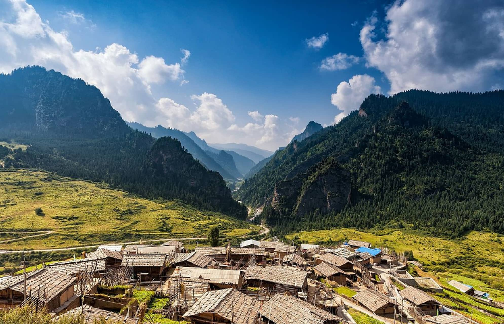
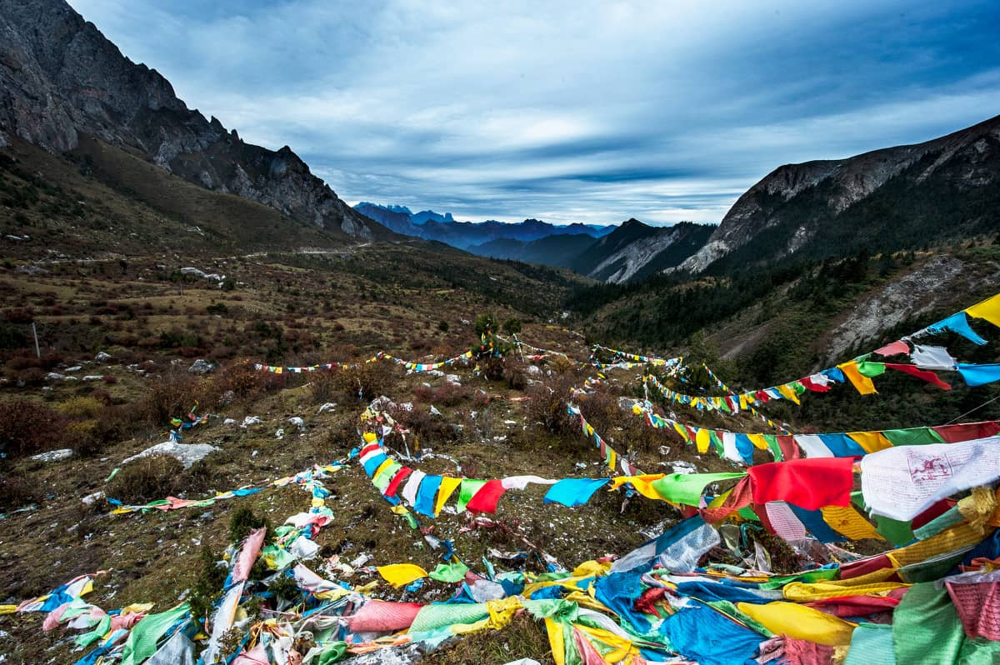

# Zagana Travel Guide: Hiking and Drone Photography in Gansu's Hidden Stone Castle

When legendary explorer Joseph Rock stepped into the hidden valleys of southern Gansu in the 1920s, he wrote: *"I have never seen such magnificent scenery... if the author of Genesis had seen the beauty of迭部 (Diebu), he would have placed the birthplace of humanity here."* 

He was talking about **Zagana** (also spelled Zhagana). 

Meaning "Stone Box" in the local Tibetan dialect, Zagana is a surreal, high-altitude mountain redoubt completely encircled by razor-sharp limestone cliffs. Four traditional Tibetan villages spill down the steep terraced hillsides, surrounded by alpine forests and grazing yaks. It feels less like modern China and more like a fantasy kingdom straight out of *The Lord of the Rings*.

For travel photographers and hikers, Zagana is the ultimate prize on the Silk Road loop. Here is your definitive 2026 survival blueprint to mastering its trails and capturing its misty mornings.

---

## 1. Top 3 Photography Viewpoints for Epic Scale

Zagana is inherently photogenic, but due to its high ridge lines, the light changes rapidly. The classic misty landscape shots you see online are captured during the early morning "golden hour."

### Viewpoint 1: The Main Village Panorama (Yari Village Overlook)
*   **The Shot:** This is the iconic postcard view. Position yourself on the wooden observation decks located high above Yari Village (the highest of the four settlements). 
*   **Best Time:** 6:30 AM – 7:30 AM. As the sun rises behind the eastern peaks, heavy mountain mist rises from the valley floor, beautifully trapping the traditional Tibetan wooden stilt houses in a sea of clouds.

### Viewpoint 2: The Fairy Beach (Xiannv Tan)
*   **The Shot:** A lush, emerald-green alpine meadow surrounded by towering grey limestone peaks. It offers a spectacular, unobstructed view of the sheer rock walls cutting vertically into the sky. Use a wide-angle lens ($16-35mm$) and shoot from a low angle to compress the wildflowers against the massive mountains.

---

## 2. Crucial 2026 Drone Regulations for Foreigners

Zagana from the air looks absolutely mind-blowing. The way the ridges curve makes it a drone pilot's dream. However, flying a drone (DJI, etc.) as an international traveler in China requires strict compliance.

*   **Real-Name Registration:** You **MUST** register your drone with your passport details on the official CAAC (Civil Aviation Administration of China) website before taking off.
*   **Local Border Restrictions:** Because Gannan borders sensitive mountainous zones, check your DJI Fly App for sudden No-Fly Zones (NFZs). **Never fly near or directly over active Tibetan monasteries** (such as the small temple at the top of the village) as it disturbs the resident monks and is considered highly disrespectful.
*   **The Wind Hazard:** At 3,000+ meters, the wind shear coming off the limestone cliffs can be violent. Watch your battery levels closely; fighting the high-altitude headwind on the return flight will drain your juice twice as fast.

---

## 3. The Pure Adventure: The Hardcore Hiking Trails

While standard tourists ride the internal electric shuttle buses between the lower boardwalks, the true magic of Zagana reveals itself only when you hike past the tourist boundary lines.

### The Sacred Stone Gate Loop (Intermediate)
*   **Duration:** 3–4 hours.
*   **The Route:** Starting from the upper village, follow the dirt tracks heading deeper into the canyons toward the "Stone Gate" (Shimen). The trail snakes along a roaring glacier-fed river, leading you deep into untouched pine forests where local nomads camp with their herds.
*   **Altitude Note:** You will be hiking between 3,000m and 3,400m ($11,150\text{ ft}$). Pack trekking poles and plenty of water; the thin air makes even minor inclines feel twice as exhausting.

---

## Zagana Adventure Cheat Sheet

| Metric | 2026 Advisory | Local Insider Tip |
| :--- | :--- | :--- |
| **Park Admission** | ~80 RMB per person | Keep your physical paper ticket; you need to scan it multiple times at internal checkpoints. |
| **Where to Stay** | Traditional Tibetan homestay | Stay in **Yari** or **Dongwa** village. Request a room with a west-facing balcony for private sunrise shooting. |
| **Night Temperatures** | 8°C to 14°C (July/August) | Even in mid-summer, you will need a thick fleece jacket or a down windbreaker after dark. |

---

## Bypassing the Remote Transit Headaches
Here is the raw truth about Zagana: **It is incredibly remote.** There are no trains, no airports, and no direct English-speaking public transit options leading into this mountain pocket. The nearest town, Diebu, is an hour away, and taxis will often refuse to drive international tourists up the winding cliff-side roads without charging exorbitant black-market rates.

To explore Zagana safely without getting stranded in the mountains with heavy camera gear, having an experienced local driver with a high-clearance SUV or private van is non-negotiable. 

Take a look at our [Gansu Transport and Chauffeur Options](/blog/getting-around-gansu-train-flight-charter) to understand how we map out mountain journeys, or click the **Contact Me** button at the top of the page to email Alex directly. Let us handle the high-altitude driving and local homestay bookings while you focus on your shot list!
