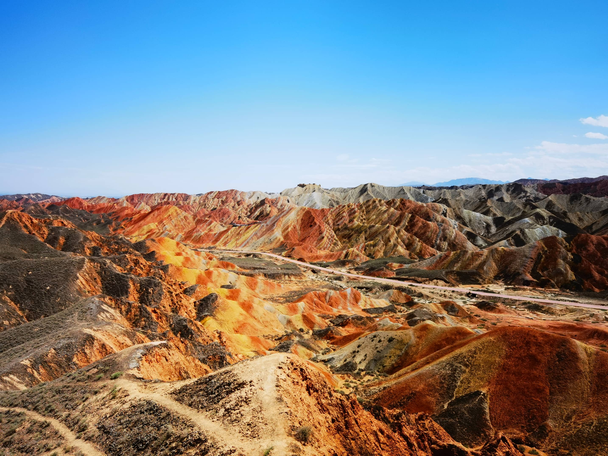

# Photographing Zhangye Danxia: The Ultimate Rainbow Mountains Guide

It looks like an oil painting brought to life, or a landscape from another planet. The **Zhangye Danxia National Geological Park**—world-famous as the "Rainbow Mountains of China"—is a dream destination for travel photographers. These surreal, multi-colored sandstone ridges were formed over 24 million years of tectonic shifting and mineral layering.

However, capturing the perfect shot here requires precise timing, proper positioning, and an understanding of the park's strict logistics. A bad weather day or arriving at the wrong platform can leave you with dull, muddy-looking photos. 

In this updated 2026 photography guide, we share the exact blueprints to getting publication-ready shots of this natural wonder.

---

## 1. The Golden Rule: Weather and Timing

The most critical factor for photographing the Rainbow Mountains is **light**. Under overcast skies, the colors can look surprisingly muted. But the moment the sun breaks through—especially after rain—the minerals ignite into vivid stripes of magenta, yellow, emerald, and amber.

### Best Season:
* **June to September:** This is the ideal window. The summer sun is intense, which makes the colors pop, and late afternoon rain showers are common. **A clear sunset right after a summer rainstorm is the holy grail for photographers here.**

### Best Time of Day:
* **Late Afternoon to Sunset:** Do not bother waking up for sunrise here; the mountains face a direction that makes sunset infinitely superior. The park lighting peaks during the last 2 hours before twilight.

---

## 2. Navigating the 4 Essential Viewing Platforms

You are not allowed to hike freely on the fragile sandstone. Visitors must ride the park’s eco-buses, which loop between four designated viewing platforms. Each offers a completely different photographic perspective.

### Platform 1: Panoramic Scale (Colorful Meeting Screen)
* **What to shoot:** This is the largest platform and your first stop. It offers massive, sweeping vistas of the entire mountain range.
* **Lens tip:** Use a wide-angle lens ($16-35mm$) to capture the sheer, immense scale of the landscape against the desert sky.

### Platform 2: The Sea of Colors (Seven-Color Sea)
* **What to shoot:** This platform sits at a lower angle, allowing you to get closer to the intricate wave patterns of the layers. 
* **Lens tip:** Look for abstract composition lines where different mineral stripes intersect.

### Platform 4: The Ultimate Sunset (Colorful Flashing Screen) — *Most Important!*
* **What to shoot:** This is the crown jewel of the park. It offers a perfect west-facing view of a massive ridge that resembles a multi-colored silk ribbon. 
* **Logistics Note:** **Make sure you arrive at Platform 4 at least 90 minutes before the official sunset.** It gets incredibly crowded with tourists. Push your way to the top tier for an unobstructed view of the sun dropping behind the peaks.

---

## 3. Advanced Camera Settings for the Perfect Pop

Because the contrast between the bright sky and the dark desert shadows can be extreme, standard automatic settings will often overexpose your sky or underexpose the mountains.

* **Shoot in RAW:** This is non-negotiable. You will need to recover the shadow details of the valleys and temper the bright highlights of the sun in post-processing.
* **Use a Circular Polarizer (CPL Filter):** A polarizer cuts out the glare bouncing off the sandstone rocks, instantly deepening the saturation of the red and yellow mineral layers.
* **Exposure Bracketing (AEB):** If you are shooting directly into the sunset at Platform 4, take 3 bracketed shots (one underexposed, one neutral, one overexposed) and blend them later as an HDR image to capture the full dynamic range.

---

## Summary Cheat Sheet for Your Trip

| Detail | 2026 Advisory | Photographer's Note |
| :--- | :--- | :--- |
| **Park Operating Hours** | 6:00 AM – 8:00 PM (Summer) | Last entry bus leaves at 7:00 PM. Don't be late! |
| **Peak Sunset Window** | 7:30 PM – 8:15 PM (July/August) | Be positioned on **Platform 4** by 6:30 PM. |
| **Must-Bring Gear** | Tripod, CPL Filter, Telephoto Lens | A $70-200mm$ zoom lens is vital for isolating abstract textures. |

---

## Getting to Zhangye Comfortably
The Rainbow Mountains are located about 40 kilometers outside of Zhangye city center. There are no reliable English public buses to the park gates. To ensure you don't miss the golden hour sunset while waiting for a local taxi, we highly recommend arranging transport in advance. 

Check out our [Gansu Transport Guide: Train vs. Flight vs. Private Car Charter](/blog/getting-around-gansu-train-flight-charter) to book a reliable local driver for your photography expedition, or click **Contact Me** at the top of the page to query our private photography van rates.
