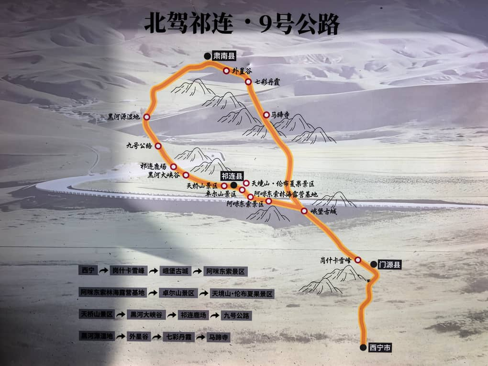
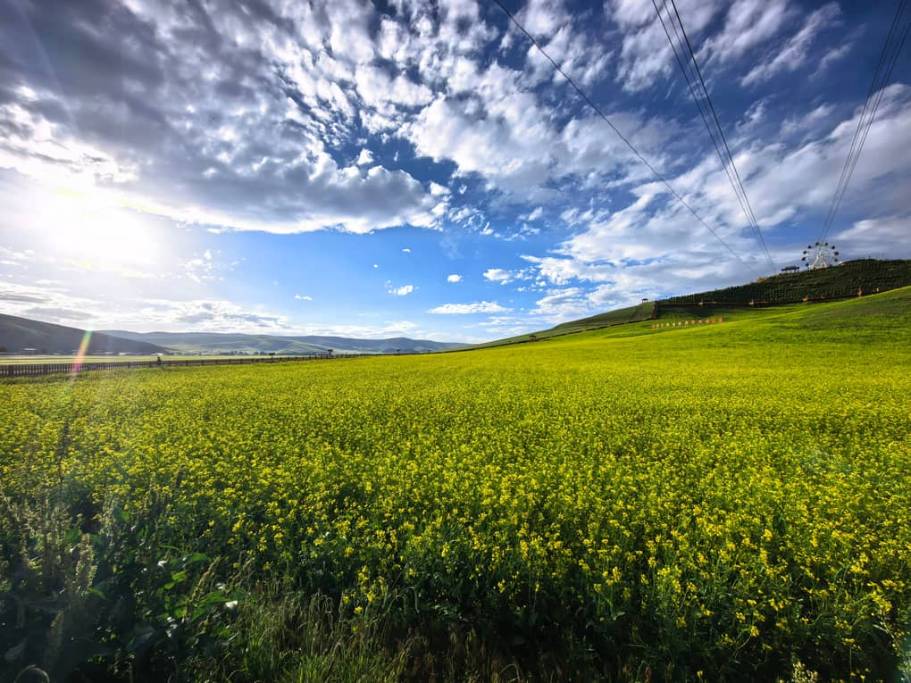

# Zhangye Route 9 Scenic Drive: Navigating the Qilian Mountain 'Figure 9' Highway

When travelers envision Zhangye, the surreal rainbow-colored mudstones of the Danxia Landform usually steal the spotlight. Yet, driving south toward the towering glaciers of the **Qilian Mountains**, a modern geometric marvel cuts through the high-altitude pastures: **Zhangye's "Route 9" (张掖9号公路)**.

Connecting the scenic gateway of **Biandukou (扁都口)** in Minle County to the historic border post of **Erbao Town (俄堡镇)** in Qinghai, this newly paved alpine road winds gracefully through mountain gorges and high-elevation meadows. 

From an aerial drone perspective, the road loops back on itself in a dramatic switchback curve that forms a giant, immaculate **Arabic numeral "9"** etched into the emerald mountain slopes.

For road-trippers and aerial photographers linking Gansu and Qinghai, this high-altitude corridor is one of Northwest China's best-kept secrets.

---

## 1. Why "Route 9" Went Viral

Unlike numbered national highways (such as G227), "Route 9" earned its name from travel photographers capturing the landscape from 200 meters above ground:

* **Geometric Precision:** Smooth black asphalt and crisp white road markings twist across rolling alpine meadows, creating an unmistakable "9" against the hillside.
* **Dramatic Color Contrasts:** In July and August, the highway cuts through golden oceans of blooming canola flowers, deep green pine valleys, and snow-dusted peaks.
* **Quiet Detour:** While tour buses crowd the main commercial overlooks of Biandukou, Route 9 offers wide horizons with significantly less congestion.

---

## 2. The Classic Driving Circuit: Zhangye to Erbao & Beyond

Route 9 forms a core scenic artery linking the Hexi Corridor in Gansu to the northern high plateaus of Qinghai.

### Suggested Overland Route Flow:
1. **Departure from Zhangye City (Morning):** Head south along Highway G227 toward Minle County (approx. 1.5 hours).
2. **Biandukou Scenic Area (Late Morning):** Drive through the historic mountain pass where ancient Silk Road merchants entered the Hexi Corridor. Stop for photos among the high-altitude rapeseed flower fields.
3. **The "Figure 9" Road Loop (Midday):** Ascend the switchbacks of Route 9. Pull over at designated laybys to capture aerial drone footage and landscape photography.
4. **Jingyangling Mountain Pass (3,767m):** Cross the high mountain pass into Qinghai Province, enjoying panoramic views of prayer flags and alpine tundra.
5. **Erbao Ancient Town (Afternoon):** Stop at this historic frontier outpost to enjoy fresh plateau yak yogurt (*Yàoniúnǎi*) and traditional hand-carved mutton (*Shǒuzhuā Yángròu*).

6. [Zhangye City] ➔ Biandukou Pass ➔ Route 9 Loop ➔ Jingyangling Pass (3,767m) ➔ [Erbao Town]

7. 

---

## 3. Drone Photography & Road Safety Essentials

* **Drone Regulations & Winds:** High-altitude gusts can be strong across the mountain ridges. Use a heavy drone (such as DJI Mavic 3 or Air series) and keep an eye on battery depletion caused by cold air.
* **Parking Etiquette:** The mountain road features sharp blind curves. **Never stop inside a curve or on a narrow shoulder.** Use paved laybys and marked lookout platforms to set up tripods.
* **Altitude Preparedness:** Elevations along the route range from **2,800 to 3,767 meters (9,180 – 12,350 ft)**. Dress in windproof layers and carry plenty of drinking water to prevent mild altitude fatigue.

---

## Route 9 Driving Metrics

| Metric | Details |
| :--- | :--- |
| **Location** | Minle County, Gansu (Bordering Qilian County, Qinghai) |
| **Best Travel Window** | **July to September** (Peak canola bloom and lush green pastures) |
| **Road Type** | Paved mountain asphalt (Accessible by standard cars and SUVs) |
| **Driving Distance** | ~110 km from Zhangye City to Erbao Town (approx. 2.5 to 3 hours) |

---

## Drive the Qilian Sky Roads with Alex

Traversing high-altitude mountain passes between Gansu and Qinghai requires reliable vehicles, route planning, and careful timing for aerial photography.

**We make exploring the Silk Road's hidden highways completely seamless.**

When you book a private Gansu-to-Qinghai overland crossing with us:
* **Comfortable High-Clearance SUVs:** Modern, heated vehicles piloted by mountain drivers experienced in navigating Qilian alpine weather.
* **Aerial Photography Assistance:** We know the safest pull-outs along Route 9 for launching drones and capturing wide-angle road trip footage.
* **Flexible Route Extensions:** We seamlessly connect your Route 9 drive into full itineraries covering Zhuo'er Mountain, Menyuan Canola Fields, and Qinghai Lake.

Check out our [7-Day Silk Road Itinerary Guide](/blog/7-day-silk-road-itinerary-lanzhou-to-dunhuang) to see how this drive integrates into your holiday, or click **Contact Me** at the top of the page to plan your custom Northwest road trip today!
